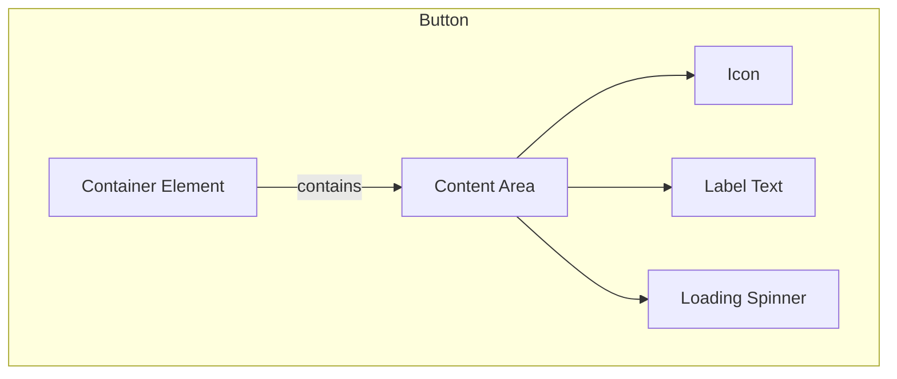

import { BrowserSupport } from "@app/_components/browser-support";
import { BuildEffort } from "@app/_components/build-effort";
import { FaqStructuredData } from "@app/_components/faq-structured-data";
import { PatternPreview } from "@app/_components/pattern-preview";
import { PatternStats } from "@app/_components/pattern-stats";
import { PatternComparison } from "@app/_components/pattern-comparison";
import { RelatedPatternsCard } from "@app/_components/related-patterns-card";

# Button

<PatternStats
  popularity="high"
/>

<PatternPreview
  alt="Example of a primary button UI pattern showing a Continue button in
  action"
/>

## Overview

**Buttons** are interactive elements that trigger actions or events when clicked or interacted with.

<BuildEffort
  level="low"
  description="A native HTML button with optional styling enhancements. No JavaScript required unless adding advanced behaviors."
/>

## Use Cases

### When to use:

- To trigger an immediate action or event (e.g., "Save", "Delete", "Send")
- To submit a form
- To open or close interactive elements (modals, dialogs, menus)
- To toggle between states (e.g., play/pause, show/hide)
- To download files or content
- To navigate between steps in a multi-step process

### When not to use:

- For navigation between pages (use links instead)
- When the action isn't immediately clear to users
- For text-only content that doesn't trigger an action
- When the interaction would be better served by a different component (e.g., checkbox, toggle switch)
- When multiple conflicting actions are grouped together
- When the action requires additional context that isn't immediately available

### Common scenarios and examples

- Primary actions: "Submit", "Save", "Continue"
- Secondary actions: "Cancel", "Back", "Reset"
- Destructive actions: "Delete", "Remove", "Clear All"
- Toggle actions: "Show More", "Expand/Collapse", "Play/Pause"
- Process actions: "Upload", "Download", "Export"
- Social actions: "Share", "Follow", "Like"

<PatternComparison
  current="Button"
  alternatives={[
    {
      name: "Link",
      path: "/patterns/navigation/link",
      when: "navigating to different pages or sections",
      pros: ["SEO friendly", "Right-click options", "Native browser behavior"],
      cons: ["Not for actions", "Less visual emphasis", "No button states"]
    },
    {
      name: "Icon Button",
      path: "/patterns/forms/icon-button",
      when: "space is limited or action is universally understood",
      pros: ["Compact", "Visual clarity", "Good for toolbars"],
      cons: ["Needs tooltip", "Less accessible", "Icon ambiguity"]
    },
    {
      name: "Toggle Switch",
      path: "/patterns/forms/toggle-switch",
      when: "switching between two states or on/off settings",
      pros: ["Clear state", "Immediate feedback", "Mobile friendly"],
      cons: ["Only binary", "Takes more space", "Not for actions"]
    }
  ]}
/>

## Benefits

- Provides clear, actionable interactions for users to accomplish tasks
- Maintains consistency in user interface interactions across the application
- Offers visual feedback and states (hover, focus, active, disabled) to enhance usability
- Supports accessibility through keyboard navigation and screen reader compatibility
- Reduces cognitive load by making actions immediately recognizable

## Drawbacks

- **Overuse can lead to UI clutter** – Too many buttons in an interface can confuse users.
- **Styling inconsistencies** – Needs proper theming and responsive considerations for different screen sizes.
- **Click area issues** – If not sized properly, buttons may be difficult to tap on mobile.
- **Lack of clear labels** – Buttons without descriptive text (e.g., just an icon) can cause usability problems.
- **Focus management** – Requires proper `:focus` states for accessibility and keyboard users.

## Anatomy



### Component Structure

1. **Container**

- The root button element that wraps all other components
- Handles click events and keyboard interactions
- Manages focus states and accessibility attributes
- Contains variants for different button styles (default, destructive, outline, etc.)

2. **Label Text**

- The button label communicates the action that will occur
- Should be clear, concise, and action-oriented
- Must maintain proper contrast ratio with the background

3. **Icon (Optional)**

- Icons can be added to clarify an action
- Should be the same color as the text
- Placed on the left side of the label by default
- Size should be proportional to text (default 16x16px)
- Should include proper ARIA labels when used alone

4. **Loading State (Optional)**

- Visual indicator for async operations
- Replaces or overlays the button content
- Should maintain the button's original width
- Prevents multiple clicks during loading
- Typically uses a spinner or progress indicator
- Add loading text alongside spinners (e.g., "Saving..." vs just a spinner)

5. **Visual States**

- Default: Normal state
- Hover: Visual feedback on mouse over
- Focus: Keyboard navigation indicator
- Active: Pressed state
- Disabled: Indicates non-interactive state
- Loading: Shows processing state

### Summary of Components**

| Component     | Required? | Purpose                                                   |
| ------------- | --------- | --------------------------------------------------------- |
| Container     | ✅ Yes    | Wraps all button elements and handles interactions.       |
| Label Text    | ✅ Yes    | Communicates the action that the button performs.         |
| Icon          | ❌ No     | Enhances clarity of the action (typically placed left).   |
| Loading State | ❌ No     | Indicates an ongoing process (e.g., saving, submitting).  |
| Visual States | ✅ Yes    | Defines button interactions (hover, focus, active, etc.). |

## Button Variations

### Content Composition

1. **Text Only**

   ```html
   <button type="button">Button</button>
   ```

2. **Icon Only**

   ```html
   <button type="button" aria-label="Settings">
     <svg aria-hidden="true">...</svg>
   </button>
   ```

3. **Icon + Text**

   - Left Icon

   ```html
   <button type="button">
     <svg aria-hidden="true">...</svg>
     <span>Button</span>
   </button>
   ```

   - Right Icon

   ```html
   <button type="button">
     <span>Button</span>
     <svg aria-hidden="true">...</svg>
   </button>
   ```

4. **Double Icon**

   ```html
   <button type="button">
     <svg aria-hidden="true">...</svg>
     <span>Button</span>
     <svg aria-hidden="true">...</svg>
   </button>
   ```

5. **With Counter/Badge**

   ```html
   <button type="button">
     <span>Messages</span>
     <span class="counter">18</span>
   </button>
   ```

6. **With Command/Shortcut**
   ```html
   <button type="button">
     <span>Print</span>
     <span class="shortcut">⌘P</span>
   </button>
   ```

### Profile Variations

7. **With Avatar**
   ```html
   <button type="button">
     
     <span>@username</span>
   </button>
   ```

### Action Groups

8. **Button Groups**

   - Horizontal Group

   ```html
   <div role="group" aria-label="Text alignment">
     <button type="button">Left</button>
     <button type="button">Center</button>
     <button type="button">Right</button>
   </div>
   ```

   - Vertical Group

   ```html
   <div role="group" aria-label="Actions" class="vertical">
     <button type="button">Files</button>
     <button type="button">Media</button>
   </div>
   ```

9. **Split Buttons**
   ```html
   <div class="split-button">
     <button type="button">Action</button>
     <button type="button" aria-label="More options">▼</button>
   </div>
   ```

### State Variations

10. **Loading States**

    ```html
    <button type="button" aria-busy="true">
      <svg class="spinner" aria-hidden="true">...</svg>
      <span>Loading...</span>
    </button>
    ```

11. **Toggle States**
    ```html
    <button type="button" aria-pressed="false">
      <span>Pin</span>
    </button>
    ```

### Social Variations

12. **Social Login**
    ```html
    <button type="button" class="social-login google">
      <svg aria-hidden="true">...</svg>
      <span>Login with Google</span>
    </button>
    ```

### Special Purpose

13. **Upload Button**

    ```html
    <button type="button" class="upload">
      <svg aria-hidden="true">...</svg>
      <span>Upload image</span>
      <span class="status">No image uploaded</span>
    </button>
    ```

14. **Numeric Indicator**
    ```html
    <button type="button">
      <span>Star</span>
      <span class="count">729</span>
    </button>
    ```

Each variation can be combined with different visual styles (primary, secondary, outline, ghost) and sizes (small, medium, large) to create the full range of possible button components.

## Examples

### Basic Implementation

```html
<!-- Small Button -->
<button type="button" class="button-sm">Small</button>

<!-- Default Size Button -->
<button type="button">Default</button>

<!-- Large Button -->
<button type="button" class="button-lg">Large</button>

<!-- Icon-only Button -->
<button type="button" aria-label="Settings">
  <svg aria-hidden="true">
    <use href="#icon-settings" />
  </svg>
</button>
```

### Form Submit Button

```html
<form>
  <!-- Form fields here -->
  <button type="submit" class="button button-primary" data-loading="false">
    <span class="button-text">Submit Form</span>
    <svg class="icon spinner hidden" aria-hidden="true">
      <use href="#icon-loading" />
    </svg>
  </button>
</form>
```

## Best Practices

### Content

**Do's ✅**

- Use action verbs that describe what the button does (eg: "Save" instead of "Submit")
- Keep button labels concise and clear
- Be consistent with button labeling across the application
- Include loading text when appropriate ("Saving..." vs "Save")
- Use sentence case for button labels (e.g., "Save Changes")

**Don'ts ❌**

- Don't use vague labels like "Click Here" or "Submit"
- Don't use inconsistent terminology
- Don't write overly long button labels
- Don't use technical jargon in button labels
- Don't mix different cases in button labels

### Accessibility

**Do's ✅**

- Use descriptive labels that clearly communicate the action [^describe-buttons]
- Provide visual feedback for all interactive states
- Ensure keyboard navigation works properly
- Include loading states for asynchronous actions
- Don't pass the `disabled` attribute to buttons, instead use `aria-disabled`. You would risk disrupting the keyboard navigation flow as this would reset focus on the button.
- Use descriptive loading states with both text and visual indicators

**Don'ts ❌**

- Don't rely solely on color to communicate button states
- Don't disable browser focus indicators without providing alternatives
- Don't use button elements for navigation (use links instead)
- Don't auto-focus destructive actions
- Don't remove focus styles

### Visual Design

**Do's ✅**

- Use the same button style for the same action throughout the application
- Make buttons finger-friendly for mobile users (minimum 44x44px [touch target](/glossary/touch-targets))
- Use appropriate visual hierarchy (primary, secondary, tertiary buttons)
- Maintain consistent spacing between button groups
- Use appropriate color contrast ratios (WCAG 2.1 AA compliance)
- Include hover and focus states for interactive feedback
- Keep icon and text alignment consistent
- Maintain consistent padding and height across similar buttons
- Scale button size appropriately for different [viewport](/glossary/viewport) sizes

**Don'ts ❌**

- Don't have more than one primary action button on the screen at a time
- Don't use a [dark pattern](https://www.deceptive.design/) when you don't want users to take a certain action
- Don't mix different button styles for the same action type
- Don't use colors that conflict with your application's color scheme
- Don't make disabled buttons look interactive
- Don't use inconsistent corner radius within button groups
- Avoid having buttons looking like links or vice versa
- Don't use spinners without descriptive text

### Mobile & Touch Considerations

**Do's ✅**

- Place primary actions within thumb-friendly zones
- Use full-width buttons for important actions on mobile
- Implement haptic feedback for touch interactions
- Maintain sufficient spacing between [touch targets](/glossary/touch-targets) (minimum 8px)

**Don'ts ❌**

- Don't place critical actions in hard-to-reach corners
- Don't rely solely on hover states for mobile feedback
- Don't make [touch targets](/glossary/touch-targets) smaller than 44x44px
- Don't crowd multiple buttons together on mobile views

### Layout & Positioning

**Do's ✅**

- Place primary action buttons in prominent, easily accessible locations
- Align buttons consistently within forms and dialogs
- Group related buttons together
- Consider mobile [touch targets](/glossary/touch-targets) (minimum 44x44px)

**Don'ts ❌**

- Don't position buttons where they might be accidentally clicked
- Don't hide important actions behind dropdown menus
- Don't place buttons in unexpected locations (e.g., footer)

## Accessibility

### ARIA Attributes

**Required ARIA attributes:**

- Use `aria-label` for icon-only buttons
- Use `aria-pressed` for toggle buttons
- Use `aria-expanded` for buttons that control expandable content
- Use `aria-disabled="true"` instead of the `disabled` attribute
- Use `aria-describedby` to associate additional descriptive text

### Screen Reader Support

**Implementation example:**

```html
<!-- Icon-only button with proper ARIA -->
<button type="button" aria-label="Close dialog">
  <svg aria-hidden="true">
    <use href="#icon-close" />
  </svg>
</button>

<!-- Toggle button with ARIA pressed state -->
<button type="button" aria-pressed="false">
  <span>Dark mode</span>
</button>

<!-- Expandable content button -->
<button type="button" aria-expanded="false" aria-controls="content-1">
  <span>Show more</span>
</button>
```

### Keyboard Navigation

- Buttons must be focusable and activated with both Enter and Space keys
- Focus order should follow a logical sequence
- Focus states must be clearly visible
- Avoid removing focus outlines without providing alternatives
- Maintain focus after interactions (e.g., after closing a modal)

## Testing Guidelines

### Functional Testing

**Should ✓**

- [ ] Show a loader when the button is submitting a form
- [ ] Disable the button during form submission to prevent double submissions
- [ ] Handle click events and trigger the appropriate action
- [ ] Maintain proper visual states (hover, focus, active, disabled)
- [ ] Support keyboard interaction (Enter and Space keys)
- [ ] Preserve button width when switching between normal and loading states
- [ ] Reset to initial state after operation completion

### Accessibility Testing

**Should ✓**

- [ ] Be focusable and have visible focus indicators
- [ ] Have proper ARIA labels, especially for icon-only buttons
- [ ] Maintain sufficient color contrast ratios (WCAG 2.1 AA)
- [ ] Support screen reader announcements of button state changes
- [ ] Be operable with keyboard navigation
- [ ] Communicate loading states to assistive technologies
- [ ] Have appropriate [touch target](/glossary/touch-targets) sizes (minimum 44x44px)

### Visual Testing

**Should ✓**

- [ ] Maintain consistent styling across different variants (primary, secondary, destructive)
- [ ] Display icons with correct alignment and spacing
- [ ] Show proper visual feedback for all interactive states
- [ ] Render correctly across different [viewport](/glossary/viewport) sizes
- [ ] Handle text overflow appropriately
- [ ] Display loading spinners centered within the button
- [ ] Maintain proper padding and margins in all states

### Performance Testing

**Should ✓**

- [ ] Render without layout shifts
- [ ] Handle rapid click events appropriately
- [ ] Maintain smooth transitions between states
- [ ] Load icons and spinners efficiently
- [ ] Function without JavaScript (progressive enhancement)

### Testing Tools

- Accessibility: [WAVE](https://wave.webaim.org/), [aXe](https://www.deque.com/axe/browser-extensions/), or [Lighthouse](https://developer.chrome.com/docs/lighthouse/overview)
- SEO: [Google's Rich Results Test](https://developers.google.com/search/docs/appearance/structured-data)
- Performance: [Chrome DevTools Performance panel](https://developer.chrome.com/docs/devtools/performance/overview)
- Visual Regression: [Percy](https://percy.io/) or [Chromatic](https://www.chromatic.com/)
- Cross-browser: [BrowserStack](https://www.browserstack.com/) or [Sauce Labs](https://saucelabs.com/)

## Browser Support

<BrowserSupport features={["html.elements.button", "api.HTMLButtonElement"]} />

## [Design Tokens](/glossary/design-tokens)

These [design tokens](/glossary/design-tokens) follow the [Design Tokens Format](https://design-tokens.github.io/community-group/format/) specification and can be used with various token transformation tools to generate platform-specific variables.

### Button Tokens in DTF Format

```json
{
  "$schema": "https://design-tokens.org/schema.json",
  "button": {
    "sizing": {
      "height": {
        "sm": { "value": "2.25rem", "type": "dimension" },
        "md": { "value": "2.5rem", "type": "dimension" },
        "lg": { "value": "2.75rem", "type": "dimension" }
      },
      "paddingX": {
        "sm": { "value": "0.75rem", "type": "dimension" },
        "md": { "value": "1rem", "type": "dimension" },
        "lg": { "value": "2rem", "type": "dimension" }
      },
      "iconSize": { "value": "1rem", "type": "dimension" },
      "iconGap": { "value": "0.5rem", "type": "dimension" },
      "touchTarget": {
        "value": "2.75rem",
        "type": "dimension",
        "description": "44px minimum [touch target](/glossary/touch-targets)"
      }
    },
    "typography": {
      "fontFamily": { "value": "{font.family.sans}", "type": "fontFamily" },
      "fontWeight": { "value": "600", "type": "fontWeight" },
      "fontSize": {
        "sm": { "value": "0.875rem", "type": "dimension" },
        "md": { "value": "1rem", "type": "dimension" },
        "lg": { "value": "1.125rem", "type": "dimension" }
      }
    },
    "border": {
      "radius": {
        "sm": { "value": "0.375rem", "type": "dimension" },
        "md": { "value": "0.5rem", "type": "dimension" },
        "lg": { "value": "0.75rem", "type": "dimension" },
        "pill": { "value": "999px", "type": "dimension" }
      },
      "width": { "value": "1px", "type": "dimension" }
    },
    "variants": {
      "primary": {
        "background": {
          "default": { "value": "{color.primary.600}", "type": "color" },
          "hover": { "value": "{color.primary.700}", "type": "color" },
          "active": { "value": "{color.primary.800}", "type": "color" },
          "disabled": { "value": "{color.primary.200}", "type": "color" }
        },
        "text": {
          "default": { "value": "{color.white}", "type": "color" },
          "disabled": { "value": "{color.primary.100}", "type": "color" }
        }
      },
      "secondary": {
        "background": {
          "default": { "value": "{color.gray.100}", "type": "color" },
          "hover": { "value": "{color.gray.200}", "type": "color" },
          "active": { "value": "{color.gray.300}", "type": "color" },
          "disabled": { "value": "{color.gray.50}", "type": "color" }
        },
        "text": {
          "default": { "value": "{color.gray.900}", "type": "color" },
          "disabled": { "value": "{color.gray.400}", "type": "color" }
        }
      },
      "destructive": {
        "background": {
          "default": { "value": "{color.red.600}", "type": "color" },
          "hover": { "value": "{color.red.700}", "type": "color" },
          "active": { "value": "{color.red.800}", "type": "color" },
          "disabled": { "value": "{color.red.200}", "type": "color" }
        },
        "text": {
          "default": { "value": "{color.white}", "type": "color" },
          "disabled": { "value": "{color.red.100}", "type": "color" }
        }
      },
      "outline": {
        "border": {
          "default": { "value": "{color.gray.300}", "type": "color" },
          "hover": { "value": "{color.gray.400}", "type": "color" },
          "active": { "value": "{color.gray.500}", "type": "color" },
          "disabled": { "value": "{color.gray.200}", "type": "color" }
        },
        "text": {
          "default": { "value": "{color.gray.900}", "type": "color" },
          "disabled": { "value": "{color.gray.400}", "type": "color" }
        }
      }
    },
    "states": {
      "focusRing": {
        "width": { "value": "2px", "type": "dimension" },
        "offset": { "value": "2px", "type": "dimension" },
        "color": { "value": "{color.primary.200}", "type": "color" }
      },
      "loadingSpinner": {
        "size": { "value": "1rem", "type": "dimension" },
        "borderWidth": { "value": "2px", "type": "dimension" }
      }
    }
  }
}
```

## Frequently Asked Questions

<FaqStructuredData
  items={[
    {
      question: "What is a button in web design?",
      answer:
        "A button is a UI element that allows users to perform actions or trigger events, such as submitting a form or opening a dialog.",
    },
    {
      question: "When should I use a button?",
      answer:
        "Use a button when you want to initiate an action, like submitting data, opening a modal, or performing interactive tasks within your application.",
    },
    {
      question: "How can I make a button accessible?",
      answer:
        "Ensure buttons are focusable, provide descriptive labels, support keyboard interactions, and have sufficient color contrast. Use semantic HTML elements like `<button>` and manage ARIA attributes appropriately.",
    },
    {
      question: "What are the different types of buttons?",
      answer:
        "Common types include primary buttons for main actions, secondary buttons for less important actions, and tertiary buttons for minimal emphasis. Variants like text, contained, and outlined buttons offer different visual styles.",
    },
    {
      question: "What are common mistakes to avoid when implementing buttons?",
      answer:
        "Avoid using non-semantic elements for buttons, neglecting accessibility features, overloading buttons with too many styles, and failing to provide clear visual feedback for different states.",
    },
  ]}
/>

## Related Patterns

<RelatedPatternsCard category="forms" />

## Resources

### Articles

- [button: The Button element](https://developer.mozilla.org/en-US/docs/Web/HTML/Element/button)
- [I've been doing buttons wrong! Have you?](https://uxplanet.org/ive-been-doing-buttons-wrong-have-you-2117c0066613) by Adham Dannaway
- [A comprehensive guide to buttons](https://uxplanet.org/a-comprehensive-guide-to-buttons-8f3b8a1c6f0d) by UX Planet
- [A comprehensive guide to designing UX buttons](https://www.invisionapp.com/inside-design/comprehensive-guide-designing-ux-buttons/?ref=checklist.design) by InVision

- [Building Accessible Buttons with ARIA: A11y Support Series](https://www.deque.com/blog/accessible-aria-buttons/) by Deque
- [Buttons A11y Styleguide](https://a11y-style-guide.com/style-guide/section-general.html#kssref-general-buttons)

### Design systems

- [Style Dictionary](https://styledictionary.com/)
- [Button (Carbon Design System)](https://carbondesignsystem.com/components/button/usage/)
- [Button (Material Design)](https://m3.material.io/components/all-buttons)

### Libraries

[Button - Origin UI](https://originui.com/button)

### Footnotes

[^describe-buttons]: [Descriptive buttons](https://primer.style/guides/accessibility/descriptive-buttons)
