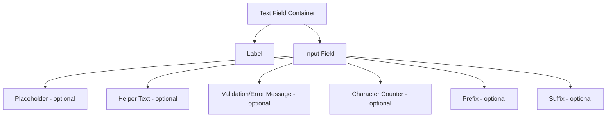

import { BrowserSupport } from "@app/_components/browser-support";
import { BuildEffort } from "@app/_components/build-effort";
import { FaqStructuredData } from "@app/_components/faq-structured-data";
import { PatternPreview } from "@app/_components/pattern-preview";
import { Playground } from "@app/_components/playground";

# Text Field

<PatternPreview />

## Overview

A **Text Field** is a fundamental form input component that allows users to enter and edit text-based data. It is commonly used in **forms, search fields, authentication fields, and messaging interfaces**.

Text fields can accept single-line or multi-line input and may include additional features like placeholders, character counters, validation messages, and formatting assistance.

<BuildEffort
  level="low"
  description="Requires basic HTML input handling, validation, keyboard navigation, and optional accessibility attributes."
/>

## Use Cases

### When to use:

Use a text field when you need users to input freeform text, such as:

- **Login and authentication fields** – Username, password, email.
- **Search fields** – Query inputs in search bars.
- **Forms and surveys** – Collecting names, addresses, or custom responses.
- **Messaging interfaces** – Chat applications and comment sections.
- **Data entry fields** – User-generated content like tags, descriptions, or reviews.

### When not to use:

- **For pre-defined options** – Use [dropdowns](/patterns/forms/selection-input), [radio](/patterns/forms/radio), or [checkboxes](/patterns/forms/checkbox) instead.
- **For structured data inputs** – Use specialized inputs like [date pickers](/patterns/forms/date-picker) or [currency fields](/patterns/forms/currency-input).
- **For short selections** – Use [auto-complete](/patterns/forms/autocomplete) inputs instead of requiring full text input.
- **When voice input or selections are better** – Consider alternatives for accessibility.

## Benefits

- **Flexible** – Allows users to enter freeform responses.
- **Widely recognized** – Standardized interaction that users expect.
- **Supports real-time validation** – Instant feedback for user input.
- **Can be enhanced** – Custom validation, auto-formatting, and assistance.

## Drawbacks

- **User errors** – Freeform text increases the risk of typos and incorrect formatting.
- **Lack of guidance** – May require placeholders, labels, or tooltips to improve usability.
- **Accessibility concerns** – Must be properly labeled and include validation feedback for screen readers.

## Anatomy



### Component Structure

1. **Container (`div` or `fieldset`)**

   - Wraps the entire text field component.
   - Ensures proper spacing and alignment.
   - May include additional styling or group related inputs.

2. **Label (`label`)**

   - Describes the purpose of the input field.
   - Should be visually positioned above the input.
   - Must be **associated with the input** using the `for` attribute.

3. **Input Field (`input[type="text"]`)**

   - The interactive area where users enter text.
   - Supports attributes such as `autocomplete`, `maxlength`, and `required`.
   - Should have proper focus styles for accessibility.

4. **Placeholder (Optional)**

   - Provides a hint before users type.
   - Disappears when input is focused.
   - **Should not replace a label** for accessibility.

5. **Helper Text (`p` or `span`, optional)**

   - Provides additional guidance or formatting instructions.
   - Typically placed **below the input field**.
   - Should be **persistent** and not disappear on focus.

6. **Validation/Error Message (`<output>` preferred, `<p>` or `<span>` acceptable)**

   - Displays a **clear, specific message** when input is invalid.
   - **Use `<output>` for dynamic validation feedback** - semantically represents the result of user input.
   - Use `<p>` for static helper text that doesn't change.
   - Should be **associated with the input using `aria-describedby`**.
   - Appears below the input, replacing helper text if necessary.

7. **Character Counter (`p` or `span`, optional)**

   - Displays **remaining or used character count** (e.g., "20/100 characters").
   - Helps users stay within input length limits.
   - Should update dynamically as the user types.

8. **Prefix (`span`, optional)**

   - Static text **before the input** (e.g., `$` for currency, `@` for usernames).
   - Should be **visually distinguishable** from user input.

9. **Suffix (`span`, optional)**
   - Static text **after the input** (e.g., `.com` for domain fields).
   - Helps users understand **expected input formats**.

#### **Summary of Components**

| Component                | Required? | Purpose                                      |
| ------------------------ | --------- | -------------------------------------------- |
| Label                    | ✅ Yes    | Describes the input field's purpose.         |
| Input Field              | ✅ Yes    | The main interactive element for user input. |
| Placeholder              | ❌ No     | Provides a hint but disappears on input.     |
| Helper Text              | ❌ No     | Offers guidance or additional instructions.  |
| Validation/Error Message | ❌ No     | Provides feedback when input is invalid.     |
| Character Counter        | ❌ No     | Tracks remaining/used characters.            |
| Prefix                   | ❌ No     | Displays static text before the input.       |
| Suffix                   | ❌ No     | Displays static text after the input.        |

## Variations

### Basic Text Field
Simple single-line input with label and optional helper text.

```html
<div class="text-field">
  <label for="email">Email Address</label>
  <input type="text" id="email" placeholder="Enter your email">
</div>
```

### With Validation States
Text field showing different validation states (error, success, warning).

```html
<!-- Error State -->
<div class="text-field text-field--error">
  <label for="password">Password</label>
  <input type="password" id="password" aria-invalid="true" aria-describedby="password-error">
  <output class="text-field__error" id="password-error">Password must be at least 8 characters</output>
</div>

<!-- Success State -->
<div class="text-field text-field--success">
  <label for="username">Username</label>
  <input type="text" id="username" value="john_doe" aria-describedby="username-success">
  <output class="text-field__success" id="username-success">Username is available</output>
</div>
```

### With Character Counter
Text field that shows remaining character count.

```html
<div class="text-field">
  <label for="bio">Bio</label>
  <textarea id="bio" maxlength="160" aria-describedby="bio-counter"></textarea>
  <div class="text-field__counter" id="bio-counter">0/160</div>
</div>
```

### With Prefix/Suffix
Text field with icons or text before or after the input.

```html
<div class="text-field">
  <label for="website">Website</label>
  <div class="text-field__input-wrapper">
    <span class="text-field__prefix">https://</span>
    <input type="text" id="website" placeholder="example.com">
    <button type="button" class="text-field__suffix" aria-label="Clear input">
      <svg aria-hidden="true"><!-- clear icon --></svg>
    </button>
  </div>
</div>
```

### With Helper Text
Text field with additional guidance below the input.

```html
<div class="text-field">
  <label for="username">Username</label>
  <input type="text" id="username" aria-describedby="username-help">
  <div class="text-field__help" id="username-help">Must be 3-20 characters, letters and numbers only</div>
</div>
```

### Search Text Field
Optimized for search with specific styling and behavior.

```html
<div class="text-field text-field--search">
  <label for="search" class="sr-only">Search</label>
  <div class="text-field__input-wrapper">
    <svg class="text-field__prefix" aria-hidden="true"><!-- search icon --></svg>
    <input type="search" id="search" placeholder="Search products...">
    <button type="button" class="text-field__suffix" aria-label="Clear search">
      <svg aria-hidden="true"><!-- close icon --></svg>
    </button>
  </div>
</div>
```

## Code Examples

### Basic Text Field

Simple text field with label and proper accessibility attributes.

<Playground patternType="forms" pattern="text-field" example="basic" />

### With Validation States

Text field showing different validation states (error, success, warning).

<Playground patternType="forms" pattern="text-field" example="validation" />

### With Helper Text

Text field with additional guidance and formatting instructions.

<Playground patternType="forms" pattern="text-field" example="helper-text" />

### With Character Counter

Text field that shows remaining character count as user types.

<Playground patternType="forms" pattern="text-field" example="character-counter" />

### With Icons

Text field with prefix and suffix icons for enhanced usability.

<Playground patternType="forms" pattern="text-field" example="with-icons" />

### Different Input Types

Various input types optimized for different data entry scenarios.

<Playground patternType="forms" pattern="text-field" example="input-types" />

### Required Field Indicators

Best practices for marking required fields accessibly.

<Playground patternType="forms" pattern="text-field" example="required" />

### **Required Field Implementation Guidelines**

#### **1️⃣ Best Practice: Explicit "Required" Label**

✅ **Most accessible** – clear for all users, including screen readers.

```html
<label for="username"> Username <span>(Required)</span> </label>
<input type="text" id="username" name="username" required />
```

**Pros ✅**

- Works for **all users**, including screen readers and color-blind users.
- No need for extra ARIA attributes.

**Cons ❌**

- Takes slightly more space in the UI.

#### **2️⃣ Alternative: Asterisk (\*) with ARIA Explanation**

✅ **Common practice**, but needs `aria-describedby` for screen reader users.

```html
<label for="username"> Username <span aria-hidden="true">*</span> </label>
<input
  type="text"
  id="username"
  name="username"
  required
  aria-describedby="required-msg"
/>
<p id="required-msg" class="sr-only">
  Fields marked with an asterisk are required.
</p>
```

**Pros ✅**

- Keeps UI cleaner while maintaining accessibility.
- Screen readers will announce **"Fields marked with an asterisk are required."**

**Cons ❌**

- **Requires additional explanation** (`aria-describedby`).
- **Without the extra message, asterisks alone are not accessible**.

#### **3️⃣ Alternative: Required Field with Visually Hidden Text**

✅ **Keeps UI minimal while ensuring accessibility.**

```html
<label for="email"> Email <span class="sr-only">(Required)</span> </label>
<input type="email" id="email" name="email" required />
```

**Pros ✅**

- **Looks clean visually** while still accessible.
- **Screen readers announce it as "Email Required"**.

**Cons ❌**

- **Not visible for sighted users** who rely on visual cues.

#### **4️⃣ Alternative: Required Field with an Inline Icon + Tooltip**

✅ **More user-friendly**, provides additional guidance.

```html
<label for="phone">
  Phone Number
  <span aria-hidden="true" class="required-icon" tabindex="0"> *</span>
</label>
<input
  type="tel"
  id="phone"
  name="phone"
  required
  aria-describedby="required-msg"
/>
<p id="required-msg" class="sr-only">
  Fields marked with an asterisk are required.
</p>
```

**Pros ✅**

- **Visually clear** while keeping text minimal.
- Works well when paired with a **tooltip on hover or focus**.

**Cons ❌**

- **Requires CSS for styling** (ensuring asterisks are not the only indicator).
- Users **might not see tooltip hints** if they don't hover over the icon.

#### **5️⃣ Alternative: Required Field with `required` Attribute Only**

⚠ **Not recommended as a standalone solution!**

```html
<label for="password"> Password </label>
<input type="password" id="password" name="password" required />
```

**Pros ✅**

- Works well for **basic validation**.
- Screen readers **will announce the field as required**.

**Cons ❌**

- No **visible indicator for sighted users** before form submission.
- **Errors only appear after submission**, which may confuse users.
- Some browsers may **not enforce required fields consistently**.

## Common Mistakes & Anti-Patterns

#### Using Placeholder as Primary Label

**❌ What's Wrong?** Relying on placeholder text as the only label makes the field inaccessible when users start typing, and screen readers may not announce it properly.

```html
<!-- Bad: Placeholder as label -->
<input type="text" placeholder="First Name">
```

**How to Fix It?** Always provide a visible label and use placeholder for hints or examples only.

```html
<!-- Good: Label + helpful placeholder -->
<label for="firstName">First Name</label>
<input type="text" id="firstName" placeholder="e.g., John">
```

---

#### Poor Validation Timing

**❌ What's Wrong?** Showing error messages too early (on first keystroke) or too late (only on form submission) frustrates users.

**How to Fix It?** Use **progressive validation**:
- Show errors after field loses focus (onBlur) for first-time entry
- Show real-time validation for corrections after initial error
- Validate required fields on blur, format validation on input

```javascript
// Good: Progressive validation
function validateField(input, hasBeenBlurred) {
  if (hasBeenBlurred && input.value.length > 0) {
    // Show real-time validation after first blur
    showValidationFeedback(input);
  }
}
```

---

#### Missing Error Recovery

**❌ What's Wrong?** Not providing clear guidance on how to fix validation errors leaves users stuck.

**How to Fix It?** Include specific, actionable error messages with examples.

```html
<!-- Bad: Vague error -->
<output class="error">Invalid input</output>

<!-- Good: Specific guidance -->
<output class="error">
  Password must contain at least 8 characters, including 1 number and 1 special character. 
  Example: MyPass123!
</output>
```

---

#### Inaccessible Focus Management

**❌ What's Wrong?** Poor focus indicators or focus traps make keyboard navigation impossible.

**How to Fix It?** Ensure visible focus states and logical tab order.

```css
/* Good: Visible focus indicator */
.text-field input:focus {
  outline: 2px solid #0066cc;
  outline-offset: 2px;
}
```

## Best Practices

### **Content & Usability**

**Do's ✅**

- Provide a **clear and descriptive label**.
- Use **placeholder text sparingly** and never as a replacement for a label.
- Indicate **required fields** clearly and provide helpful validation feedback.
- Use **real-time validation** to prevent errors early.
- Ensure sufficient **touch target size** for mobile users.
- Allow users to **copy, paste, and autocomplete** when appropriate.
- **Use input masks sparingly**—they can improve formatting but may frustrate users if too rigid.
- Offer **formatting hints** when users must follow a specific pattern (e.g., phone numbers, dates).
- Provide **default values** when applicable to reduce typing effort.

**Don'ts ❌**

- Don't use placeholder text instead of a visible label.
- Avoid long character limits without a counter.
- Don't require unnecessary or sensitive information without justification.
- Don't enforce **case sensitivity** unless absolutely necessary.
- Avoid disabling **copy-paste** for passwords or sensitive fields, as this can harm usability.

---

### **Accessibility**

**Do's ✅**

- Associate the text field with a `<label>` element for screen readers.
- Use `aria-describedby` to connect inputs to error messages or hints.
- Ensure **high contrast** between text and background.
- Provide **keyboard navigation** and support tabbing.
- Allow **speech-to-text functionality** for accessibility.
- Use `aria-invalid="true"` when a validation error occurs.
- Ensure **error messages appear next to the field** and are **read aloud by screen readers**.

**Don'ts ❌**

- Don't remove focus outlines—they are essential for keyboard users.
- Don't rely solely on color to indicate errors.
- Avoid using `title` attributes for tooltips—use visible descriptions.
- Don't use `placeholder` as the only accessible text—it disappears when users start typing.
- Avoid **dynamic placeholder text changes** that may confuse assistive technologies.

---

### **Visual Design**

**Do's ✅**

- Use **sufficient padding and line height** for readability.
- Maintain a **clear distinction between active, focused, and disabled states**.
- Use **icons (optional)** for additional context (e.g., search icon in a search field).
- Ensure **error states are visually prominent** without being intrusive.
- **Use color contrast** that meets WCAG 2.1 AA standards (e.g., 4.5:1 ratio for text).

**Don'ts ❌**

- Avoid excessive borders or decorative elements.
- Don't make the input field too small, especially on mobile.
- Avoid low contrast text and background combinations.
- Don't rely solely on placeholder text for field instructions.

---

### **Layout & Positioning**

**Do's ✅**

- Align labels **above or beside** the text field for clarity.
- Keep **consistent spacing and alignment** with other form elements.
- Ensure sufficient **spacing between multiple input fields** for easy readability.
- Place **validation messages near the input field** to improve error recognition.

**Don'ts ❌**

- Don't position labels too far from the input.
- Avoid overly narrow text fields that cut off content.
- Don't place validation messages too far from the field.
- Avoid placing multiple fields **on the same line on mobile**, as this reduces readability.

### **Input Description Placement: Above or Below the Text Field?**

#### **Best Practice: Place Input Descriptions Below the Field**

In most cases, **input descriptions (helper text, formatting hints, and additional guidance) should be placed below the text field** for **consistency, readability, and accessibility**.

**✅ Why?**

- **Users scan from top to bottom** – The label is read first, then the input, then any additional help.
- **Aligns with error messages** – Since validation errors appear below the field, keeping all feedback in one place reduces cognitive load.
- **Screen reader order** – Screen readers will naturally announce the description **right after the field** when placed below.
- **Follows industry standards** – Major design systems (Google Material, IBM Carbon, Bootstrap) place helper text below.

---

#### **📍 When to Place Descriptions Above the Field?**

⚠ **There are some exceptions where placing descriptions above is preferable:**

1. **When users must understand something before typing**
   - Example: _"Enter your National Insurance number in the format QQ123456C"_
2. **Password requirements**
   - Example: _"Password must be at least 8 characters and contain a number."_
3. **When there is no error message below the field**
   - Helps avoid excessive space between the input and the next element.

---

#### **Best Practice: Only Show One at a Time**

To avoid overwhelming users:

- **Before an error occurs**, display helper text **below** the input.
- **When an error occurs**, **replace** the helper text with the error message.

✅ **Example (Best Practice)**

```html
<label for="email">Email</label>
<input
  type="email"
  id="email"
  name="email"
  required
  aria-describedby="email-info"
/>
<p id="email-info" class="helper-text">
  We'll never share your email with anyone.
</p>

<!-- Error message replaces helper text when validation fails -->
<p id="email-error" class="error-message" style="display: none;">
  Please enter a valid email.
</p>

<script>
  const emailInput = document.getElementById("email");
  const helperText = document.getElementById("email-info");
  const errorText = document.getElementById("email-error");

  emailInput.addEventListener("input", function () {
    if (!emailInput.validity.valid) {
      helperText.style.display = "none";
      errorText.style.display = "block";
    } else {
      helperText.style.display = "block";
      errorText.style.display = "none";
    }
  });
</script>
```

### **Final Recommendation for Input Description Placement**

| **Scenario**                                                   | **Where to Place Helper Text?** | **Why?**                                                      |
| -------------------------------------------------------------- | ------------------------------- | ------------------------------------------------------------- |
| **Standard input fields (e.g., email, name, search)**          | **Below**                       | Ensures consistency with error messages & better readability. |
| **Inputs with specific formatting (e.g., date, phone number)** | **Above**                       | Users need to understand format before typing.                |
| **Password fields (with complexity rules)**                    | **Above**                       | Users need guidance before they type.                         |
| **Large forms with minimal UI**                                | **Above** or **Inline**         | To prevent visual clutter.                                    |
| **Error messages**                                             | **Below**                       | Always below, ensuring users immediately see what went wrong. |

## Accessibility

### **Keyboard Interaction Pattern**

Text fields should support **standard keyboard navigation and interactions** to ensure accessibility and usability.

| **Key**                   | **Action**                                                        |
| ------------------------- | ----------------------------------------------------------------- |
| `Tab`                     | Moves focus to the next interactive element.                      |
| `Shift + Tab`             | Moves focus to the previous interactive element.                  |
| `Enter` _(inside a form)_ | Submits the form (unless prevented).                              |
| `Arrow Left / Right`      | Moves the text cursor within the input.                           |
| `Arrow Up / Down`         | Moves the cursor within multi-line text fields (`textarea`).      |
| `Esc`                     | If inside a **search field**, clears input _(optional behavior)._ |

## Micro-Interactions & Animations

For text field components, implement these specific animations to enhance user experience while maintaining performance:

### Focus Animation
- **Effect:** Smooth border color transition and subtle scale when field receives focus
- **Timing:** 200ms ease-out transition for professional feel
- **Implementation:** CSS transition on border-color and box-shadow properties

```css
.text-field input {
  border: 1px solid #d1d5db;
  transition: border-color 200ms ease-out, box-shadow 200ms ease-out;
}

.text-field input:focus {
  border-color: #3b82f6;
  box-shadow: 0 0 0 3px rgba(59, 130, 246, 0.1);
}
```

### Validation State Animation
- **Effect:** Smooth color transition when switching between validation states
- **Timing:** 300ms ease-in-out to allow users to notice state changes
- **Implementation:** Animate border color, text color, and icon appearance

### Character Counter Animation
- **Effect:** Number increments smoothly and color changes as limit approaches
- **Timing:** 150ms for number updates, 200ms for color transitions
- **Implementation:** Animate color when reaching 80% (warning) and 95% (danger) of limit

### Label Float Animation
- **Effect:** Label moves from placeholder position to above field when focused
- **Timing:** 200ms ease-out for smooth, natural movement
- **Implementation:** Transform translateY and scale properties

## Tracking

Text field interactions provide valuable insights into user behavior, form completion rates, and usability issues. Track these key metrics to optimize the input experience.

### Key Tracking Points

| **Event Name** | **Description** | **Why Track It?** |
|----------------|-----------------|-------------------|
| `textfield.focus` | When user focuses on a text field | Measures field engagement and interaction patterns |
| `textfield.input` | When user types in the field | Tracks active usage and input behavior |
| `textfield.blur` | When user leaves the field | Identifies completion patterns and field abandonment |
| `textfield.clear` | When user clears field content | Shows user correction behavior and field complexity |
| `textfield.validation_error` | When validation fails | Identifies problematic fields and error patterns |
| `textfield.validation_success` | When validation passes | Measures successful field completion |
| `textfield.paste` | When user pastes content | Shows copy-paste usage patterns |
| `textfield.autocomplete_used` | When browser autocomplete is used | Indicates field recognition and user convenience |

### Event Payload Structure

```json
{
  "event": "textfield.validation_error",
  "properties": {
    "field_name": "email",
    "field_type": "email",
    "error_type": "invalid_format",
    "input_length": 12,
    "time_spent": 4.2,
    "attempt_number": 2,
    "form_id": "registration"
  }
}
```

### Key Metrics to Analyze

- **Field Completion Rate** → Percentage of users who successfully complete each field
- **Error Rate** → Frequency of validation errors per field type
- **Time to Complete** → Average time users spend on each field
- **Abandonment Points** → Where users stop filling forms
- **Correction Patterns** → How often users backspace or clear fields
- **Paste Usage** → Fields where users commonly paste content

## Localization

Text fields require comprehensive localization support for international users, including text direction, input methods, and cultural formatting differences.

```json
{
  "text_field": {
    "validation": {
      "required": "This field is required",
      "invalid_email": "Please enter a valid email address",
      "invalid_format": "Please check the format",
      "too_short": "Must be at least {min} characters",
      "too_long": "Must be no more than {max} characters",
      "contains_invalid_chars": "Contains invalid characters"
    },
    "actions": {
      "clear": "Clear field",
      "show_password": "Show password",
      "hide_password": "Hide password",
      "copy": "Copy to clipboard",
      "paste": "Paste from clipboard"
    },
    "counter": {
      "characters_remaining": "{count} characters remaining",
      "character_limit_reached": "Character limit reached",
      "over_limit": "{count} characters over limit"
    },
    "states": {
      "loading": "Loading...",
      "success": "Valid",
      "processing": "Processing...",
      "saved": "Saved"
    },
    "placeholders": {
      "search": "Search...",
      "email": "Enter your email",
      "password": "Enter your password",
      "optional": "Optional"
    }
  }
}
```

### RTL Language Support

For right-to-left languages (Arabic, Hebrew), adjust text alignment and icon positions:

```css
[dir="rtl"] .text-field input {
  text-align: right;
}

[dir="rtl"] .text-field__prefix {
  order: 2;
}

[dir="rtl"] .text-field__suffix {
  order: 0;
}
```

### Input Method Support

Consider different input methods for international users:

- **IME Support:** Handle composition events for Chinese, Japanese, Korean input
- **Virtual Keyboards:** Optimize for mobile virtual keyboards with appropriate `inputmode` attributes
- **Cultural Formats:** Support local name orders, address formats, and phone number patterns

## Performance Metrics

Target performance metrics for text field components:

- **Initial render**: < 100ms for text field appearance
- **Focus response**: < 50ms from click to focus state
- **Validation feedback**: < 150ms after input validation
- **Character counter updates**: < 50ms for smooth counting
- **Memory usage**: < 5KB per text field instance

## **Testing Guidelines**

### **Functional Testing**

**Should ✓**

- [ ] Verify that users can input, edit, and delete text without issues.
- [ ] Ensure character limits work correctly and display remaining characters if applicable.
- [ ] Validate correct error handling and messaging (e.g., required fields, invalid formats).
- [ ] Confirm keyboard navigation and focus behavior, including tab order.
- [ ] Ensure users can **copy, paste, and autofill** without restrictions.
- [ ] Test **input masks and auto-formatting** to confirm they work as expected.
- [ ] Validate that pressing **Enter/Return** behaves as expected (e.g., form submission or moving to the next field).

---

### **Accessibility Testing**

**Should ✓**

- [ ] Ensure text fields have associated **labels (`<label for="id">`)** for screen readers.
- [ ] Validate that error messages are announced by **screen readers (NVDA, JAWS, VoiceOver, TalkBack)**.
- [ ] Confirm that **keyboard users can navigate and interact** effectively using `Tab`, `Shift+Tab`, `Enter`, and `Esc`.
- [ ] Ensure **high contrast between text and background** (meets WCAG 2.1 AA contrast ratio).
- [ ] Check that **focus indicators are visible** when navigating via keyboard.
- [ ] Test with **different screen readers** to confirm field descriptions and validation messages are correctly read.
- [ ] Verify that **speech-to-text functionality works** for users relying on voice input.
- [ ] Ensure **placeholder text is not the only accessible label**, as it disappears when typing.
- [ ] Check for `aria-describedby` and `aria-invalid="true"` usage in error handling scenarios.

---

### **Performance Testing**

**Should ✓**

- [ ] Ensure text input does not **cause delays, freezing, or slow response times**.
- [ ] Validate large text input handling (e.g., pasting 1000+ characters into a field).
- [ ] Check **browser compatibility across different devices** (Chrome, Firefox, Safari, Edge, mobile browsers).
- [ ] Test mobile usability, including **touch input, autocorrect behavior, and focus handling**.
- [ ] Ensure input fields **don't trigger layout shifts** (Cumulative Layout Shift - CLS).
- [ ] Validate **lazy loading and deferred scripts** do not delay field interactions.
- [ ] Check memory usage when dynamically adding or removing fields.

---

### **Security Testing**

**Should ✓**

- [ ] Ensure fields do not store sensitive data in autocomplete history unless necessary (`autocomplete="off"` for sensitive inputs).
- [ ] Validate against **Cross-Site Scripting (XSS) attacks**—inputs should sanitize user-entered data.
- [ ] Verify that error messages do not reveal sensitive details (e.g., don't display "Incorrect email or password" separately).
- [ ] Check that invalid inputs do not break the layout or cause unexpected behavior.

---

### **Mobile & Touch Testing**

**Should ✓**

- [ ] Ensure the **correct keyboard type appears** for each input (e.g., numeric for phone numbers, email keyboard for email fields).
- [ ] Validate touch targets are **large enough (at least 44x44px)** for usability.
- [ ] Test how input behaves in **dark mode** and ensure readability.
- [ ] Check if input fields adjust correctly when the **virtual keyboard opens** (avoiding overlapping content).
- [ ] Ensure users can **easily dismiss the keyboard** after typing (e.g., tapping outside the input).
- [ ] Verify that **autocorrect and autocomplete work properly** without interfering with expected input behavior.
- [ ] Confirm that **multi-line inputs (`textarea`) scroll correctly** without hiding text on smaller screens.

---

### **Error Handling & Validation Testing**

**Should ✓**

- [ ] Ensure validation errors appear **next to the relevant input field** (not in a separate section).
- [ ] Validate that **real-time validation** does not trigger prematurely while typing.
- [ ] Confirm that error messages **persist until fixed**, rather than disappearing too quickly.
- [ ] Ensure errors provide **clear guidance** (e.g., "Enter a valid email" instead of "Invalid input").
- [ ] Check if `aria-live="polite"` announces validation messages dynamically.
- [ ] Test behavior when **submitting an empty required field**—does it highlight correctly?
- [ ] Verify that server-side validation handles **unexpected input** gracefully (e.g., very long strings, special characters).
- [ ] Ensure users can **recover from errors easily** without refreshing the page.

---

### **Edge Case Testing**

**Should ✓**

- [ ] Simulate **slow network conditions** to check if validation messages delay input behavior.
- [ ] Test behavior when **copying and pasting large amounts of text** into a field.
- [ ] Ensure **input remains intact** when navigating away and returning to the form.
- [ ] Check how the field handles **emoji, special characters, and non-Latin alphabets**.
- [ ] Test what happens if a **user pastes an entire paragraph into a single-line text field**.
- [ ] Verify that auto-suggestions do not interfere with manual input.
- [ ] Test behavior when **users press the "back" button on mobile browsers**—does the input persist?
- [ ] Ensure users **can undo accidental deletions** (via `Ctrl+Z` or long press on mobile).

## Frequently Asked Questions

<FaqStructuredData
  items={[
    {
      question: "What is a text field in web design?",
      answer:
        "A text field is an input element that allows users to enter and edit text in forms or interfaces, commonly used for data entry such as names, emails, or search queries.",
    },
    {
      question: "What are best practices for designing text fields?",
      answer:
        "Best practices include using clear and visible labels, providing appropriate input types, ensuring sufficient contrast, supporting keyboard navigation, and offering helpful placeholder text when necessary.",
    },
    {
      question: "How can I make text fields accessible?",
      answer:
        "Ensure that each text field has a visible label, supports keyboard navigation, provides sufficient color contrast, and includes clear instructions or error messages to assist users with disabilities.",
    },
    {
      question: "What is the difference between a text field and a text area?",
      answer:
        "A text field is typically a single-line input for short text, while a text area is a multi-line input designed for longer text entries, such as comments or messages.",
    },
    {
      question: "Should I use placeholder text as a label?",
      answer:
        "No, placeholder text should not replace labels. Placeholders can provide examples or hints but should not be used as the primary label, as they disappear when users start typing, potentially causing confusion.",
    },
  ]}
/>

## Related Patterns

- [Autocomplete](/patterns/forms/autocomplete) – Suggests options as users type.
- [Password](/patterns/forms/password) – Specialized text field for secure input.
- [Search Field](/patterns/forms/search-field) – Optimized for search queries.

## Resources

### Libraries

- [Input - Origin UI](https://originui.com/input) - Modern input component collection
- [React Hook Form](https://react-hook-form.com/) - Performant, flexible forms with validation
- [Formik](https://formik.org/) - Forms without tears
- [React Final Form](https://final-form.org/react) - High performance forms
- [Mantine TextInput](https://mantine.dev/core/text-input/) - Full-featured text input component
- [Chakra UI Input](https://chakra-ui.com/docs/components/input) - Simple and modular input component

### Design Systems

- [Material Design Text Fields](https://material.io/components/text-fields) - Google's text field guidelines
- [Human Interface Guidelines](https://developer.apple.com/design/human-interface-guidelines/text-fields) - Apple's text field standards
- [Ant Design Input](https://ant.design/components/input) - Enterprise-grade input design
- [Carbon Design System](https://carbondesignsystem.com/components/text-input/usage) - IBM's input component guidelines
- [Atlassian Design System](https://atlassian.design/components/textfield/examples) - Textfield component examples

### Articles & Guides

- [Form Design Best Practices](https://uxplanet.org/designing-perfect-text-field-clarity-accessibility-and-user-experience-6e7dd80e68c8) - Comprehensive form design guide
- [Accessible Form Design](https://webaim.org/techniques/forms/) - WebAIM's form accessibility techniques
- [Mobile Input Best Practices](https://developers.google.com/web/fundamentals/design-and-ux/input/forms) - Google's mobile form guidelines
- [Input Validation Patterns](https://www.smashingmagazine.com/2009/07/web-form-validation-best-practices-and-tutorials/) - Validation best practices guide

### Tools & Utilities

- [HTML5 Input Types](https://developer.mozilla.org/en-US/docs/Web/HTML/Element/input#input_types) - Complete reference for input types
- [Accessibility Checker](https://wave.webaim.org/) - Check form accessibility
- [Color Contrast Analyzer](https://www.tpgi.com/color-contrast-checker/) - Ensure sufficient contrast
- [Screen Reader Testing](https://webaim.org/articles/screenreader_testing/) - Test with assistive technologies
