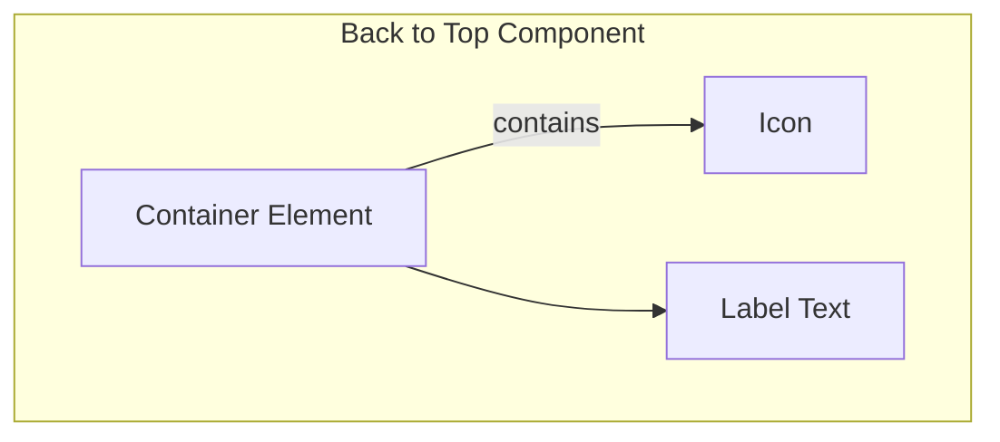

import { BrowserSupport } from "@app/_components/browser-support";
import { BuildEffort } from "@app/_components/build-effort";
import { FaqStructuredData } from "@app/_components/faq-structured-data";
import { Playground } from "@app/_components/playground";

# Back to Top

## Overview

**Back to Top** gives users a quick way back to the page top after scrolling through lengthy or [infinite content](/patterns/navigation/infinite-scroll).

This floating button or link typically sits at the bottom-right corner, improving navigation and user experience.

<BuildEffort
  level="low"
  description="Uses a simple anchor link or JavaScript scroll function. Requires smooth scrolling and proper visibility toggling."
/>

## Use Cases

### When to use:

Use **Back to Top** to **help users quickly return to long page tops without excessive scrolling**.

**Common scenarios include:**

- Long or content-heavy pages where users scroll far down
- Quick navigation back to headers or navigation menus is essential
- Blogs, documentation pages, or e-commerce category listings need extensive scrolling

### When not to use:

- Very short pages with minimal or unnecessary scrolling
- Your layout already has persistent bottom navigation or sticky top menus
- Pages without infinite scrolling where scrolling isn't an issue

### Common scenarios and examples

- Long editorial content (articles, guides, and blog posts)
- Content hubs or portals with extensive listings
- FAQ pages with collapsible or expanded sections
- Dashboards or analytics pages containing large data tables
- Infinite scrolling experiences (e.g., social feeds) to let users quickly jump to the top

## Benefits

- Better navigation and usability on long pages
- Improved site accessibility with direct routes to main navigation
- Less scrolling fatigue for mobile users
- Clean UI that hides controls until needed, showing them after scrolling

## Drawbacks

- **Not always necessary** – Short pages make the button redundant
- **Can be disruptive** – Sudden jumps to top disorient users
- **Visibility control** – Needs logic to appear after certain scroll depth
- **Hidden functionality risk** – Users might not notice or understand it
- **Placement conflicts** – Interferes with other floating UI elements without careful positioning

## Anatomy



### Component Structure

1. **Container**

- Clickable element (usually button) triggering scroll to top
- Positioned as floating element on desktop and mobile
- Handles focus states and accessibility attributes

2. **Icon (Optional)**

- Shows the go-to-top action (up arrow)
- Clear and universally recognized
- Sized for readability (16×16px or 24×24px common)
- Contrasts with background

3. **Label Text (Optional)**

- Clarifies action for screen readers or when icon alone doesn't work
- Hidden for visual users but available to assistive technology
- Visible when design needs extra clarity

4. **Visual States**

- **Default**: Visible when the user scrolls past a certain threshold
- **Hover**: Provides a visual cue (e.g. change in background color)
- **Active**: Pressed or clicked state
- **Focus**: Outline or highlight for keyboard navigation
- **Hidden**: Button is invisible or removed when the user is near the top of the page

#### **Summary of Components**

| Component     | Required? | Purpose                                                     |
| ------------- | --------- | ----------------------------------------------------------- |
| Container     | ✅ Yes    | Clickable element that triggers scrolling to the top.       |
| Icon          | ❌ No     | Visual indicator (e.g., an up arrow) for quick recognition. |
| Label Text    | ❌ No     | Provides additional clarity, especially for screen readers. |
| Visual States | ✅ Yes    | Defines interaction states (hover, active, focus, hidden).  |

## Variations

### 1. Fixed Position Button
The most common implementation - a button that remains in a fixed position (typically bottom-right) as the user scrolls.

**When to use:** Standard long-form content pages, articles, documentation

### 2. Sticky Footer Integration
Integrated into a sticky footer bar that may also contain other navigation elements.

**When to use:** When you have a persistent footer with multiple actions

### 3. Progress Indicator Combo
Combined with a scroll progress indicator that shows how far down the page the user has scrolled.

**When to use:** Long articles or tutorials where progress tracking is valuable

### 4. Expandable FAB (Floating Action Button)
A floating action button that expands to reveal multiple navigation options including "Back to Top".

**When to use:** Mobile apps or sites with multiple quick actions

### 5. Sidebar Integration
Embedded within a sticky sidebar navigation alongside other page navigation elements.

**When to use:** Documentation sites or content with extensive navigation needs

### 6. Contextual Appearance
Appears only within specific long sections rather than globally on the page.

**When to use:** Pages with distinct long sections that benefit from section-specific navigation

## Examples

### Interactive Back to Top Demo

<Playground patternType="navigation" pattern="back-to-top" example="basic" height="700px" />

This example showcases:
- Smooth scroll animation to top
- Button appears after scrolling 300px
- Fade-in/out transitions for button visibility
- Progress bar showing scroll position
- Throttled scroll events for performance
- Keyboard support (Tab to focus, Enter/Space to activate)
- Respects `prefers-reduced-motion` for accessibility
- Mobile-optimized touch targets

### Basic Implementation (HTML + minimal JS)

```html
<button type="button" class="js-back-to-top" aria-label="Back to top" hidden>
  ↑
</button>

<script>
  // Basic scroll logic
  const backToTopBtn = document.querySelector(".js-back-to-top");
  const scrollThreshold = 300; // in px

  function toggleBackToTop() {
    if (window.scrollY > scrollThreshold) {
      backToTopBtn.removeAttribute("hidden");
    } else {
      backToTopBtn.setAttribute("hidden", "");
    }
  }

  function scrollToTop() {
    window.scrollTo({ top: 0, behavior: "smooth" });
  }

  document.addEventListener("scroll", toggleBackToTop);
  backToTopBtn.addEventListener("click", scrollToTop);
</script>
```

### React Implementation with Hooks

```jsx
import { useState, useEffect } from 'react';

function BackToTop() {
  const [isVisible, setIsVisible] = useState(false);

  useEffect(() => {
    const toggleVisibility = () => {
      setIsVisible(window.scrollY > 300);
    };

    window.addEventListener('scroll', toggleVisibility);
    return () => window.removeEventListener('scroll', toggleVisibility);
  }, []);

  const scrollToTop = () => {
    window.scrollTo({
      top: 0,
      behavior: 'smooth'
    });
  };

  return isVisible ? (
    <button
      onClick={scrollToTop}
      className="back-to-top"
      aria-label="Back to top"
    >
      ↑
    </button>
  ) : null;
}
```

### CSS Styling

```css
.back-to-top {
  position: fixed;
  bottom: 2rem;
  right: 2rem;
  width: 3rem;
  height: 3rem;
  border-radius: 50%;
  background-color: #007bff;
  color: white;
  border: none;
  cursor: pointer;
  opacity: 0.9;
  transition: opacity 0.3s, transform 0.3s;
  z-index: 1000;
}

.back-to-top:hover {
  opacity: 1;
  transform: translateY(-4px);
}

.back-to-top:focus {
  outline: 2px solid #0056b3;
  outline-offset: 2px;
}

/* Reduce motion for accessibility */
@media (prefers-reduced-motion: reduce) {
  .back-to-top {
    transition: none;
  }
  
  * {
    scroll-behavior: auto !important;
  }
}

/* Mobile optimization */
@media (max-width: 768px) {
  .back-to-top {
    bottom: 1rem;
    right: 1rem;
  }
}
```

## Best Practices

### Content

**Do's ✅**

- Show a clear visual indicator (usually an up arrow icon)
- Display the button only after the user scrolls a predetermined distance
- Hide it when the user is near the top of the page
- Use an accessible label (e.g., `aria-label="Back to top"`) if the text is omitted

**Don'ts ❌**

- Don't make it permanently visible for short pages—it can be distracting
- Don't use vague icons or labels (e.g., a random symbol without context)
- Don't crowd the button with other floating elements
- Don't rely solely on color for states—use shape or text changes if possible

### Accessibility

**Do's ✅**

- Ensure the button is keyboard-focusable and can be activated via Enter or Space
- Provide sufficient color contrast between the button and its background
- Use an appropriate aria-label or descriptive text for screen readers
- Manage focus: after scrolling up, keep the user informed or maintain logical focus

**Don'ts ❌**

- Don't hide it behind complex interactions or animations
- Don't place it in a position that overlaps other important UI elements
- Don't disable focus outlines without providing an alternative focus style

### Visual Design

**Do's ✅**

- Use a large enough icon or label for quick recognition (minimum 16×16px icon)
- Maintain consistent styling with the rest of your UI (color, shape, corners)
- Incorporate hover/focus states that match your design system guidelines
- Place it in a fixed position (often bottom-right) for easy access

**Don'ts ❌**

- Don't block important content with a floating button
- Don't make the button so small that it's hard to tap on mobile
- Don't use misleading icons (ensure the arrow is pointing up)

### Mobile & Touch Considerations

**Do's ✅**

- Use a minimum touch target of 44×44px
- Keep it within thumb-friendly zones at the bottom of the screen
- Make sure it doesn't overlap interactive elements (navigation drawers, chat bubbles)
- Add any necessary spacing from device edges to avoid accidental swipes

**Don'ts ❌**

- Don't place it in corners difficult to reach on large screens
- Don't rely on hover states for mobile users—visual changes should appear on tap/press
- Don't crowd the bottom area with too many floating icons

### Layout & Positioning

**Do's ✅**

- Fix its position to the viewport so it remains visible during scrolling
- Use consistent margin or spacing from edges for aesthetic alignment
- Keep in mind other fixed UI elements such as sticky footers or chat widgets

**Don'ts ❌**

- Don't move it around the page as the user scrolls
- Don't tie it to an element that scrolls out of view

## Common Mistakes & Anti-Patterns

### 🚫 **Always Visible on Short Pages**
**The Problem:**
Showing the Back to Top button on pages that don't require scrolling or have minimal content creates unnecessary UI clutter.

**How to Fix It:**
Only display the button after the user has scrolled at least 2x the viewport height or a minimum of 1000px.

### 🚫 **Jarring Jump Without Animation**
**The Problem:**
Instantly jumping to the top without smooth scrolling can disorient users and make them lose context.

**How to Fix It:**
Implement smooth scrolling with `scroll-behavior: smooth` or JavaScript animation with appropriate duration (300-500ms).

### 🚫 **Poor Button Visibility**
**The Problem:**
Using low contrast colors or making the button too small/transparent makes it hard to notice or click.

**How to Fix It:**
Ensure sufficient color contrast (WCAG AA minimum) and use a minimum touch target of 44x44px.

### 🚫 **Blocking Important Content**
**The Problem:**
Placing the button where it covers important interactive elements like chat widgets or cookie banners.

**How to Fix It:**
Carefully position the button to avoid overlapping with other floating elements, adjusting position dynamically if needed.

### 🚫 **Missing Keyboard Support**
**The Problem:**
Button only works with mouse/touch, excluding keyboard users from using the feature.

**How to Fix It:**
Ensure the button is keyboard accessible, focusable with Tab, and activatable with Enter/Space keys.

### 🚫 **No Visual Feedback on Interaction**
**The Problem:**
Button doesn't provide hover, focus, or active states, leaving users uncertain if their interaction registered.

**How to Fix It:**
Implement clear visual states for all interactions including hover, focus, active, and disabled states.

## Micro-Interactions & Animations

### Button Appearance Animation
- **Effect:** Fade in with slight scale up
- **Timing:** 200ms ease-out
- **Trigger:** When scroll threshold is passed
- **Implementation:** CSS transition on opacity and transform

### Hover State Transition
- **Effect:** Background color change with subtle shadow elevation
- **Timing:** 150ms ease-in-out
- **Trigger:** Mouse hover or focus
- **Implementation:** CSS :hover and :focus states

### Click Feedback
- **Effect:** Scale down slightly then back to normal
- **Timing:** 100ms down, 150ms up
- **Trigger:** Click or tap
- **Implementation:** CSS :active state with transform: scale(0.95)

### Scroll Animation
- **Effect:** Smooth easing scroll to top
- **Timing:** 300-500ms depending on scroll distance
- **Trigger:** Button activation
- **Implementation:** JavaScript with easing function or CSS scroll-behavior

### Progress Indicator (Optional)
- **Effect:** Circular progress fills as user scrolls down
- **Timing:** Real-time tracking
- **Trigger:** Scroll events (throttled)
- **Implementation:** SVG stroke-dasharray animation

### Hide Animation
- **Effect:** Fade out with slight scale down
- **Timing:** 200ms ease-in
- **Trigger:** When user scrolls back near top
- **Implementation:** CSS transition with visibility toggle

## Tracking

### Key Events to Track

| **Event Name** | **Description** | **Why Track It?** |
| --- | --- | --- |
| `back_to_top.shown` | Button becomes visible after scroll threshold | Understand if users scroll far enough to see it |
| `back_to_top.clicked` | User clicks/taps the button | Measure actual usage and engagement |
| `back_to_top.keyboard_activated` | Button activated via keyboard | Track accessibility feature usage |
| `back_to_top.scroll_depth` | Maximum scroll depth before using button | Understand when users decide to return |
| `back_to_top.time_to_use` | Time between button appearance and click | Measure decision making time |

### Event Payload Structure

```json
{
  "event": "back_to_top.clicked",
  "properties": {
    "page_height": 5000,
    "scroll_depth": 3500,
    "time_on_page": 45,
    "device_type": "mobile",
    "button_position": "bottom-right"
  }
}
```

### Key Metrics to Analyze

- **Usage Rate:** Percentage of users who see and use the button
- **Scroll Depth at Use:** Average scroll position when button is clicked
- **Time to Engagement:** How long users take to click after button appears
- **Device Breakdown:** Usage patterns across desktop vs mobile
- **Page Type Performance:** Which content types benefit most from the feature

## Localization

```json
{
  "back_to_top": {
    "button": {
      "label": "Back to top",
      "aria_label": "Scroll back to top of page",
      "tooltip": "Return to top"
    },
    "announcements": {
      "scrolling": "Scrolling to top of page",
      "completed": "Reached top of page"
    },
    "progress": {
      "indicator_label": "Scroll progress: {percentage}%"
    }
  }
}
```

### RTL (Right-to-Left) Considerations

- Position button on bottom-left for RTL languages
- Mirror any directional icons appropriately
- Adjust animation directions for RTL context

### Cultural Considerations

- **Icon choice:** Up arrow is universally understood
- **Position:** Bottom-right is standard in LTR, bottom-left in RTL
- **Color significance:** Avoid colors with negative cultural connotations

## Accessibility

### Performance Metrics

```html
<button type="button" class="js-back-to-top" aria-label="Back to top" hidden>
  ↑
</button>

<script>
  // Basic scroll logic
  const backToTopBtn = document.querySelector(".js-back-to-top");
  const scrollThreshold = 300; // in px

  function toggleBackToTop() {
    if (window.scrollY > scrollThreshold) {
      backToTopBtn.removeAttribute("hidden");
    } else {
      backToTopBtn.setAttribute("hidden", "");
    }
  }

  function scrollToTop() {
    window.scrollTo({ top: 0, behavior: "smooth" });
  }

  document.addEventListener("scroll", toggleBackToTop);
  backToTopBtn.addEventListener("click", scrollToTop);
</script>
```

### React Implementation with Hooks

```tsx
import { useState, useEffect } from 'react';

function BackToTop() {
  const [isVisible, setIsVisible] = useState(false);
  
  useEffect(() => {
    const toggleVisibility = () => {
      setIsVisible(window.scrollY > 300);
    };
    
    window.addEventListener('scroll', toggleVisibility);
    return () => window.removeEventListener('scroll', toggleVisibility);
  }, []);
  
  const scrollToTop = () => {
    window.scrollTo({
      top: 0,
      behavior: 'smooth'
    });
  };
  
  return (
    <button
      className={`back-to-top ${isVisible ? 'visible' : ''}`}
      onClick={scrollToTop}
      aria-label="Back to top"
    >
      ↑
    </button>
  );
}
```

### CSS Styling

```css
.back-to-top {
  position: fixed;
  bottom: 1rem;
  right: 1rem;
  width: 2.5rem;
  height: 2.5rem;
  border-radius: 50%;
  background: #333;
  color: white;
  border: none;
  cursor: pointer;
  opacity: 0;
  visibility: hidden;
  transition: opacity 200ms, visibility 200ms;
}

.back-to-top.visible {
  opacity: 1;
  visibility: visible;
}

.back-to-top:hover {
  background: #555;
}

.back-to-top:focus {
  outline: 2px solid #0066cc;
  outline-offset: 2px;
}
```

## Accessibility

### Performance Metrics

**Target Metrics:**

- **Scroll trigger threshold**: Show after 2x viewport height (or ~1000px)
- **Scroll animation duration**: 300-500ms for smooth feel
- **Button fade-in**: < 200ms transition
- **Interaction delay**: < 50ms response to click
- **Frame rate**: Maintain 60fps during scroll animation

**Scroll Performance:**

- **Throttle scroll events**: Check position every 100-150ms (not on every scroll)
- **Use Intersection Observer**: More performant than scroll listeners
- **Passive event listeners**: Add `{ passive: true }` to scroll handlers
- **RAF for animations**: Use requestAnimationFrame for smooth scrolling

**Visibility Optimization:**

- **CSS transitions**: Use for show/hide animations (not JavaScript)
- **Transform + opacity**: Animate these properties for GPU acceleration
- **Will-change**: Apply sparingly to button during transitions
- **Avoid reflows**: Don't change layout properties during animations

**Mobile Performance:**

- **Touch responsiveness**: < 100ms feedback on tap
- **Reduced motion**: Respect `prefers-reduced-motion` media query
- **Scroll behavior**: Use native CSS `scroll-behavior: smooth` when possible
- **Battery impact**: Minimize continuous animations

## Testing Guidelines

### Functional Testing

**Should ✓**

- [ ] Show the button after scrolling a set distance
- [ ] Smoothly scroll to top when clicked
- [ ] Hide the button when the user is near the top
- [ ] Maintain correct visible/hidden states on page load and resize
- [ ] Prevent overlapping interactions with other floating components

Accessibility Testing

**Should ✓**

- [ ] Have proper ARIA labels for icon-only implementations
- [ ] Be operable with keyboard (Enter, Space)
- [ ] Maintain a visible focus state when tabbed to
- [ ] Provide enough contrast between button and background
- [ ] Respect user motion preferences (reduce motion if system preferences are set)

Visual Testing

**Should ✓**

- [ ] Float consistently at the chosen position across different viewport sizes
- [ ] Show correct hover, focus, and active states
- [ ] Remain unobtrusive yet visible
- [ ] Align with other design elements and not overlap key UI components

Performance Testing

**Should ✓**

- [ ] Not introduce layout shifts when appearing or disappearing
- [ ] Handle rapid scrolling up/down events effectively
- [ ] Support smooth animations without jank
- [ ] Remain performant on mobile devices

## Browser Support

<BrowserSupport features={["css.position.fixed", "window.api.scrollto"]} />

## Performance Metrics

### Target Metrics

**Response Times:**
- **Button appearance:** < 50ms after scroll threshold
- **Hover feedback:** < 100ms visual response
- **Click to scroll start:** < 50ms
- **Scroll animation:** 300-500ms duration
- **Focus outline:** Immediate (< 16ms)

**Scroll Performance:**
- **Throttle rate:** Check position every 100-150ms
- **Frame rate:** Maintain 60fps during animations
- **Memory usage:** < 1MB for button component
- **CPU usage:** < 5% during scroll monitoring

**Animation Performance:**
- **Use transform/opacity:** GPU-accelerated properties only
- **Avoid reflows:** No layout changes during animations
- **Will-change:** Apply sparingly, remove after animation
- **RequestAnimationFrame:** For smooth scroll implementations

**Mobile Optimization:**
- **Touch response:** < 100ms feedback
- **Gesture recognition:** Support swipe-to-top on iOS
- **Battery impact:** Minimal with throttled events
- **Reduced motion:** Respect user preferences

## SEO Considerations

- **No direct SEO impact** - Back to Top is a UX feature that doesn't affect content indexing
- **Indirect benefits:** Improved user engagement metrics (time on page, bounce rate)
- **Ensure button doesn't hide content** from search engine crawlers
- **Use semantic HTML** (`<button>` element) for better accessibility signals
- **Avoid keyword stuffing** in button text or ARIA labels

## Design Tokens

These design tokens follow the [Design Tokens Format](https://design-tokens.github.io/community-group/format/) specification and can be used with various token transformation tools to generate platform-specific variables.

### Button Tokens in DTF Format

```json
{
  "$schema": "https://design-tokens.org/schema.json",
  "backToTop": {
    "position": {
      "right": { "value": "1rem", "type": "dimension" },
      "bottom": { "value": "1rem", "type": "dimension" }
    },
    "sizing": {
      "width": { "value": "2.5rem", "type": "dimension" },
      "height": { "value": "2.5rem", "type": "dimension" },
      "touchTarget": {
        "value": "2.75rem",
        "type": "dimension",
        "description": "44px minimum touch target"
      }
    },
    "icon": {
      "size": { "value": "1.25rem", "type": "dimension" }
    },
    "border": {
      "radius": { "value": "50%", "type": "dimension" },
      "width": { "value": "0px", "type": "dimension" }
    },
    "colors": {
      "background": {
        "default": { "value": "{color.gray.200}", "type": "color" },
        "hover": { "value": "{color.gray.300}", "type": "color" },
        "active": { "value": "{color.gray.400}", "type": "color" }
      },
      "icon": {
        "default": { "value": "{color.gray.900}", "type": "color" }
      }
    },
    "states": {
      "focusRing": {
        "width": { "value": "2px", "type": "dimension" },
        "offset": { "value": "2px", "type": "dimension" },
        "color": { "value": "{color.primary.200}", "type": "color" }
      }
    }
  }
}
```


## FAQ

<FaqStructuredData
  items={[
    {
      question: "What is a 'Back to Top' button?",
      answer:
        "A 'Back to Top' button is a user interface element that allows users to quickly return to the top of a webpage without manually scrolling, enhancing navigation on long pages.",
    },
    {
      question: "When should I use a 'Back to Top' button?",
      answer:
        "Implement a 'Back to Top' button on pages that require significant scrolling, typically more than two screens of content. This feature is especially beneficial for mobile users and those with accessibility needs.",
    },
    {
      question: "Where should the 'Back to Top' button be placed?",
      answer:
        "The button is typically positioned in the bottom right corner of the page, where users expect to find it. This placement keeps it accessible yet unobtrusive.",
    },
    {
      question: "How can I make a 'Back to Top' button accessible?",
      answer:
        "Ensure the button is keyboard navigable by using a standard `<button>` element, provide a descriptive label like 'Back to Top', and implement visible focus indicators for users navigating via keyboard.",
    },
    {
      question:
        "What are the best practices for designing a 'Back to Top' button?",
      answer:
        "Use clear labeling, maintain a consistent position, ensure the button is appropriately sized for both desktop and mobile devices, and avoid covering important content. The button should appear after users have scrolled down a significant portion of the page.",
    },
  ]}
/>

## Related Patterns

Consider these related patterns when implementing **Back to Top**:

- [Infinite Scroll](/patterns/navigation/infinite-scroll) - Often paired with Back to Top for long scrolling experiences.
- [Pagination](/patterns/navigation/pagination) - Alternative navigation method for long content lists.
- [Progress Indicator](/patterns/user-feedback/progress-indicator) - Shows users their scroll position on long pages.
- [Sidebar](/patterns/navigation/sidebar) - Can include persistent navigation that reduces need for Back to Top.

## Resources

### Libraries & Frameworks

#### React Components
- [React Scroll](https://github.com/fisshy/react-scroll) – Scroll components with smooth animations
- [React Back to Top Button](https://github.com/HermanNygaard/react-back-to-top-button) – Simple back to top button component

#### Vue Components
- [Vue Backtotop](https://github.com/caiofsouza/vue-backtotop) – Back to top component for Vue.js
- [Vue Scroll To](https://github.com/rigor789/vue-scrollto) – Scrolling to elements with easing

#### Vanilla JavaScript
- [Vanilla Back To Top](https://github.com/vfeskov/vanilla-back-to-top) – Lightweight vanilla JS implementation
- [ScrollToTop.js](https://github.com/cferdinandi/smooth-scroll) – Smooth scrolling library

### Articles

- [Back-to-Top Button Design Guidelines](https://www.nngroup.com/articles/back-to-top/)
- [Scroll to Top: Does it Need to be Accessible?](https://www.digitala11y.com/scroll-to-top-does-it-need-to-be-accessible/)
