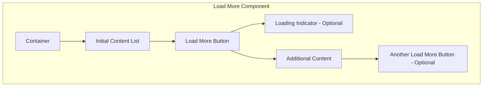

import { BrowserSupport } from "@app/_components/browser-support";
import { BuildEffort } from "@app/_components/build-effort";
import { FaqStructuredData } from "@app/_components/faq-structured-data";
import { Playground } from "@app/_components/playground";
import { PatternPreview } from "@app/_components/pattern-preview";

# Load More

<PatternPreview />

## Overview

**Load More** lets users request additional content dynamically instead of loading everything upfront. This pattern cuts initial page load times and gives users seamless access to more content when they need it.

<BuildEffort
  level="medium"
  description="Requires dynamic content loading, state management, accessibility considerations (keyboard navigation, `aria-live` updates), and performance optimizations. The button should be removed when all content is loaded."
/>

## Use Cases

### When to use:

Use Load More when users should explore content progressively at their own pace without getting overwhelmed. Unlike infinite scrolling, Load More gives users clear control and lets them consciously decide when to view more items.

For better usability, make sure the Load More button gets **removed when all content is loaded** or updates to show that no additional items remain (like **"No More Results"**).

**Common scenarios include:**

- Large lists of content need pagination (news feeds, product listings)
- Page performance improves by loading only a subset of data initially
- Users browse progressively instead of needing all content at once
- You want an alternative to infinite scrolling with more user control

### When not to use:

- The full content list is small enough to load upfront without performance issues
- Users need to compare multiple items at once ([pagination](/patterns/navigation/pagination) works better here)
- Real-time updates or continuous data streaming is required

### Common scenarios and examples

- **E-commerce**: Loading additional products in a grid or list
- **News or blog feeds**: Expanding more articles dynamically
- **Social media feeds**: Loading additional posts without overwhelming users
- **Search results**: Fetching more results upon user request

## Benefits

- **Speeds up initial page load** by reducing data overhead
- **Users control** their content consumption, avoiding cognitive overload
- **Better accessibility** than infinite scrolling since users keep track of their position
- **Works across devices** with controlled data retrieval
- **Footer stays accessible** – users can reach secondary links like policies, shipping info, and contact details
- **Stops unnecessary clicks** by **removing the Load More button once everything loads** or showing **"No More Results"**
- **Prevents layout jumps** – newly loaded content appears smoothly without shifting user position

## Drawbacks

- **User Effort** – Users must take action to reveal more content, not seamless like infinite scroll
- **Hidden Content Risk** – Users might miss that more content exists if the button lacks visibility
- **Flow Interruption** – Clicking Load More breaks immersion compared to continuous scrolling
- **Navigation Issues** – Returning to previously loaded sections gets tricky without proper implementation
- **SEO Hurdles** – Search engines might skip dynamically loaded content without proper handling
- **Accessibility Work** – Screen readers need careful ARIA implementation to announce new content
- **Performance Cost** – Multiple fetch requests impact performance without optimization

## Anatomy



### Component Structure

1. **Container**

   - Wraps the entire load more component
   - Keeps content properly structured and styled

2. **Initial Content List**

   - Shows a **limited number of items** to avoid overwhelming users
   - Sets the default **starting state** before additional content loads

3. **Load More Button**

   - Primary trigger for **loading additional content**
   - Must show **clear affordance** that more content exists
   - Often includes **ARIA attributes** to indicate loading state

4. **Loading Indicator (Optional)**

   - Shows **visual feedback** while fetching new content
   - Usually a **spinner, progress bar, or skeleton loader**

5. **Additional Content**

   - **Newly loaded items** appear after clicking Load More
   - Must blend **seamlessly** with the initial content list

6. **Another Load More Button (Optional)**
   - Appears **if more content is available after the first load**.
   - Helps users **incrementally explore content** without scrolling endlessly.

#### **Summary of Components**

| Component                | Required? | Purpose                                                      |
| ------------------------ | --------- | ------------------------------------------------------------ |
| Container                | ✅ Yes    | Wraps the content that will load more items.                 |
| Initial Content List     | ✅ Yes    | Displays a limited set of items to avoid overwhelming users. |
| Load More Button         | ✅ Yes    | Allows users to manually fetch more content.                 |
| Loading Indicator        | ❌ No     | Shows progress while loading more items.                     |
| Additional Content       | ✅ Yes    | The dynamically inserted content after clicking "Load More." |
| Another Load More Button | ❌ No     | Appears if further content can still be loaded.              |

## Variations

### Basic Load More
Standard button that loads additional content when clicked.

### Load More with Counter
Shows how many items will be loaded (e.g., "Load 10 more items").

### Load More with Progress
Displays overall progress (e.g., "Showing 20 of 100 items").

### Auto-Load on Scroll Proximity
Automatically triggers when user scrolls near the button (hybrid approach).

### Load More with Categories
Multiple load more buttons for different content sections.

### Skeleton Loading
Shows placeholder content while real content loads.

## Best Practices

### Content

**Do's ✅**

- Show clearly that more content is available
- Pick concise, meaningful labels: **"Load More"**, **"Show More"**, or **"See More Results"**
- Keep transitions smooth when new content loads

**Don'ts ❌**

- Skip vague labels like **"Click Here"**
- Never load excessive content at once; keep batches manageable
- Avoid disrupting the existing layout when inserting new content

### Accessibility & UX

**Do's ✅**

- Make the **Load More** button keyboard accessible (`tab` and `enter` keys)
- Announce new content to screen readers (`aria-live="polite"`)
- Give feedback (loading indicators) to show content retrieval
- **Keep keyboard focus logical** – After clicking Load More, focus shifts **to the newly loaded content**, not back to the button
- **Alert assistive technologies** – `aria-live="polite"` tells screen reader users that additional items loaded

**Don'ts ❌**

- Keep focus on the **Load More** button after clicking (skip `disabled`)
- Never use infinite scrolling without a **Load More** fallback
- Stop relying solely on color for action buttons (check contrast and readable text)

### Visual Design

**Do's ✅**

- Put the **Load More** button prominently below existing content
- Show clear visual feedback when new content loads (animations, progress indicators)
- Keep spacing and alignment consistent with existing content

**Don'ts ❌**

- Never make the button too small for mobile tapping
- Prevent sudden layout shifts when loading new content

### Layout & Positioning

**Do's ✅**

- Put the **Load More** button at logical content breakpoints
- Loaded content appears right after existing items
- Keep the user's position in the list after loading more

**Don'ts ❌**

- Never insert new content above the user's current view unless explicitly requested
- Skip loading content off-screen without visual confirmation

## Common Mistakes & Anti-Patterns

#### No Visual Feedback After Clicking "Load More"

**❌ What's Wrong?**

Users think the button broke if nothing happens immediately after clicking.

**How to Fix It?**
Add a **spinner or loading animation** and consider disabling the button until new content fully loads.

---

#### Loading Too Many Items at Once

**❌ What's Wrong?**

Large content batches slow performance, cause layout shifts, and overwhelm users.

**How to Fix It?**
Load **smaller chunks** (10–20 items per click). Use incremental updates instead of one large data fetch.

---

#### Forcing Users to Click "Load More" Too Often

**❌ What's Wrong?**

Repeated Load More clicks frustrate users and make pages feel unresponsive.

**How to Fix It?**
Try **auto-loading on scroll** after a few manual loads, or increase batch size when you detect high engagement.

---

#### No Clear End of Content Indicator

**❌ What's Wrong?**

Users can't tell when they've reached the end, clicking Load More repeatedly with no result.

**How to Fix It?**
Show a "You've reached the end" message or hide the button entirely when no more data exists.

---

#### Not Accessible via Keyboard (Accessibility)

**❌ What's Wrong?**

Load More buttons that aren't focusable or don't respond to keyboard events lock out keyboard users from loading new content.

**How to Fix It?**
Use a proper, focusable element like `<button>`. Check that `Tab` focuses it and `Enter/Space` triggers loading.

---

#### No ARIA Updates for New Content (Accessibility)

**❌ What's Wrong?**

Screen reader users miss new items without announcements that content got added to the page.

**How to Fix It?**
Wrap your list with `role="region"` or use `aria-live="polite"`. Update the live region or add a brief "New content loaded" announcement after each batch renders.

---

#### Insufficient Visual Contrast or Feedback (Accessibility)

**❌ What's Wrong?**

Low-contrast Load More buttons or hard-to-see loading indicators (like small spinners on cluttered backgrounds) cause problems for low-vision users.

**How to Fix It?**
Use **high-contrast** button styles and **clear, visible** loading indicators (spinner or progress bar) that stand out from surrounding content.

## Examples

### Interactive Load More Demo

<Playground patternType="navigation" pattern="load-more" example="basic" height="600px" />

This example demonstrates:
- Loading state with spinner animation
- Smooth content insertion with fade-in effect
- Proper button state management (disabled during loading)
- Progress tracking (showing X of Y items)
- Keyboard support (Enter/Space to activate)
- Screen reader announcements for loaded content
- Automatic button removal when all content is loaded

## Micro-Interactions & Animations

### Button State Transitions
- **Effect:** Smooth transition between default, hover, loading, and disabled states
- **Timing:** 200ms ease-out for hover effects, immediate for loading state
- **Implementation:** CSS transitions on background-color, transform, and opacity

### Loading Spinner Animation
- **Effect:** Rotating spinner or pulsing dots to indicate loading
- **Timing:** 1s infinite rotation or 1.4s pulse sequence
- **Implementation:** CSS keyframe animations or SVG animations

### Content Insertion Animation
- **Effect:** New items fade in and slide up from below
- **Timing:** 300ms ease-out for each item, staggered by 50ms
- **Implementation:** CSS animations with animation-delay for stagger effect

### Progress Counter Update
- **Effect:** Number smoothly increments when new items load
- **Timing:** 500ms ease-in-out
- **Implementation:** JavaScript counter animation with requestAnimationFrame

### End of Content Feedback
- **Effect:** Button fades out and "End of content" message fades in
- **Timing:** 300ms crossfade
- **Implementation:** Opacity transition with element swap

## Tracking

Load More tracking measures how users navigate content, their preference for incremental loading versus pagination, and engagement depth. User behavior analysis optimizes when and how Load More gets implemented.

### Key Tracking Points

Load More interactions provide valuable user behavior insights. Key events to track include:

| **Event Name**           | **Description**                                                                           | **Why Track It?**                                                            |
| ------------------------ | ----------------------------------------------------------------------------------------- | ---------------------------------------------------------------------------- |
| `load_more.view`         | When the "Load More" button enters the viewport.                                          | Determines visibility and whether users see the option to load more content. |
| `load_more.click`        | When a user clicks the "Load More" button.                                                | Measures engagement and intent to see additional content.                    |
| `load_more.auto_trigger` | When more content loads automatically without user action (e.g., lazy loading on scroll). | Helps compare manual clicks vs. auto-triggered loads.                        |
| `load_more.depth`        | The number of times a user loads more content in one session.                             | Indicates how deep users are willing to explore.                             |
| `load_more.scroll_usage` | If infinite scrolling is enabled, tracks when users reach the "Load More" trigger area.   | Helps compare scrolling behavior vs. button clicks.                          |

### Event Payload Structure

For consistent tracking, use this event format:

```json
{
  "event": "load_more.click",
  "properties": {
    "load_more_id": "search_results",
    "current_page": 1,
    "next_page": 2,
    "total_pages": 5
  }
}
```

### Key Metrics to Analyze

After setting up tracking, these metrics provide actionable insights:

- **Load More Click Rate** → Percentage of users who click the "Load More" button.
- **Auto-Trigger Rate** → Percentage of users who load more content automatically via scrolling (if enabled).
- **Average Load More Depth** → Number of times users load more content in a session.
- **Completion Rate** → Percentage of users who reach the final batch of content.
- **Scroll vs. Click Engagement** → If both options exist, measures user preference for scrolling vs. manually clicking "Load More."

### Insights & Optimization Based on Tracking

Tracking data analysis optimizes the Load More experience:

- 🚨 **Low Load More Click Rate?**
  → Users don't notice the button or find it unnecessary.
  **Fix:** Improve visibility, adjust styling, or test auto-loading on scroll.

- ⏳ **High Auto-Trigger Rate?**
  → Users rely on automatic loading instead of clicking.
  **Fix:** Consider replacing Load More with infinite scrolling or add a "Show More" summary before triggering content.

- 🔄 **Low Average Load More Depth?**
  → Users stop after one or two loads.
  **Fix:** Make the first few results engaging enough to encourage further exploration.

- 🔁 **Low Completion Rate?**
  → Users rarely reach the final batch.
  **Fix:** Try smaller content chunks per load or add preview indicators ("Showing 20 of 100 results").

- ⚙️ **High Scroll vs. Click Engagement?**
  → Users prefer scrolling over clicking.
  **Fix:** Consider switching to infinite scrolling but maintain good performance and usability.

Continuous monitoring of these metrics refines the Load More pattern, helping users navigate content without unnecessary friction.

## Localization

```json
{
  "load_more": {
    "button_text": {
      "default": "Load More",
      "with_count": "Load {count} More Items",
      "loading": "Loading..."
    },
    "progress": {
      "showing": "Showing {current} of {total} items",
      "all_loaded": "All items loaded",
      "end_message": "You've reached the end"
    },
    "errors": {
      "load_failed": "Failed to load items. Please try again.",
      "network_error": "Check your connection and try again"
    },
    "announcements": {
      "items_loaded": "{count} new items loaded",
      "loading_started": "Loading more items",
      "no_more_items": "No more items to load"
    }
  }
}
```

## Code Examples

### Basic Load More Implementation

```html
<div class="content-list" role="region" aria-label="Content items">
  <ul id="items-list">
    <!-- Initial items -->
  </ul>

  <button
    type="button"
    class="load-more-btn"
    aria-label="Load more items"
    data-loading="false"
  >
    <span class="btn-text">Load More</span>
    <span class="btn-spinner" aria-hidden="true"></span>
  </button>

  <div class="load-progress" aria-live="polite">
    Showing <span id="current-count">10</span> of <span id="total-count">50</span> items
  </div>
</div>
```

### Load More with Intersection Observer

```javascript
// Auto-load when button is near viewport
const loadMoreBtn = document.querySelector('.load-more-btn');

const observer = new IntersectionObserver((entries) => {
  entries.forEach(entry => {
    if (entry.isIntersecting && !isLoading) {
      // Trigger load when button is 200px from viewport
      loadMoreContent();
    }
  });
}, {
  rootMargin: '200px'
});

observer.observe(loadMoreBtn);
```

## Accessibility

### ARIA Attributes

**Required ARIA attributes:**

- Use `aria-controls` to associate the **Load More** button with the content being updated.
- Announce loading states with `aria-live="polite"`.
- If the button is removed after loading all content, update its `aria-label` to indicate that no more content is available.

### Screen Reader Support

**Implementation considerations:**

- Users should be informed when new content is added.
- Ensure proper tab focus order when new items appear.
- Use accessible button elements (`<button>` instead of `<div>` or `<span>`).

## Testing Guidelines

### Functional Testing

**Should ✓**

- Verify that the **Load More** button successfully loads additional content when clicked.
- Ensure **smooth transitions** and that new content is **visually distinct** without disrupting the layout.
- Test **multiple clicks on the button** to confirm continuous content retrieval works as expected.
- Ensure the button **disables or disappears** when all content has been loaded.
- Validate that clicking **Load More** does not cause a page refresh or unexpected navigation.
- Confirm that the **user remains in the same scroll position** after loading more content.
- Ensure newly loaded content appears **sequentially** in the correct order.
- Check for **error handling**—simulate network failures to confirm users receive an appropriate message.

---

### Accessibility Testing

**Should ✓**

- Verify that the **Load More** button is fully keyboard accessible\*\* (`Tab` to navigate, `Enter` to activate).
- Ensure that new content is **announced to screen readers** using `aria-live="polite"`.
- Validate that **focus moves to the newly loaded content** rather than back to the button.
- Check that the button has **proper contrast** and is easily readable.
- Confirm that screen readers announce when **no more content is available** after the last load.
- Ensure that `aria-controls` links the button to the dynamically updated content.
- Verify that users can **navigate through the loaded content** using standard keyboard interactions.

---

### Performance Testing

**Should ✓**

- Ensure that **each content load request is optimized** to avoid unnecessary data retrieval.
- Check that **lazy-loading techniques** prevent excessive memory usage.
- Test with **large datasets** to confirm that performance remains smooth.
- Validate that **content loading does not block interactions** with other page elements.
- Measure **network requests and response times** to ensure efficient API calls.
- Check that **animations and transitions** remain smooth without jank.
- Verify that **multiple Load More interactions do not degrade performance** over time.

---

### SEO Considerations Testing

**Should ✓**

- Confirm that dynamically loaded content is **indexable by search engines** (e.g., using server-side rendering or progressive enhancement).
- Check that search engines can **crawl and discover** all content, even if JavaScript is disabled.
- Ensure that **important content is not hidden behind JavaScript-only interactions**.
- Run Lighthouse or Google's Mobile-Friendly Test to ensure SEO best practices are met.
- Test the page with JavaScript disabled to confirm that at least some content remains visible.

---

### User Experience Testing

**Should ✓**

- Observe user behavior to determine if the **Load More button is easily discoverable**.
- Ensure that the button **clearly communicates** its function (e.g., "Load More" vs. "Show More Results").
- Test on **mobile devices** to verify tap targets are large enough.
- Confirm that **loading indicators** provide clear feedback during content retrieval.
- Ensure that **content loads fast enough** to avoid user frustration.
- Validate that **users do not get lost** when additional content is inserted.

---

### Edge Case Testing

**Should ✓**

- Simulate a **slow network connection** to test how loading delays affect usability.
- Check behavior when **no more content is available**—the button should be removed or updated.
- Verify how the component behaves if the **API fails** or returns an error.
- Test **rapid multiple clicks** on the button to ensure proper request handling.
- Ensure **back navigation retains loaded content**, preventing users from losing progress.
- Confirm the **component adapts to different screen sizes and orientations**.

## Usability Testing Insights

Based on usability studies, users expect:
- **Clear progress indication** - Users want to know how much content remains
- **Consistent batch sizes** - Loading 10 items then 50 items confuses users
- **Preserved scroll position** - Page shouldn't jump when new content loads
- **Quick loading times** - Users abandon if loading takes > 3 seconds
- **End-of-content clarity** - Users repeatedly click when the end isn't clear

## Browser Support

<BrowserSupport features={["api.IntersectionObserver", "css.transitions", "html.elements.button"]} />

## Performance Metrics

**Target Metrics:**

- **Initial button render**: < 50ms after page load
- **Loading state feedback**: < 100ms after click (immediate visual response)
- **Content fetch time**: 200-500ms for typical batch (10-20 items)
- **DOM update after fetch**: < 100ms for smooth insertion
- **Total time to new content visible**: < 600ms ideal, < 1000ms acceptable

**Memory Considerations:**

- **Items per batch**: 10-20 items optimal (balance between requests and memory)
- **DOM nodes**: Monitor total count, consider virtualization after 100+ items
- **Image lazy loading**: Load images only when approaching viewport
- **Previous content**: Keep in DOM for scroll position preservation

**Network Optimization:**

- **Prefetch next batch**: Start loading when user is 80% through current content
- **Request debouncing**: Prevent multiple simultaneous requests
- **Caching strategy**: Cache loaded pages for back navigation
- **Compression**: Enable gzip/brotli for API responses

**Animation Performance:**

- **Use CSS transforms**: For smooth loading animations (not margins/positions)
- **Will-change property**: Apply to animated elements sparingly
- **RequestAnimationFrame**: For JavaScript-based scroll animations
- **Reduce reflows**: Batch DOM updates, avoid layout thrashing

## SEO Considerations

- Ensure content loaded via **Load More** is indexable by search engines.
- Use progressive enhancement to allow content visibility even if JavaScript is disabled.
- Provide a paginated alternative if necessary for deep content navigation.
- Ensure that dynamically loaded content is **crawlable by search engines** by using progressive enhancement techniques or **server-side rendering**.
- If SEO visibility is a priority, consider **implementing paginated URLs** as a fallback to allow search engines to index all content properly.

## Design Tokens

These design tokens follow the [Design Tokens Format](https://design-tokens.github.io/community-group/format/) specification and can be used with various token transformation tools to generate platform-specific variables.

### Load More Tokens in DTF Format

```json
{
  "$schema": "https://design-tokens.org/schema.json",
  "loadMore": {
    "button": {
      "background": {
        "default": { "value": "{color.primary.600}", "type": "color" },
        "hover": { "value": "{color.primary.700}", "type": "color" },
        "active": { "value": "{color.primary.800}", "type": "color" },
        "disabled": { "value": "{color.gray.300}", "type": "color" }
      },
      "text": {
        "default": { "value": "{color.white}", "type": "color" },
        "disabled": { "value": "{color.gray.500}", "type": "color" }
      },
      "padding": {
        "vertical": { "value": "0.75rem", "type": "dimension" },
        "horizontal": { "value": "1.5rem", "type": "dimension" }
      },
      "fontSize": { "value": "{typography.size.base}", "type": "fontSizes" },
      "fontWeight": { "value": "{typography.weight.medium}", "type": "fontWeights" },
      "borderRadius": { "value": "{radius.md}", "type": "dimension" },
      "minWidth": { "value": "7.5rem", "type": "dimension" },
      "minHeight": {
        "value": "2.75rem",
        "type": "dimension",
        "description": "44px minimum touch target for WCAG compliance"
      }
    },
    "spinner": {
      "size": { "value": "1.25rem", "type": "dimension" },
      "color": { "value": "{color.primary.600}", "type": "color" },
      "animationDuration": { "value": "1s", "type": "duration" }
    },
    "content": {
      "gap": { "value": "1rem", "type": "dimension" },
      "itemAnimation": {
        "duration": { "value": "300ms", "type": "duration" },
        "staggerDelay": { "value": "50ms", "type": "duration" },
        "slideDistance": { "value": "1.25rem", "type": "dimension" }
      }
    },
    "progress": {
      "fontSize": { "value": "{typography.size.sm}", "type": "fontSizes" },
      "color": { "value": "{color.gray.600}", "type": "color" },
      "margin": { "value": "1rem", "type": "dimension" }
    },
    "container": {
      "marginTop": { "value": "2rem", "type": "dimension" },
      "marginBottom": { "value": "2rem", "type": "dimension" }
    }
  }
}
```

## FAQ

<FaqStructuredData
  items={[
    {
      question: "What is the 'Load More' pattern in web design?",
      answer:
        "The 'Load More' pattern is a UI component that allows users to load additional content on demand, reducing initial page load times and improving content discoverability. It is often compared with [Infinite Scroll](/patterns/navigation/infinite-scroll), where content loads automatically, and [Pagination](/patterns/navigation/pagination), where users navigate between predefined pages.",
    },
    {
      question: "When should I use the 'Load More' pattern?",
      answer:
        "Use the 'Load More' pattern when users need control over content loading without being overwhelmed by an excessive amount of data at once. It is ideal for media galleries, search results, and feeds where users prefer manual control rather than automatic loading like in [Infinite Scroll](/patterns/navigation/infinite-scroll).",
    },
    {
      question:
        "How does 'Load More' compare to infinite scrolling and pagination?",
      answer:
        "'Load More' provides a middle ground between [Infinite Scroll](/patterns/navigation/infinite-scroll), which continuously loads content as users scroll, and [Pagination](/patterns/navigation/pagination), which separates content into discrete pages. 'Load More' allows users to explore additional content without navigating away from their current view.",
    },
    {
      question: "What are the benefits of using the 'Load More' pattern?",
      answer:
        "Benefits include improved user control, better accessibility, and reduced initial page load times. Unlike [Infinite Scroll](/patterns/navigation/infinite-scroll), it allows users to reach the footer and navigate more easily.",
    },
    {
      question: "What are the drawbacks of the 'Load More' pattern?",
      answer:
        "One downside is that search engines may struggle to index content hidden behind a 'Load More' button. A hybrid approach that combines 'Load More' with [Pagination](/patterns/navigation/pagination) can sometimes be a better alternative for SEO purposes.",
    },
    {
      question: "How can I implement the 'Load More' pattern accessibly?",
      answer:
        "Ensure the button is keyboard accessible and labeled correctly. Similar to [Accordion](/patterns/content-management/accordion), you should use ARIA attributes such as `aria-expanded` to indicate state changes when content loads.",
    },
    {
      question:
        "What are some best practices for designing a 'Load More' button?",
      answer:
        "Use a clear, descriptive label such as 'Load More' or 'Show More'. Ensure the button provides immediate feedback when clicked, similar to [Button](/patterns/forms/button) components.",
    },
  ]}
/>

## Related Patterns

Consider these related patterns when implementing **Load More**:

- [Infinite Scroll](/patterns/navigation/infinite-scroll) - Automatically loads content as users scroll.
- [Pagination](/patterns/navigation/pagination) - A structured way to navigate large sets of content.
- [Loading Indicator](/patterns/user-feedback/loading-indicator) - Displays feedback when content is loading.

## Resources

### Libraries & Frameworks

#### React Components
- [React Infinite Scroll Component](https://github.com/ankeetmaini/react-infinite-scroll-component) – Infinite scroll with "Load More" support
- [React Waypoint](https://github.com/civiccc/react-waypoint) – Trigger functions when scrolling to an element
- [React Query](https://tanstack.com/query/latest) – Data fetching with pagination support
- [SWR](https://swr.vercel.app/) – Data fetching with infinite loading patterns

#### Vue Components
- [Vue Infinite Loading](https://github.com/PeachScript/vue-infinite-loading) – Infinite scroll plugin with "Load More" button option
- [Vue Load More](https://github.com/Akryum/vue-observe-visibility) – Detect when element becomes visible

#### Vanilla JavaScript
- [Infinite Scroll](https://infinite-scroll.com/) – JavaScript plugin by Metafizzy
- [LoadMore.js](https://github.com/pakastin/loadmore) – Lightweight load more implementation
- [Intersection Observer API](https://developer.mozilla.org/en-US/docs/Web/API/Intersection_Observer_API) – Native browser API for detecting visibility

### Design Systems

- [Material Design - Progress & Activity](https://m3.material.io/components/progress-indicators/overview) - Loading patterns guidance
- [Carbon Design System - Loading](https://carbondesignsystem.com/patterns/loading-pattern/) - IBM's loading patterns
- [Atlassian Design System - Load More](https://atlassian.design/patterns/progressive-disclosure) - Progressive disclosure patterns

### Articles & Guides

- [Load More vs Pagination vs Infinite Scroll](https://www.nngroup.com/articles/infinite-scrolling-tips/) - Nielsen Norman Group analysis
- [Implementing Load More Accessibly](https://www.deque.com/blog/accessible-loading-indicators/) - Deque accessibility guide
- [Performance Best Practices for Load More](https://web.dev/patterns/web-vitals-patterns/infinite-scroll/) - Web.dev performance guide
- [SEO Considerations for Load More](https://developers.google.com/search/docs/specialty/ecommerce/pagination-and-incremental-page-loading) - Google's SEO guidelines

### Tools & Testing

- [WAVE](https://wave.webaim.org/) - Test load more accessibility
- [Lighthouse](https://developers.google.com/web/tools/lighthouse) - Performance testing for lazy loading
- [PageSpeed Insights](https://pagespeed.web.dev/) - Analyze load more performance impact
