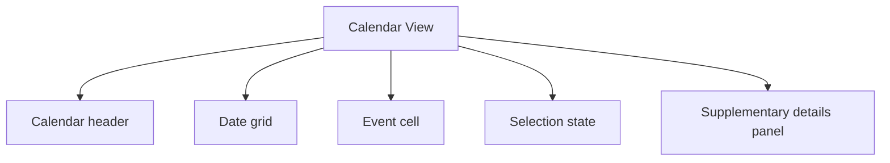

# Calendar View

> Learn how to implement calendar views. Discover best practices for date navigation, event display, and calendar interactions.

**URL:** https://uxpatterns.dev/patterns/data-display/calendar
**Source:** apps/web/content/patterns/data-display/calendar.mdx

---

## Overview

A **Calendar View** pattern helps teams create a reliable way to present time-based information in a grid that helps people compare days, weeks, or months at a glance. It is most useful when teams need booking and scheduling.

Compared with adjacent patterns, this pattern should reduce friction without hiding the state, rules, or recovery paths people need to keep moving.

## Use Cases

### When to use:

- Booking and scheduling
- Team availability
- Events and release planning

### When not to use:

- Use a simpler view when users only need one or two values and not the full layout.
- Avoid this pattern when the task is creation or editing rather than interpretation.
- Do not force the same view onto mobile if another representation would be clearer.

### Common scenarios and examples

- Booking and scheduling where users need a clear, repeatable interface model.
- Team availability where users need a clear, repeatable interface model.
- Events and release planning where users need a clear, repeatable interface model.

## Benefits

- Clarifies how calendar view should behave before implementation details begin to sprawl.
- Creates a reusable interaction model for teams who need to present time-based information in a grid that helps people compare days, weeks, or months at a glance.
- Makes accessibility, edge cases, and recovery paths part of the design instead of post-launch cleanup.
- Gives product, design, and engineering a shared language for evaluating trade-offs.

## Drawbacks

- It can become visually dense or noisy when too much state is shown at once.
- Responsive behavior usually needs a deliberate mobile fallback, not just smaller text.
- Loading, empty, and error states are just as important as the happy path.
- Performance work becomes visible quickly when the dataset or layout grows.

## Anatomy



### Component Structure

1. **Calendar header**

- Shows the current period and navigation controls.

2. **Date grid**

- Defines the visible days or time slots.

3. **Event cell**

- Displays scheduled content, availability, or counts.

4. **Selection state**

- Shows the active date or range.

5. **Supplementary details panel**

- Provides expanded information for the current selection.

#### Summary of Components

| Component | Required? | Purpose |
| --- | --- | --- |
| Calendar header | ✅ Yes | Shows the current period and navigation controls. |
| Date grid | ✅ Yes | Defines the visible days or time slots. |
| Event cell | ✅ Yes | Displays scheduled content, availability, or counts. |
| Selection state | ❌ No | Shows the active date or range. |
| Supplementary details panel | ❌ No | Provides expanded information for the current selection. |

## Variations

### Month view

Optimizes for broad scheduling overview.

**When to use:** Use when users compare activity across many days.

### Week view

Shows more detail per day or time slot.

**When to use:** Use for operational scheduling and booking.

### Agenda hybrid

Pairs the calendar with a linear event list.

**When to use:** Use when overview and detail both matter.

## Examples

### Live Preview

### Basic Implementation

```html
<div class="demo-shell card calendar-card">
  <div class="calendar-header"><button type="button">‹</button><strong>March 2026</strong><button type="button">›</button></div>
  <div class="calendar-grid"><span class="day">Mon</span><span class="day">Tue</span><span class="day">Wed</span><span class="day">Thu</span><span class="day">Fri</span><span class="day">Sat</span><span class="day">Sun</span><button type="button" class="date">1</button><button type="button" class="date">2</button><button type="button" class="date">3</button><button type="button" class="date">4</button><button type="button" class="date">5</button><button type="button" class="date event">6</button><button type="button" class="date">7</button><button type="button" class="date">8</button><button type="button" class="date">9</button><button type="button" class="date">10</button><button type="button" class="date">11</button><button type="button" class="date">12</button><button type="button" class="date event">13</button><button type="button" class="date">14</button><button type="button" class="date">15</button><button type="button" class="date">16</button><button type="button" class="date">17</button><button type="button" class="date">18</button><button type="button" class="date">19</button><button type="button" class="date event">20</button><button type="button" class="date">21</button><button type="button" class="date">22</button><button type="button" class="date">23</button><button type="button" class="date">24</button><button type="button" class="date">25</button><button type="button" class="date">26</button><button type="button" class="date">27</button><button type="button" class="date">28</button><button type="button" class="date">29</button><button type="button" class="date">30</button><button type="button" class="date">31</button><button type="button" class="date"></button><button type="button" class="date"></button><button type="button" class="date"></button><button type="button" class="date"></button></div>
</div>
```

### What this example demonstrates

- A clear baseline implementation of calendar view that can be reviewed without framework-specific noise.
- Visible state, spacing, and content hierarchy that mirror the implementation guidance above.
- A small enough surface to copy into a design review or prototype before scaling the pattern up.

### Implementation Notes

- Start with [semantic HTML](/glossary/semantic-html) and only add JavaScript where the interaction truly requires it.
- Keep styling tokens and spacing consistent with adjacent controls or layouts.
- If the live implementation introduces async behavior, mirror those states in the code example rather than documenting them only in prose.
## Best Practices

### Content

**Do's ✅**

- Start with the questions users need answered before choosing the layout.
- Use labels, legends, and headings that explain why the data matters.
- Keep supporting metadata close to the item, card, chart, or row it describes.

**Don'ts ❌**

- Do not assume everyone already understands the metric, status, or sorting rule.
- Do not rely on truncation to hide critical context.
- Do not bury key actions where they only appear on hover.

### Accessibility

**Do's ✅**

- Verify that calendar view can be completed using keyboard alone.
- Keep focus order logical when the pattern opens, updates, or reveals additional UI.
- Preserve a visible focus state that is still readable at high zoom.
- Use semantic elements first, then add ARIA only where semantics alone are not enough.
- Announce state changes such as errors, loading, or completion in the right place and with the right politeness.

**Don'ts ❌**

- Do not remove focus styles without a visible replacement.
- Do not depend on placeholder or helper text that disappears before the user can act on it.
- Do not assume pointer, touch, and assistive technologies will all interact with the pattern the same way.

### Visual Design

**Do's ✅**

- Use hierarchy to separate primary values from supporting context.
- Reserve space for loading and empty states to avoid layout jumps.
- Design density levels intentionally for desktop and mobile.

**Don'ts ❌**

- Do not use decorative chrome that competes with the data itself.
- Do not make all rows, cards, or panels look equally important when priorities differ.
- Do not overload a single view with every possible control.

### Layout & Positioning

**Do's ✅**

- Preserve scannability as the [viewport](/glossary/viewport) shrinks.
- Keep filters, summaries, and data visibly connected.
- Choose stable ordering and grouping rules so users can build muscle memory.
**Don'ts ❌**

- Do not let controls jump around between breakpoints.
- Do not hide essential data behind horizontal scrolling without a fallback.
- Do not treat empty or zero states as an afterthought.

## Common Mistakes & Anti-Patterns 🚫

### **Choosing the layout before the task**

**The Problem:**
Teams often pick a visually familiar pattern before confirming whether users need comparison, exploration, or scanning.

**How to Fix It?**
Start from the user task, then map the layout to comparison, chronology, hierarchy, or overview needs.

---

### **Ignoring non-happy states**

**The Problem:**
A polished default view still feels broken when loading, empty, and error states are inconsistent.

**How to Fix It?**
Design the data lifecycle up front, including empty, partial, stale, and failed results.

---

### **Shipping a desktop-only density model**

**The Problem:**
Large tables, dense dashboards, and heavy cards collapse quickly on small screens.

**How to Fix It?**
Define a mobile strategy such as stacked cards, progressive disclosure, or alternate summaries before implementation.

## Data Flow

- Start by defining the source of truth for the dataset, then map how filters, sorting, and view state transform that dataset before render.
- Keep loading, empty, and partial states in the same data flow model as the populated state so the view does not need separate ad hoc logic.
- When the pattern supports drilling into detail, keep the transition between overview and detail explicit so users understand what changed.

## Performance

- Measure the cost of rendering the default view before adding richer adornments such as nested actions, charts, or inline filters.
- Use [pagination](/glossary/pagination), windowing, or progressive disclosure when the layout would otherwise render too many items at once.
- Stabilize heights and placeholder geometry so loading and data refresh states do not cause large layout shifts.
## Usability Considerations

- Test whether people can answer the intended question in under a few seconds; if not, the layout may be too dense or too vague.
- Make sort, filter, and grouping rules visible whenever they change the order or subset of data.
- Give users a clear path back to a simpler or more detailed view when one layout cannot answer every question.

## Accessibility

### Keyboard Interaction

- [ ] Verify that calendar view can be completed using keyboard alone.
- [ ] Keep focus order logical when the pattern opens, updates, or reveals additional UI.
- [ ] Preserve a visible focus state that is still readable at high zoom.

### Screen Reader Support

- [ ] Use semantic elements first, then add ARIA only where semantics alone are not enough.
- [ ] Announce state changes such as errors, loading, or completion in the right place and with the right politeness.
- [ ] Connect labels, hints, and status text with `aria-describedby` or structural headings when useful.

### Visual Accessibility

- [ ] Do not rely on color alone to convey severity, completion, or selection state.
- [ ] Test the pattern at 200% zoom and with reduced motion enabled.
- [ ] Ensure [touch targets](/glossary/touch-targets) remain comfortable on mobile and coarse pointers.
## Testing Guidelines

### Functional Testing

- [ ] Verify the default, loading, error, and success states for calendar view.
- [ ] Test the primary action and the obvious recovery action in the same run.
- [ ] Confirm that state survives refresh, navigation, or retry in the way users would expect.

### Accessibility Testing

- [ ] Run keyboard-only checks and at least one [screen reader](/glossary/screen-reader) pass on the final implementation.
- [ ] Validate headings, labels, and announcement behavior with real content rather than lorem ipsum.
- [ ] Check color contrast and focus visibility in both default and stressed states.
### Edge Cases

- [ ] Test empty, long, duplicated, and unexpectedly formatted content.
- [ ] Check behavior on narrow screens, zoomed layouts, and slower networks.
- [ ] Verify that optimistic or asynchronous states reconcile correctly after a failure.

## Frequently Asked Questions

## Related Patterns

## Resources

### References

- [WCAG 2.2](https://www.w3.org/TR/WCAG22/) - Accessibility baseline for keyboard support, focus management, and readable state changes.
- [MDN date input](https://developer.mozilla.org/en-US/docs/Web/HTML/Element/input/date) - Native date input support, parsing, and constraint behavior.

### Guides

- [Nielsen Norman Group: Date-input usability](https://www.nngroup.com/articles/date-input/) - Research on segmented date fields, formatting, and calendar picker tradeoffs.

### Articles

- [web.dev: Rendering on the Web](https://web.dev/articles/rendering-on-the-web) - Rendering tradeoffs for data-rich pages, dashboards, and result-heavy views.

### NPM Packages

- [`@fullcalendar/react`](https://www.npmjs.com/package/%40fullcalendar%2Freact) - Full-featured calendar component for scheduling and agenda views.
- [`react-big-calendar`](https://www.npmjs.com/package/react-big-calendar) - Calendar layouts for week, month, and agenda displays.
- [`date-fns`](https://www.npmjs.com/package/date-fns) - Date parsing, formatting, and range math for calendars and schedule interfaces.
