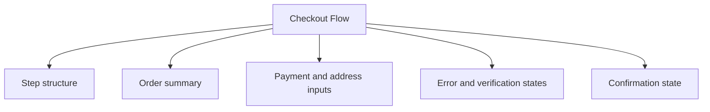

# Checkout Flow

> Learn how to implement checkout flows. Discover best practices for payment forms, order review, and conversion optimization.

**URL:** https://uxpatterns.dev/patterns/e-commerce/checkout
**Source:** apps/web/content/patterns/e-commerce/checkout.mdx

---

## Overview

A **Checkout Flow** pattern helps teams create a reliable way to guide shoppers from cart review to confirmed payment with as little friction as possible while preserving trust. It is most useful when teams need physical goods purchase.

Compared with adjacent patterns, this pattern should reduce friction without hiding the state, rules, or recovery paths people need to keep moving.

## Use Cases

### When to use:

- Physical goods purchase
- Digital checkout and subscriptions
- Guest and returning buyer flows

### When not to use:

- Use a simpler purchase path when the item, buyer, and payment state are already known.
- Avoid forcing the full pattern when users only need a quick confirmation step.
- Do not optimize for conversion at the expense of price and policy clarity.

### Common scenarios and examples

- Physical goods purchase where users need a clear, repeatable interface model.
- Digital checkout and subscriptions where users need a clear, repeatable interface model.
- Guest and returning buyer flows where users need a clear, repeatable interface model.

## Benefits

- Clarifies how checkout flow should behave before implementation details begin to sprawl.
- Creates a reusable interaction model for teams who need to guide shoppers from cart review to confirmed payment with as little friction as possible while preserving trust.
- Makes accessibility, edge cases, and recovery paths part of the design instead of post-launch cleanup.
- Gives product, design, and engineering a shared language for evaluating trade-offs.

## Drawbacks

- State needs to stay consistent across sessions, devices, and sometimes anonymous users.
- Metrics can distort the experience if every surface is optimized only for engagement or conversion.
- Abuse, fraud, or misuse pressure must be planned for early.
- Trust drops quickly when counts, totals, or status badges feel inaccurate.

## Anatomy



### Component Structure

1. **Step structure**

- Organizes contact, shipping, payment, and review information.

2. **Order summary**

- Keeps totals, discounts, and items visible.

3. **Payment and address inputs**

- Collect the information required to complete the purchase.

4. **Error and verification states**

- Explain payment, stock, or validation issues clearly.

5. **Confirmation state**

- Shows what happens after a successful order.

#### Summary of Components

| Component | Required? | Purpose |
| --- | --- | --- |
| Step structure | ✅ Yes | Organizes contact, shipping, payment, and review information. |
| Order summary | ✅ Yes | Keeps totals, discounts, and items visible. |
| Payment and address inputs | ✅ Yes | Collect the information required to complete the purchase. |
| Error and verification states | ✅ Yes | Explain payment, stock, or validation issues clearly. |
| Confirmation state | ❌ No | Shows what happens after a successful order. |

## Variations

### Single-page checkout

Keeps every section visible in one flow.

**When to use:** Use when the purchase is short and returning users are common.

### Step-based checkout

Splits the purchase into clear stages.

**When to use:** Use when shipping, billing, and payment complexity would overwhelm one screen.

### Express checkout

Skips most fields for trusted returning buyers.

**When to use:** Use when stored addresses and payment methods are already available.

## Best Practices

### Content

**Do's ✅**

- Explain the outcome of the action in language users understand immediately.
- Surface the next useful action without burying key details.
- Keep counts, prices, and status indicators synchronized with visible state.

**Don'ts ❌**

- Do not gamify high-stakes actions through unclear labels or manipulative copy.
- Do not hide moderation, pricing, or policy details users need before acting.
- Do not assume optimistic updates will always succeed.

### Accessibility

**Do's ✅**

- Verify that checkout flow can be completed using keyboard alone.
- Keep focus order logical when the pattern opens, updates, or reveals additional UI.
- Preserve a visible focus state that is still readable at high zoom.
- Use semantic elements first, then add ARIA only where semantics alone are not enough.
- Announce state changes such as errors, loading, or completion in the right place and with the right politeness.

**Don'ts ❌**

- Do not remove focus styles without a visible replacement.
- Do not depend on placeholder or helper text that disappears before the user can act on it.
- Do not assume pointer, touch, and assistive technologies will all interact with the pattern the same way.

### Visual Design

**Do's ✅**

- Show trust-building signals such as state, identity, or pricing close to the action.
- Reserve strong color and badges for meaningful status changes.
- Design reversible actions differently from permanent ones.

**Don'ts ❌**

- Do not make primary and destructive actions look interchangeable.
- Do not use motion that implies completion before the system has confirmed it.
- Do not let promotional content overpower core task information.

### Layout & Positioning

**Do's ✅**

- Keep identity, object details, and actions close enough to scan together.
- Test the pattern in crowded feeds, lists, and summary views.
- Preserve space for moderation, legal, or transactional details where needed.

**Don'ts ❌**

- Do not hide critical next steps below large promotional modules.
- Do not split state changes across too many disconnected panels.
- Do not assume a desktop purchase or engagement flow will translate directly to mobile.

## Security Considerations

- Protect state-changing actions with real authorization checks rather than relying on hidden controls alone.
- Plan for optimistic updates to fail and make rollback or reconciliation visible.
- Store audit-relevant events such as checkout attempts, moderation actions, or abuse reports in a way the product team can actually inspect later.

## Tracking

- Track impressions, primary actions, reversals, and error states for checkout flow separately so the team can see where the pattern succeeds or fails.
- Measure completed outcomes, not just taps or opens, especially when the pattern can be reversed or abandoned later.
- Annotate experiments and rollout changes so spikes in engagement or conversion are interpretable.

## Common Mistakes & Anti-Patterns 🚫

### **Treating trust as secondary UI**

**The Problem:**
Counts, totals, identities, and policies are often the main thing users are checking before acting.

**How to Fix It?**
Design trust signals into the main hierarchy instead of leaving them as tiny secondary text.

---

### **Over-optimizing for the first click**

**The Problem:**
Aggressive prompts can increase taps while harming completion quality or long-term trust.

**How to Fix It?**
Measure the full journey, including reversals, refunds, reports, and hidden dissatisfaction.

---

### **Ignoring abuse and fraud paths**

**The Problem:**
Social and commerce surfaces invite misuse as soon as they create visible value.

**How to Fix It?**
Plan rate limits, authorization checks, moderation, and audit trails as part of the pattern itself.

## Examples

### Live Preview

### Basic Implementation

```html
<div class="demo-shell checkout-demo">
  <section class="card checkout-flow">
    <ol class="steps"><li class="active">Shipping</li><li>Payment</li><li>Review</li></ol>
    <div class="section-block"><strong>Shipping address</strong><p class="muted">123 Pattern Street, Toronto</p></div>
    <button type="button">Continue to payment</button>
  </section>
  <aside class="card summary">
    <strong>Order summary</strong>
    <p class="muted">2 items · Free shipping · Total $128</p>
  </aside>
</div>
```

### What this example demonstrates

- A clear baseline implementation of checkout flow that can be reviewed without framework-specific noise.
- Visible state, spacing, and content hierarchy that mirror the implementation guidance above.
- A small enough surface to copy into a design review or prototype before scaling the pattern up.

### Implementation Notes

- Start with [semantic HTML](/glossary/semantic-html) and only add JavaScript where the interaction truly requires it.
- Keep styling tokens and spacing consistent with adjacent controls or layouts.
- If the live implementation introduces async behavior, mirror those states in the code example rather than documenting them only in prose.
## Accessibility

### Keyboard Interaction

- [ ] Verify that checkout flow can be completed using keyboard alone.
- [ ] Keep focus order logical when the pattern opens, updates, or reveals additional UI.
- [ ] Preserve a visible focus state that is still readable at high zoom.

### Screen Reader Support

- [ ] Use semantic elements first, then add ARIA only where semantics alone are not enough.
- [ ] Announce state changes such as errors, loading, or completion in the right place and with the right politeness.
- [ ] Connect labels, hints, and status text with `aria-describedby` or structural headings when useful.

### Visual Accessibility

- [ ] Do not rely on color alone to convey severity, completion, or selection state.
- [ ] Test the pattern at 200% zoom and with reduced motion enabled.
- [ ] Ensure [touch targets](/glossary/touch-targets) remain comfortable on mobile and coarse pointers.
## Testing Guidelines

### Functional Testing

- [ ] Verify the default, loading, error, and success states for checkout flow.
- [ ] Test the primary action and the obvious recovery action in the same run.
- [ ] Confirm that state survives refresh, navigation, or retry in the way users would expect.

### Accessibility Testing

- [ ] Run keyboard-only checks and at least one [screen reader](/glossary/screen-reader) pass on the final implementation.
- [ ] Validate headings, labels, and announcement behavior with real content rather than lorem ipsum.
- [ ] Check color contrast and focus visibility in both default and stressed states.
### Edge Cases

- [ ] Test empty, long, duplicated, and unexpectedly formatted content.
- [ ] Check behavior on narrow screens, zoomed layouts, and slower networks.
- [ ] Verify that optimistic or asynchronous states reconcile correctly after a failure.

## Frequently Asked Questions

## Related Patterns

## Resources

### References

- [WCAG 2.2](https://www.w3.org/TR/WCAG22/) - Accessibility baseline for keyboard support, focus management, and readable state changes.
- [WAI Forms Tutorial](https://www.w3.org/WAI/tutorials/forms/) - Accessible labels, instructions, validation, and grouping for forms and input controls.

### Guides

- [WAI Multi-page Forms](https://www.w3.org/WAI/tutorials/forms/multi-page/) - Guidance for step indicators, repeated instructions, saved progress, and logical step splits.

### Articles

- [Smashing Magazine: Designing efficient web forms](https://www.smashingmagazine.com/2017/06/designing-efficient-web-forms/) - Field-level usability guidance for labels, grouping, defaults, and submission flows.

### NPM Packages

- [`@stripe/react-stripe-js`](https://www.npmjs.com/package/%40stripe%2Freact-stripe-js) - Stripe Elements integration for secure checkout collection flows.
- [`react-hook-form`](https://www.npmjs.com/package/react-hook-form) - Low-friction form state and validation wiring for complex input flows.
- [`zod`](https://www.npmjs.com/package/zod) - Schema validation for typed parsing, normalization, and field-level error handling.
