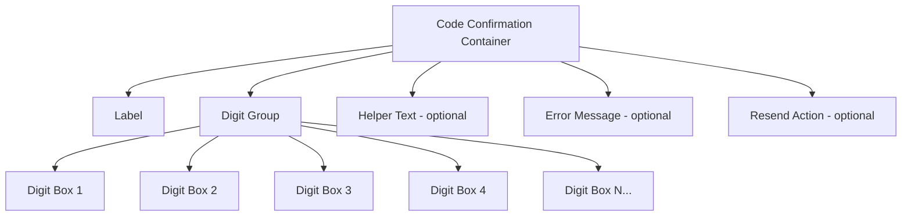

# Code Confirmation

> Implement user-friendly code confirmation inputs for verification codes and OTPs. Learn best practices for segmented inputs, auto-focus behavior, and accessibility.

**URL:** https://uxpatterns.dev/patterns/forms/code-confirmation
**Source:** apps/web/content/patterns/forms/code-confirmation.mdx

---

## Overview

A **Code Confirmation** (also called an OTP input or verification code input) is a specialized form component that allows users to enter short numeric or alphanumeric codes — typically 4–8 characters — sent via SMS, email, or authenticator app to verify identity.

The defining characteristic is the **segmented layout**: each character occupies its own individual input box, providing a clear visual structure that guides users digit-by-digit and reduces transcription errors.


_Good example of a 2FA code confirmation screen from PayPal_

## Use Cases

### When to use:

- **Two-factor authentication (2FA)** – SMS or TOTP codes used alongside password login.
- **Email verification** – Confirm account ownership after registration.
- **Password reset flows** – Short codes sent via SMS or email to authorize resets.
- **Transaction confirmation** – PIN or code required before sensitive financial actions.
- **Access codes** – Short invite or gift codes entered to unlock content.

### When not to use:

- **Long passwords or passphrases** – A standard password field is better; segmented inputs are meant for short, structured codes.
- **Free-form text entry** – Use a text field instead.
- **When the code length is unknown or variable** – Use a standard single-line input.
- **Codes longer than 8 digits** – Cognitive load increases significantly; consider a text field with masking.

## Benefits

- **Guided data entry** – Each box corresponds to one digit, reducing input errors.
- **Auto-advance** – Focus moves automatically after each character, speeding up entry.
- **Visual progress** – Users can see how many digits remain at a glance.
- **Paste support** – Pasting a copied code fills all boxes instantly.
- **Mobile-friendly** – Triggers numeric keypad automatically.

## Drawbacks

- **Complex implementation** – Coordinating focus across multiple inputs requires careful event handling.
- **Accessibility challenges** – Requires extra ARIA attributes and live region announcements.
- **Fixed length assumption** – The component must know the exact code length at render time.
- **Edge cases with paste** – Partial pastes, non-numeric characters, and whitespace must all be handled.

## Anatomy



### Component Structure

1. **Container (`div` or `fieldset`)**

   - Wraps the entire component; use `<fieldset>` with `<legend>` when the group needs a semantic label.
   - Manages overall layout and spacing.

2. **Label / Legend**

   - Describes the purpose: "Enter your 6-digit verification code".
   - Associated via `for` or as a `<legend>` inside `<fieldset>`.

3. **Digit Group (`div[role="group"]`)**

   - Horizontal row of individual digit inputs.
   - Use `aria-label="Verification code"` on the group when not using `<fieldset>`.

4. **Digit Box (`input[type="text"]` or `input[type="tel"]`)**

   - One input per expected character.
   - `maxlength="1"`, `inputmode="numeric"` for numeric codes.
   - `pattern="[0-9]"` for numeric-only validation.
   - `autocomplete="one-time-code"` on the **first** input to enable SMS autofill.

5. **Helper Text (optional)**

   - Instructions like "We sent a 6-digit code to +1 (555) 123-4567".
   - Linked via `aria-describedby`.

6. **Error Message (optional)**

   - Displayed when the code is invalid or expired.
   - Uses `aria-live="polite"` so screen readers announce it without interrupting.

7. **Resend Action (optional)**
   - Button or link to request a new code.
   - Often includes a countdown timer to prevent abuse.

#### Summary of Components

| Component       | Required? | Purpose                                              |
| --------------- | --------- | ---------------------------------------------------- |
| Label / Legend  | ✅ Yes    | Names the input group for all users                  |
| Digit Boxes     | ✅ Yes    | Individual character inputs                          |
| Helper Text     | ❌ No     | Explains where the code was sent                     |
| Error Message   | ❌ No     | Tells user if code is invalid or expired             |
| Resend Action   | ❌ No     | Allows requesting a new code                         |

## Variations

### 4-Digit Numeric OTP

Standard SMS verification code for account confirmation.

```html
<fieldset class="otp-field">
  <legend>Enter your 4-digit code</legend>
  <div class="otp-field__group" role="group" aria-label="4-digit verification code">
    <input
      class="otp-field__digit"
      type="text"
      inputmode="numeric"
      pattern="[0-9]"
      maxlength="1"
      autocomplete="one-time-code"
      aria-label="Digit 1 of 4"
    />
    <input class="otp-field__digit" type="text" inputmode="numeric" pattern="[0-9]" maxlength="1" aria-label="Digit 2 of 4" />
    <input class="otp-field__digit" type="text" inputmode="numeric" pattern="[0-9]" maxlength="1" aria-label="Digit 3 of 4" />
    <input class="otp-field__digit" type="text" inputmode="numeric" pattern="[0-9]" maxlength="1" aria-label="Digit 4 of 4" />
  </div>
</fieldset>
```

### 6-Digit Authenticator Code

Used for TOTP (Time-based One-Time Password) from apps like Google Authenticator.

```html
<fieldset class="otp-field">
  <legend>Enter your 6-digit authenticator code</legend>
  <div class="otp-field__group">
    <!-- Digits 1-3 -->
    <input class="otp-field__digit" type="text" inputmode="numeric" pattern="[0-9]" maxlength="1" aria-label="Digit 1 of 6" autocomplete="one-time-code" />
    <input class="otp-field__digit" type="text" inputmode="numeric" pattern="[0-9]" maxlength="1" aria-label="Digit 2 of 6" />
    <input class="otp-field__digit" type="text" inputmode="numeric" pattern="[0-9]" maxlength="1" aria-label="Digit 3 of 6" />
    <!-- Visual separator -->
    <span class="otp-field__separator" aria-hidden="true">–</span>
    <!-- Digits 4-6 -->
    <input class="otp-field__digit" type="text" inputmode="numeric" pattern="[0-9]" maxlength="1" aria-label="Digit 4 of 6" />
    <input class="otp-field__digit" type="text" inputmode="numeric" pattern="[0-9]" maxlength="1" aria-label="Digit 5 of 6" />
    <input class="otp-field__digit" type="text" inputmode="numeric" pattern="[0-9]" maxlength="1" aria-label="Digit 6 of 6" />
  </div>
</fieldset>
```

### Alphanumeric Invite Code

For gift card codes or invite keys that mix letters and numbers.

```html
<fieldset class="otp-field">
  <legend>Enter your invite code</legend>
  <div class="otp-field__group">
    <input class="otp-field__digit otp-field__digit--alpha" type="text" maxlength="1" aria-label="Character 1 of 8" autocapitalize="characters" />
    <input class="otp-field__digit otp-field__digit--alpha" type="text" maxlength="1" aria-label="Character 2 of 8" autocapitalize="characters" />
    <!-- ... more digits ... -->
  </div>
</fieldset>
```

### With Error State

```html
<fieldset class="otp-field otp-field--error">
  <legend>Enter your 6-digit code</legend>
  <div class="otp-field__group" aria-describedby="otp-error">
    <input class="otp-field__digit" type="text" inputmode="numeric" maxlength="1" aria-invalid="true" aria-label="Digit 1 of 6" />
    <!-- ... more digits ... -->
  </div>
  <output class="otp-field__error" id="otp-error" aria-live="polite">
    Invalid code. Please try again or request a new one.
  </output>
</fieldset>
```

### With Resend Timer

```html
<div class="otp-wrapper">
  <fieldset class="otp-field">
    <legend>Enter the code sent to your email</legend>
    <div class="otp-field__group"><!-- digit inputs --></div>
    <p class="otp-field__help" id="otp-help">Check your inbox for a 6-digit code.</p>
  </fieldset>
  <div class="otp-resend">
    <p>Didn't receive a code?</p>
    <button type="button" class="otp-resend__btn" disabled aria-disabled="true">
      Resend code <span class="otp-resend__timer" aria-live="polite">(59s)</span>
    </button>
  </div>
</div>
```

## Best Practices

### Content & Usability

**Do's ✅**

- Set `autocomplete="one-time-code"` on the first input to enable **SMS autofill** on iOS and Android.
- **Auto-advance focus** to the next input after a digit is entered.
- **Allow paste** to fill all boxes from a single clipboard paste event.
- Move focus backward on `Backspace` when the current field is empty.
- Keep digit boxes **large enough** for comfortable tap targets (at least 48×48px on mobile).
- Show a **resend option** after a reasonable timeout (30–60 seconds).
- Indicate how many digits are expected in the label or helper text.

**Don'ts ❌**

- Don't prevent paste (`onpaste="return false"`); SMS autofill and copied codes depend on it.
- Don't auto-submit the form immediately when the last digit is entered — give users a moment to review.
- Don't use `type="number"` for digit inputs; it introduces unexpected browser behavior (spinner arrows, `e` key acceptance).
- Don't clear all digits when the user enters a wrong code automatically; let them correct individual digits.
- Don't hide a resend option behind excessive waiting times.

---

### Accessibility

**Do's ✅**

- Use `<fieldset>` and `<legend>` to group the inputs semantically.
- Give each input a unique `aria-label` like "Digit 1 of 6" so screen readers announce position.
- Use `aria-live="polite"` on error messages so screen readers announce failures without interrupting.
- Announce remaining digits as users fill each box (e.g., "3 of 6 entered") via a visually-hidden live region.
- Support `autocomplete="one-time-code"` for OS-level autofill integration.
- Ensure focus moves predictably when using keyboard navigation.

**Don'ts ❌**

- Don't use `aria-hidden="true"` on individual inputs.
- Don't rely solely on focus position to convey progress — announce it programmatically.
- Don't disable the ability to tab through inputs manually.
- Don't trap focus inside the component indefinitely.

---

### Visual Design

**Do's ✅**

- Use a **clearly defined border** on each digit box to indicate it is an interactive input.
- Apply a **distinct active/focused state** (e.g., blue outline or underline animation).
- Show a **filled state** once a digit is entered (slightly different background).
- Keep the digit boxes **uniform in size** and evenly spaced.
- Use a **separator** (dash or dot) between groups of 3 in 6-digit codes for readability.

**Don'ts ❌**

- Don't make digit boxes too small to tap on mobile.
- Don't use color alone to indicate the active input state.
- Avoid excessive padding that pushes boxes far apart, breaking the "grouped" visual.

---

### Layout & Positioning

**Do's ✅**

- Center the digit group horizontally on mobile for thumb accessibility.
- Place helper text (phone number, email) directly below the group.
- Display the error message immediately below the group, not at the top of the page.
- Show the resend option below the error state or helper text area.

**Don'ts ❌**

- Don't spread the digit group across the full width of a wide layout; keep it compact.
- Don't place the label too far above the digit boxes.

## Common Mistakes & Anti-Patterns 🚫

### Using `type="number"` for Digit Inputs

**The Problem:**
`<input type="number">` accepts `e`, `+`, `-` and shows stepper arrows in some browsers. It also returns an empty string for `checkValidity` on certain non-numeric entries.

```html
<!-- Bad -->
<input type="number" min="0" max="9" class="otp-digit" />
```

**How to Fix It?** Use `type="text"` with `inputmode="numeric"` and `pattern="[0-9]"`.

```html
<!-- Good -->
<input type="text" inputmode="numeric" pattern="[0-9]" maxlength="1" class="otp-digit" />
```

---

### Blocking Paste Events

**The Problem:**
Disabling paste breaks SMS autofill and forces users to type digit-by-digit from a copied code, causing significant frustration.

```javascript
// Bad
input.addEventListener('paste', (e) => e.preventDefault());
```

**How to Fix It?** Handle paste to distribute characters across boxes.

```javascript
// Good: distribute pasted text across all digit inputs
container.addEventListener('paste', (e) => {
  e.preventDefault();
  const text = e.clipboardData.getData('text').replace(/\D/g, '');
  const digits = inputs; // NodeList of digit inputs
  [...text].slice(0, digits.length).forEach((char, i) => {
    digits[i].value = char;
  });
  // Move focus to the last filled digit or the next empty one
  const lastFilled = Math.min(text.length, digits.length) - 1;
  digits[lastFilled]?.focus();
});
```

---

### No Backspace Navigation

**The Problem:**
Users who mistype a digit expect `Backspace` to clear it and return focus to the previous box. Without this, they're stranded on an empty box.

**How to Fix It?** Listen for `keydown` and navigate backward when the input is already empty.

```javascript
input.addEventListener('keydown', (e) => {
  if (e.key === 'Backspace' && input.value === '') {
    const prev = getPreviousInput(input);
    if (prev) {
      prev.value = '';
      prev.focus();
    }
  }
});
```

---

### Auto-Submitting on Last Digit

**The Problem:**
Automatically submitting the form the instant the last digit is entered prevents users from noticing or correcting a mis-entered digit.

**How to Fix It?** Briefly delay auto-submission (100–300ms) and give users a visual confirm state, or require an explicit submit action.

```javascript
// Better: short delay allows users to notice and correct
lastInput.addEventListener('input', () => {
  if (allDigitsFilled()) {
    setTimeout(() => submitForm(), 200);
  }
});
```

## Accessibility

### Keyboard Interaction Pattern

| **Key**              | **Action**                                                         |
| -------------------- | ------------------------------------------------------------------ |
| `0–9` / `A–Z`        | Enters a digit or character and advances focus to the next input   |
| `Backspace`          | Clears current digit; if empty, moves focus to previous input      |
| `Delete`             | Clears current digit without moving focus                          |
| `Arrow Left`         | Moves focus to the previous digit input                            |
| `Arrow Right`        | Moves focus to the next digit input                                |
| `Tab`                | Moves focus to the next focusable element outside the group        |
| `Shift + Tab`        | Moves focus to the previous focusable element outside the group    |
| `Ctrl/Cmd + V`       | Pastes clipboard content and distributes digits across inputs      |

## Micro-Interactions & Animations

### Digit Entry Animation
- **Effect:** Subtle scale-up pulse (1.0 → 1.08 → 1.0) when a digit box receives a value
- **Timing:** 150ms ease-out — snappy enough to feel responsive
- **Implementation:** CSS keyframe on the `.otp-field__digit--filled` class

```css
@keyframes digit-pop {
  0% { transform: scale(1); }
  50% { transform: scale(1.08); }
  100% { transform: scale(1); }
}

.otp-field__digit--filled {
  animation: digit-pop 150ms ease-out;
}
```

### Focus Transition
- **Effect:** Border changes from neutral to brand color with a soft glow
- **Timing:** 200ms ease-out

```css
.otp-field__digit {
  border: 2px solid #d1d5db;
  transition: border-color 200ms ease-out, box-shadow 200ms ease-out;
}

.otp-field__digit:focus {
  border-color: #3b82f6;
  box-shadow: 0 0 0 3px rgba(59, 130, 246, 0.15);
  outline: none;
}
```

### Error Shake Animation
- **Effect:** Horizontal shake of the digit group when an incorrect code is submitted
- **Timing:** 400ms total, 4 oscillations

```css
@keyframes shake {
  0%, 100% { transform: translateX(0); }
  20% { transform: translateX(-6px); }
  40% { transform: translateX(6px); }
  60% { transform: translateX(-4px); }
  80% { transform: translateX(4px); }
}

.otp-field--error .otp-field__group {
  animation: shake 400ms ease-in-out;
}
```

### Success Checkmark Animation
- **Effect:** Digit group fades out and a success checkmark fades in
- **Timing:** 300ms ease-in-out crossfade after verification

## Tracking

### Key Tracking Points

| **Event Name**                  | **Description**                                        | **Why Track It?**                                     |
| ------------------------------- | ------------------------------------------------------ | ----------------------------------------------------- |
| `otp.started`                   | User begins entering the first digit                   | Measures engagement with the verification step        |
| `otp.completed`                 | All digits filled and code submitted                   | Tracks successful entry attempts                      |
| `otp.pasted`                    | User pasted a code into the input                      | Measures SMS autofill / copy-paste usage              |
| `otp.error`                     | Submitted code was incorrect or expired                | Identifies code delivery and UX problems              |
| `otp.resend_requested`          | User clicked resend code                               | Signals delivery failures or code expiry issues       |
| `otp.abandoned`                 | User left the page without completing verification     | Measures drop-off in authentication funnel            |
| `otp.auto_filled`               | OS or browser autofilled the code from SMS             | Tracks autofill effectiveness                         |

### Event Payload Structure

```json
{
  "event": "otp.error",
  "properties": {
    "code_length": 6,
    "attempt_number": 2,
    "error_type": "invalid_code",
    "entry_method": "manual",
    "time_to_complete": 12.4,
    "flow": "2fa_login"
  }
}
```

### Key Metrics to Analyze

- **Verification Completion Rate** → What percentage of users successfully complete OTP entry
- **Paste vs Manual Entry Rate** → How users prefer to enter codes
- **Error Rate** → Frequency of incorrect code submissions
- **Resend Rate** → How often codes need to be resent (delivery proxy)
- **Time to Complete** → Average seconds from first digit to submission
- **Abandonment Rate** → Users who start but don't finish verification

## Localization

```json
{
  "otp": {
    "label": "Enter your {length}-digit verification code",
    "digit_label": "Digit {current} of {total}",
    "helper": "A code was sent to {destination}",
    "remaining": "{count} digits remaining",
    "resend": {
      "prompt": "Didn't receive a code?",
      "action": "Resend code",
      "countdown": "Resend in {seconds}s",
      "available": "Request a new code"
    },
    "errors": {
      "invalid": "Invalid code. Please check and try again.",
      "expired": "This code has expired. Please request a new one.",
      "too_many_attempts": "Too many failed attempts. Please wait {minutes} minutes."
    },
    "success": "Code verified successfully"
  }
}
```

### RTL Language Support

```css
[dir="rtl"] .otp-field__group {
  flex-direction: row-reverse;
}

[dir="rtl"] .otp-field__digit {
  text-align: center; /* digits are always centered regardless of direction */
}
```

### Input Method Considerations

- Use `inputmode="numeric"` to trigger the numeric keypad on mobile for number-only codes.
- For alphanumeric codes, omit `inputmode` or use `inputmode="text"` with `autocapitalize="characters"`.
- In some locales, users may receive codes via WhatsApp or local messaging apps rather than SMS — ensure the resend UI does not assume SMS exclusively.

## Performance Metrics

- **Initial render**: < 50ms for digit group appearance
- **Auto-advance response**: < 16ms (single frame) after digit entry
- **Paste distribution**: < 50ms to fill all digits from clipboard
- **Error state transition**: < 200ms including shake animation
- **Memory usage**: < 2KB per OTP component instance

## Testing Guidelines

### Functional Testing

**Should ✓**

- [ ] Typing a digit advances focus to the next input automatically.
- [ ] Pressing `Backspace` on an empty input moves focus to the previous input and clears it.
- [ ] Pasting a full code fills all boxes and places focus on the last filled box.
- [ ] Pasting a partial code fills available boxes from the first position.
- [ ] Non-numeric characters are rejected in numeric mode.
- [ ] Submitting an invalid code displays an error message.
- [ ] The resend button becomes active after the countdown timer expires.

---

### Accessibility Testing

**Should ✓**

- [ ] Screen reader announces each digit label (e.g., "Digit 1 of 6") on focus.
- [ ] Error message is announced via `aria-live="polite"` without interrupting the user.
- [ ] The digit group has a semantic label via `<fieldset>/<legend>` or `aria-label`.
- [ ] Keyboard users can navigate all digit inputs with `Arrow Left/Right`.
- [ ] `Tab` moves focus out of the component to the next element.
- [ ] `autocomplete="one-time-code"` triggers OS SMS autofill on supported devices.
- [ ] Focus is visible on all digit inputs with a clear outline.

---

### Performance Testing

**Should ✓**

- [ ] Auto-advance fires within one animation frame (< 16ms).
- [ ] Paste handling completes before the next render cycle.
- [ ] No layout shift occurs when error message appears.
- [ ] Component renders correctly on low-end devices.

---

### Security Testing

**Should ✓**

- [ ] Code input does not persist in browser history or autocomplete suggestions.
- [ ] Rate limiting prevents brute-force attempts on the server.
- [ ] Expired codes are rejected server-side, not just client-side.
- [ ] The component does not expose the expected code in the DOM or JavaScript state.

---

### Mobile & Touch Testing

**Should ✓**

- [ ] Numeric keypad appears automatically for numeric codes.
- [ ] Touch targets are at least 44×44px per digit box.
- [ ] SMS autofill works on iOS Safari and Android Chrome.
- [ ] Pasting from the SMS notification banner fills all boxes correctly.
- [ ] The digit group does not overflow on small screens (320px width).

---

### Error Handling & Edge Cases

**Should ✓**

- [ ] Entering letters in a numeric-only field shows appropriate feedback.
- [ ] Submitting with empty boxes shows a clear "Please complete the code" error.
- [ ] Multiple rapid paste attempts do not corrupt the input state.
- [ ] After a failed attempt, individual digits can be corrected without clearing all boxes.
- [ ] Codes with leading zeros are handled correctly (not parsed as integers).

## Frequently Asked Questions

` with a `<legend>` describing the code. Give each input a unique `aria-label` indicating its position (e.g., 'Digit 3 of 6'). Add an `aria-live='polite'` region that announces progress and errors. Ensure error messages use `aria-live` and are associated with the group via `aria-describedby`.",
    },
  ]}
/>

## Related Patterns

## Resources

### References

- [WCAG 2.2](https://www.w3.org/TR/WCAG22/) - Accessibility baseline for keyboard support, focus management, and readable state changes.
- [WAI Forms Tips and Tricks](https://www.w3.org/WAI/tutorials/forms/tips/) - Practical guidance for formatting, grouping, timing, and forgiving user input rules.

### Guides

- [WAI Forms Tutorial](https://www.w3.org/WAI/tutorials/forms/) - Accessible labels, instructions, validation, and grouping for forms and input controls.

### Articles

- [Microsoft Human-AI Interaction Guidelines](https://www.microsoft.com/en-us/research/project/guidelines-for-human-ai-interaction/) - Research-backed recommendations for AI feedback, confidence, intervention, and recovery.

### NPM Packages

- [`input-otp`](https://www.npmjs.com/package/input-otp) - Accessible one-time-code inputs with segmented cells and paste handling.
- [`react-otp-input`](https://www.npmjs.com/package/react-otp-input) - OTP field helper for segmented verification-code entry.
- [`otplib`](https://www.npmjs.com/package/otplib) - TOTP/HOTP helpers for two-factor enrollment and code verification flows.
