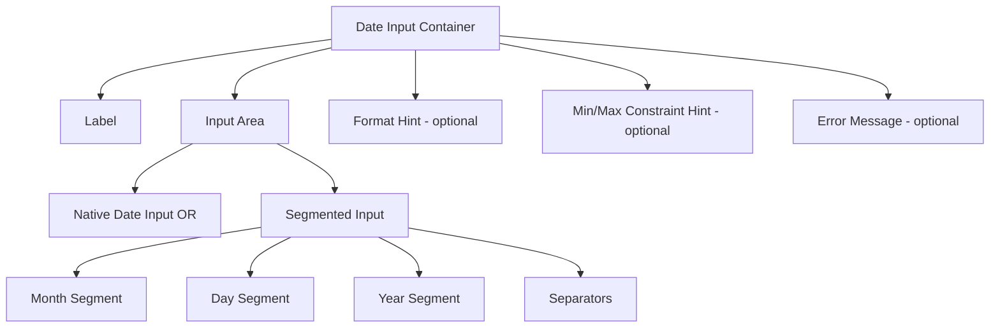

# Date Input

> Build date input fields with validation, formatting, and localization features.

**URL:** https://uxpatterns.dev/patterns/forms/date-input
**Source:** apps/web/content/patterns/forms/date-input.mdx

---

## Overview

A **Date Input** is a form field specifically designed for entering date values. It encompasses two primary implementation approaches: the native `<input type="date">` control (which renders the browser's built-in date picker), and structured text inputs using masked or segmented fields (e.g., MM/DD/YYYY format with auto-advance between day, month, and year segments).

Date Input is distinct from a **Date Picker** in that it focuses on direct keyboard entry of a date value rather than calendar-based visual selection. It is the preferred approach for entering known dates (birth dates, expiry dates) where a calendar view adds unnecessary complexity.

## Use Cases

### When to use:

- **Known, precise dates** – Birth dates, passport expiry dates, credit card expiry.
- **Historical dates** – Events or records well in the past where calendar navigation would be tedious.
- **Age or duration entry** – When users know the exact date without needing visual calendar context.
- **High-frequency data entry** – Forms where users enter many dates quickly benefit from direct text entry.
- **Date of birth** – Users always know this value; no calendar navigation needed.

### When not to use:

- **Scheduling and appointments** – Use a [Date Picker](/patterns/forms/date-picker) to show availability and context.
- **Relative date selection** – "Next Monday", "In 3 weeks" — use natural language or a date picker.
- **Date ranges** – Use a [Date Range](/patterns/forms/date-range) component instead.
- **When users need to see surrounding dates** – Calendar view is more helpful.

## Benefits

- **Fast entry** – Users who know the date can type it directly without navigating a calendar.
- **Keyboard friendly** – Efficient for power users and data entry workflows.
- **Compact** – Takes less visual space than a calendar picker.
- **Native browser support** – `<input type="date">` provides a baseline with no JS required.
- **Mobile optimized** – Native date input opens the platform's native date picker on mobile.

## Drawbacks

- **Format ambiguity** – Users may be unsure whether to enter MM/DD or DD/MM.
- **Browser inconsistency** – `<input type="date">` appearance varies greatly across browsers.
- **Locale complexity** – Date format order differs by country (ISO 8601 vs locale-specific).
- **Limited calendar context** – Users can't see surrounding dates or day-of-week.
- **Validation burden** – Invalid dates (Feb 30, invalid years) require explicit validation.

## Anatomy



### Component Structure

1. **Container**

   - Wraps all date input elements.
   - Can be a simple `<div>` or a `<fieldset>` when multiple date parts are semantically related.

2. **Label**

   - Clearly names the date field: "Date of birth", "Expiry date".
   - Include the expected format in the label or helper text: "MM/DD/YYYY".

3. **Native Date Input (`<input type="date">`)**

   - Browser-rendered date picker triggered on focus/click.
   - Value stored as `YYYY-MM-DD` (ISO 8601) regardless of displayed locale format.
   - Supports `min`, `max`, and `step` attributes.

4. **Segmented Input (alternative)**

   - Three separate inputs: month, day, year (or locale-appropriate order).
   - Auto-advances focus when each segment is filled.
   - Validates each segment independently.

5. **Format Hint**

   - Helper text showing the expected format: "(MM/DD/YYYY)".
   - Can be part of the label or separate `<p>` connected via `aria-describedby`.

6. **Error Message**

   - Specific messages: "Please enter a valid date", "Date must be in the future".
   - Uses `aria-live="polite"` for dynamic announcements.

#### Summary of Components

| Component        | Required? | Purpose                                            |
| ---------------- | --------- | -------------------------------------------------- |
| Label            | ✅ Yes    | Names and contextualizes the date field            |
| Date Input       | ✅ Yes    | The actual entry mechanism (native or segmented)   |
| Format Hint      | ❌ No     | Clarifies expected format                          |
| Min/Max Hint     | ❌ No     | Shows acceptable date range                        |
| Error Message    | ❌ No     | Validation feedback                                |

## Variations

### Native Date Input

Simplest implementation using the browser's built-in date input.

```html
<div class="date-input">
  <label for="dob">Date of birth</label>
  <input
    type="date"
    id="dob"
    name="dob"
    min="1900-01-01"
    max="2025-12-31"
    aria-describedby="dob-hint"
  />
  <p id="dob-hint" class="date-input__help">Format: MM/DD/YYYY</p>
</div>
```

### Segmented Date Input (MM/DD/YYYY)

Three coordinated inputs with auto-advance for US date format.

```html
<fieldset class="date-input date-input--segmented">
  <legend>Date of birth</legend>
  <div class="date-input__segments" aria-describedby="dob-format">
    <label class="sr-only" for="dob-month">Month</label>
    <input
      type="text"
      id="dob-month"
      class="date-input__segment date-input__segment--month"
      inputmode="numeric"
      placeholder="MM"
      maxlength="2"
      pattern="0[1-9]|1[0-2]"
      aria-label="Month"
    />
    <span class="date-input__separator" aria-hidden="true">/</span>
    <label class="sr-only" for="dob-day">Day</label>
    <input
      type="text"
      id="dob-day"
      class="date-input__segment date-input__segment--day"
      inputmode="numeric"
      placeholder="DD"
      maxlength="2"
      pattern="0[1-9]|[12]\d|3[01]"
      aria-label="Day"
    />
    <span class="date-input__separator" aria-hidden="true">/</span>
    <label class="sr-only" for="dob-year">Year</label>
    <input
      type="text"
      id="dob-year"
      class="date-input__segment date-input__segment--year"
      inputmode="numeric"
      placeholder="YYYY"
      maxlength="4"
      pattern="\d{4}"
      aria-label="Year"
    />
  </div>
  <p id="dob-format" class="date-input__help">MM/DD/YYYY</p>
</fieldset>
```

### With Min/Max Constraints

```html
<div class="date-input">
  <label for="travel-date">Departure date</label>
  <input
    type="date"
    id="travel-date"
    name="travel_date"
    min="2026-03-12"
    max="2027-12-31"
    aria-describedby="travel-hint"
    required
  />
  <p id="travel-hint" class="date-input__help">
    Available dates: today through December 31, 2027
  </p>
</div>
```

### Credit Card Expiry (MM/YY)

Simplified two-segment variant for card expiry dates.

```html
<fieldset class="date-input date-input--expiry">
  <legend>Card expiry date</legend>
  <div class="date-input__segments">
    <input
      type="text"
      inputmode="numeric"
      placeholder="MM"
      maxlength="2"
      aria-label="Expiry month"
      autocomplete="cc-exp-month"
    />
    <span class="date-input__separator" aria-hidden="true">/</span>
    <input
      type="text"
      inputmode="numeric"
      placeholder="YY"
      maxlength="2"
      aria-label="Expiry year"
      autocomplete="cc-exp-year"
    />
  </div>
</fieldset>
```

### With Error State

```html
<div class="date-input date-input--error">
  <label for="event-date">Event date</label>
  <input
    type="date"
    id="event-date"
    aria-invalid="true"
    aria-describedby="event-date-error"
  />
  <output class="date-input__error" id="event-date-error" aria-live="polite">
    Please enter a date in the future.
  </output>
</div>
```

## Best Practices

### Content & Usability

**Do's ✅**

- Include the date format in the label or as adjacent helper text (e.g., "DD/MM/YYYY").
- Use `<input type="date">` for most cases — it provides mobile-native pickers for free.
- Set appropriate `min` and `max` attributes to constrain valid date ranges.
- For birth dates, set a sensible default `max` to today's date.
- Auto-advance focus in segmented inputs after each segment is completed.
- Validate the full assembled date, not just individual segments (e.g., detect Feb 30).

**Don'ts ❌**

- Don't assume a date format — US users expect MM/DD/YYYY, most of the world uses DD/MM/YYYY.
- Don't place the year field last in a four-digit year context without making it visually obvious.
- Don't require ISO format (YYYY-MM-DD) as input — it's unfamiliar to most users.
- Don't block all keyboard input — allow users to type dates freely in native date fields.
- Don't show the calendar popup for fields like "date of birth" where users always know the date.

---

### Accessibility

**Do's ✅**

- Associate the label with the input via `for`.
- For segmented inputs, use `<fieldset>/<legend>` for the group.
- Give each segment input an individual `aria-label`.
- Announce validation errors via `aria-live="polite"`.
- Use `autocomplete="bday"` for birthday fields to assist autofill.
- Support [keyboard navigation](/glossary/keyboard-navigation) between segments with `Arrow` keys.
**Don'ts ❌**

- Don't rely on placeholder text alone to communicate date format.
- Don't use `aria-hidden` on segment separators while making them critical to understanding the format.
- Don't skip focus management for auto-advance — [screen reader](/glossary/screen-reader) users need predictable focus behavior.
---

### Visual Design

**Do's ✅**

- Style the native date input consistently with other text fields in the form.
- Make segment separators visually clear but lightweight (thin slash or dot).
- Show a focus state on the active segment in segmented inputs.
- Display error state with both color and icon/text indicator.

**Don'ts ❌**

- Don't hide the native date input's clear (×) button in browsers that show it.
- Don't use a font size smaller than 16px for date inputs on mobile to prevent iOS zoom.

---

### Layout & Positioning

**Do's ✅**

- Place format hint directly below the input field.
- For multi-segment inputs, keep all segments on one line with consistent width per segment.
- Show error messages below the date input, not inline within the segments.

**Don'ts ❌**

- Don't size the year input the same width as the month/day inputs — year is 4 digits.
- Don't place segment labels above each box — use a single group legend.

## Common Mistakes & Anti-Patterns 🚫

### Undefined Date Format

**The Problem:**
Providing an input without indicating expected format causes user errors, especially in international contexts.

```html
<!-- Bad: No format hint -->
<label for="dob">Date of birth</label>
<input type="text" id="dob" placeholder="Enter date" />
```

**How to Fix It?** Always specify format in label or helper text.

```html
<!-- Good -->
<label for="dob">Date of birth (MM/DD/YYYY)</label>
<input type="text" id="dob" inputmode="numeric" placeholder="MM/DD/YYYY" aria-describedby="dob-help" />
<p id="dob-help">Example: 01/15/1990</p>
```

---

### Validating Segments Independently Without Cross-Validation

**The Problem:**
Checking only that day ≤ 31, month ≤ 12, and year is 4 digits misses invalid dates like February 30 or April 31.

**How to Fix It?** Always validate the assembled date as a whole.

```javascript
function validateDate(month, day, year) {
  const date = new Date(year, month - 1, day);
  return (
    date.getFullYear() === Number(year) &&
    date.getMonth() === Number(month) - 1 &&
    date.getDate() === Number(day)
  );
}
```

---

### Not Handling the Native Date Input Value Format

**The Problem:**
`<input type="date">` always stores values as `YYYY-MM-DD` regardless of display locale, but developers often try to parse the displayed format instead.

**How to Fix It?** Always read from `input.value` (ISO format) or `input.valueAsDate`.

```javascript
// Good: read ISO value, format for display separately
const dateInput = document.getElementById('my-date');
const isoValue = dateInput.value; // "2026-03-12"
const dateObject = dateInput.valueAsDate; // Date object
```

---

### Auto-Advancing Before Segment is Complete

**The Problem:**
Advancing focus after the user types a single digit (e.g., "1" in the month field) prevents them from typing "12" for December.

**How to Fix It?** Auto-advance only when `maxlength` is reached.

```javascript
segment.addEventListener('input', () => {
  if (segment.value.length >= segment.maxLength) {
    focusNextSegment(segment);
  }
});
```

## Accessibility

### Keyboard Interaction Pattern

| **Key**              | **Action**                                                           |
| -------------------- | -------------------------------------------------------------------- |
| `Tab`                | Moves focus to the date input or next segment                        |
| `Shift + Tab`        | Moves focus to the previous input or segment                         |
| `0–9`                | Enters numeric digits in native input or current segment             |
| `Arrow Up / Down`    | Increments / decrements date value in native date input              |
| `Arrow Left / Right` | Moves between date parts in native input; navigates segments manually|
| `Backspace`          | Clears current segment value; moves to previous segment if empty     |
| `Delete`             | Clears current segment without moving focus                          |
| `/` or `-`           | Can advance to next segment in segmented inputs                      |

## Micro-Interactions & Animations

### Segment Auto-Advance
- **Effect:** Subtle focus ring shifts from one segment to the next instantly
- **Timing:** Immediate (< 16ms) — no animation; smooth but not animated

### Validation State Transition
- **Effect:** Border changes from neutral → red with a 200ms transition when invalid
- **Timing:** 200ms ease-out

```css
.date-input input {
  border: 1px solid #d1d5db;
  transition: border-color 200ms ease-out;
}

.date-input--error input {
  border-color: #ef4444;
}
```

### Format Hint Appearance
- **Effect:** Format hint below the field has 150ms fade-in when input is first focused

```css
.date-input__help {
  opacity: 0;
  transition: opacity 150ms ease-in;
}

.date-input:focus-within .date-input__help {
  opacity: 1;
}
```

### Date Cleared Animation
- **Effect:** Brief 100ms opacity dip when date value is cleared programmatically

## Tracking

### Key Tracking Points

| **Event Name**               | **Description**                                       | **Why Track It?**                                  |
| ---------------------------- | ----------------------------------------------------- | -------------------------------------------------- |
| `date_input.focused`         | User focuses on the date field                        | Measures engagement                                |
| `date_input.completed`       | A complete, valid date is entered                     | Measures successful date entry                     |
| `date_input.validation_error`| Invalid date submitted                                | Identifies format confusion or invalid ranges      |
| `date_input.cleared`         | Date value is cleared                                 | Signals corrections or abandonments                |
| `date_input.segment_error`   | Individual segment fails validation                   | Identifies which date parts cause most errors      |

### Event Payload Structure

```json
{
  "event": "date_input.validation_error",
  "properties": {
    "field_id": "dob",
    "error_type": "invalid_date",
    "input_method": "segmented",
    "locale": "en-US",
    "partial_value": "02/30/1990"
  }
}
```

### Key Metrics to Analyze

- **Completion Rate** → Percentage of users who successfully enter a valid date
- **Error Rate by Type** → Invalid date, out-of-range, incomplete entry
- **Format Confusion Rate** → Frequency of MM/DD vs DD/MM errors
- **Time to Complete** → Average time spent on date entry

## Localization

```json
{
  "date_input": {
    "label_dob": "Date of birth",
    "format_hint_mdy": "MM/DD/YYYY",
    "format_hint_dmy": "DD/MM/YYYY",
    "format_hint_ymd": "YYYY/MM/DD",
    "month_placeholder": "MM",
    "day_placeholder": "DD",
    "year_placeholder": "YYYY",
    "errors": {
      "required": "Please enter a date",
      "invalid": "Please enter a valid date",
      "too_early": "Date must be after {min}",
      "too_late": "Date must be before {max}",
      "future_only": "Date must be in the future",
      "past_only": "Date must be in the past"
    }
  }
}
```

### Date Format Order by Region

| Region              | Format      | Example       |
| ------------------- | ----------- | ------------- |
| United States       | MM/DD/YYYY  | 03/12/2026    |
| Most of Europe      | DD/MM/YYYY  | 12/03/2026    |
| ISO 8601 / Tech     | YYYY-MM-DD  | 2026-03-12    |
| Japan, China        | YYYY/MM/DD  | 2026/03/12    |
| Hungary             | YYYY.MM.DD  | 2026.03.12    |

Always use `Intl.DateTimeFormat` to determine the correct display order for the user's locale.

### RTL Language Support

```css
[dir="rtl"] .date-input__segments {
  flex-direction: row-reverse;
}

/* Separators remain visually between segments */
[dir="rtl"] .date-input__separator {
  order: unset;
}
```

## Performance Metrics

- **Initial render**: < 50ms for date input
- **Segment auto-advance**: < 16ms (single frame)
- **Date validation**: < 5ms for assembled date
- **Error display**: < 150ms after blur
- **Memory usage**: < 3KB per date input instance

## Testing Guidelines

### Functional Testing

**Should ✓**

- [ ] Native date input stores value as YYYY-MM-DD.
- [ ] Min/max constraints prevent out-of-range dates from being submitted.
- [ ] Segmented input auto-advances after each complete segment.
- [ ] Full date validation catches impossible dates like Feb 30.
- [ ] Backspace moves focus to previous segment when current segment is empty.
- [ ] The assembled date value is correct across all segment combinations.

---

### Accessibility Testing

**Should ✓**

- [ ] Screen reader announces each segment label when focused.
- [ ] Group legend is announced for segmented fieldset.
- [ ] Error messages are announced via `aria-live`.
- [ ] `autocomplete` attributes assist autofill (e.g., `bday`, `cc-exp`).
- [ ] Focus order is logical: label → input/segments → helper text.

---

### Performance Testing

**Should ✓**

- [ ] No layout shift when format hint appears on focus.
- [ ] Date validation runs synchronously without UI delay.

---

### Security Testing

**Should ✓**

- [ ] Date constraints are validated server-side, not just client-side.
- [ ] Malformed date strings do not cause JavaScript errors.

---

### Mobile & Touch Testing

**Should ✓**

- [ ] `type="date"` opens the native date picker on iOS and Android.
- [ ] Segmented inputs show numeric keyboard with `inputmode="numeric"`.
- [ ] [Touch targets](/glossary/touch-targets) are at least 44×44px per segment.
- [ ] Font size is at least 16px to prevent iOS auto-zoom.
---

### Edge Cases

**Should ✓**

- [ ] Leap year dates (Feb 29) are validated correctly.
- [ ] Century boundary years (1900, 2000, 2100) are handled.
- [ ] User entering year "0" or negative year is rejected.
- [ ] Partial date entry shows appropriate error, not a JavaScript exception.
- [ ] Pasting a full date string into the first segment distributes correctly.

## Frequently Asked Questions

` or a custom segmented input?",
      answer:
        "Use `<input type='date'>` for most cases — it provides a mobile-native date picker, accessibility features, and ISO 8601 value storage for free. Build a custom segmented input when you need full control over formatting, when browser inconsistency is unacceptable for your design system, or when you need three-segment auto-advance behavior.",
    },
    {
      question: "How do I validate that a date is actually valid (not just well-formatted)?",
      answer:
        "Construct a Date object from the parts and verify it round-trips: `const d = new Date(year, month-1, day); return d.getFullYear() === year && d.getMonth() === month-1 && d.getDate() === day;`. This catches impossible dates like Feb 30 that pass individual field checks.",
    },
    {
      question: "How do I handle different date format orders (MM/DD vs DD/MM)?",
      answer:
        "Use `Intl.DateTimeFormat` to determine the locale's date part order, or explicitly define it per deployment region. Always show the format in helper text so users in international contexts aren't confused.",
    },
    {
      question: "What `autocomplete` values should I use for date inputs?",
      answer:
        "For date of birth, use `autocomplete='bday'` on the full input or `bday-month`, `bday-day`, `bday-year` on segments. For credit card expiry, use `cc-exp` or `cc-exp-month` / `cc-exp-year`. For other dates, `autocomplete='off'` is appropriate if autofill would be incorrect.",
    },
    {
      question: "How should I handle date of birth inputs for elderly users or historical dates?",
      answer:
        "Set the `min` attribute to a reasonable historical date (e.g., 1900-01-01) rather than a recent year. Do not default to today's date or a recent year for DOB fields. Consider a segmented or text input rather than a calendar picker, since navigating back 80+ years in a calendar is tedious.",
    },
  ]}
/>

## Related Patterns

## Resources

### References

- [WCAG 2.2](https://www.w3.org/TR/WCAG22/) - Accessibility baseline for keyboard support, focus management, and readable state changes.
- [MDN date input](https://developer.mozilla.org/en-US/docs/Web/HTML/Element/input/date) - Native date input support, parsing, and constraint behavior.

### Guides

- [WAI Forms Tips and Tricks](https://www.w3.org/WAI/tutorials/forms/tips/) - Practical guidance for formatting, grouping, timing, and forgiving user input rules.

### Articles

- [Nielsen Norman Group: Date-input usability](https://www.nngroup.com/articles/date-input/) - Research on segmented date fields, formatting, and calendar picker tradeoffs.

### NPM Packages

- [`react-hook-form`](https://www.npmjs.com/package/react-hook-form) - Low-friction form state and validation wiring for complex input flows.
- [`date-fns`](https://www.npmjs.com/package/date-fns) - Date parsing, formatting, and range math for calendars and schedule interfaces.
- [`react-imask`](https://www.npmjs.com/package/react-imask) - Structured masking for currency, phone, date, and segmented time inputs.
