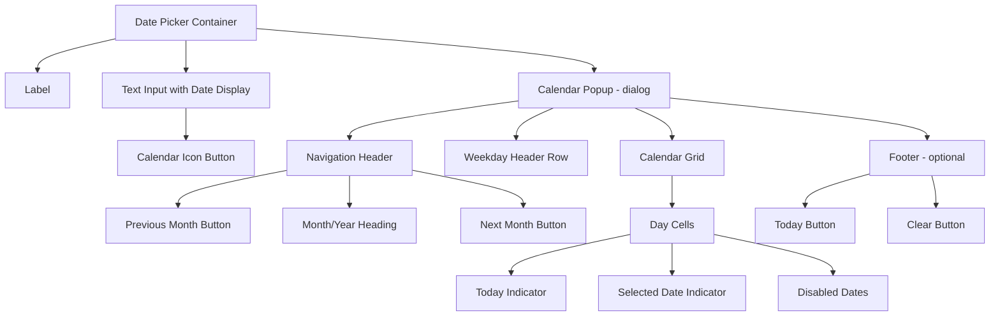

# Date Picker

> Create user-friendly date pickers with calendar interfaces and keyboard navigation.

**URL:** https://uxpatterns.dev/patterns/forms/date-picker
**Source:** apps/web/content/patterns/forms/date-picker.mdx

---

## Overview

A **Date Picker** is a form component that combines a text input (showing the selected date) with a **calendar overlay** that allows users to visually browse and select a date. The calendar provides context about surrounding dates, days of the week, and time-relative positioning that a plain text input cannot offer.

Unlike a [Date Input](/patterns/forms/date-input) (which is optimized for direct keyboard entry of known dates), a Date Picker is designed for situations where the user benefits from seeing the calendar — scheduling appointments, choosing a future delivery date, or selecting from a constrained set of available days.

## Use Cases

### When to use:

- **Appointment scheduling** – Users need to see available slots in context.
- **Delivery and shipping dates** – Shows available delivery days vs. blackout dates.
- **Event creation** – Users select a date relative to today or other events.
- **Hotel and travel booking** – Contextual date selection with pricing or availability.
- **Report or filter date** – Selecting a specific date for data filtering.

### When not to use:

- **Known, historical dates** – Use a [Date Input](/patterns/forms/date-input) for birth dates or past records where calendar navigation is tedious.
- **Date ranges** – Use a [Date Range](/patterns/forms/date-range) component instead.
- **Mobile-only contexts** – The native `<input type="date">` opens the platform's native picker; a custom calendar may be redundant.
- **Very distant dates** – Navigating 80+ years in a calendar is impractical; use a text date input with year input.

## Benefits

- **Visual context** – Users see surrounding dates, day-of-week alignment, and time position.
- **Reduced format errors** – No ambiguity about date format — clicking always produces a valid date.
- **Availability visualization** – Disabled dates clearly show unavailable options.
- **Today highlight** – Users can orient themselves relative to the current date.
- **Min/max enforcement** – Cannot select dates outside the allowed range.

## Drawbacks

- **Slower for known dates** – Navigating a calendar to a known date takes more time than typing.
- **Complex implementation** – Focus management, [keyboard navigation](/glossary/keyboard-navigation), and ARIA roles are non-trivial.
- **Modal/overlay complexity** – Popup positioning, z-[index](/glossary/index) management, and dismissal logic.
- **Accessibility burden** – Full ARIA Calendar grid pattern requires careful implementation.
- **Mobile overlap** – Competes with the native date picker experience on mobile.## Anatomy



### Component Structure

1. **Container**

   - Wraps the text input and popup calendar.
   - Manages open/closed state and positions the popup.

2. **Label**

   - Describes the field: "Check-in date", "Appointment date".
   - Associated with the text input via `for`.

3. **Text Input**

   - Displays the selected date in the locale's format.
   - Also accepts direct keyboard input (optional).
   - The calendar icon button opens the popup.

4. **Calendar Icon Button**

   - `aria-label="Open calendar"` (or "Open date picker").
   - `aria-haspopup="dialog"`.
   - `aria-expanded="true/false"` reflecting popup state.

5. **Calendar Popup (`role="dialog"`)**

   - `aria-modal="true"` with `aria-label` describing the dialog.
   - Focus is trapped inside while open.
   - Closes on `Escape` or date selection.

6. **Navigation Header**

   - Previous/next month buttons with `aria-label="Previous month"` / `"Next month"`.
   - Month/year heading as a live region announcing current view.

7. **Calendar Grid (`role="grid"`)**

   - Weekday headers as `<th scope="col">`.
   - Day cells as `<td>` with `role="gridcell"`.
   - Selected cell: `aria-selected="true"`.
   - Disabled cells: `aria-disabled="true"`.
   - Today's cell: additional visual indicator (underline or circle).

8. **Footer (optional)**

   - "Today" button to jump to and select current date.
   - "Clear" button to remove selection.

#### Summary of Components

| Component            | Required? | Purpose                                          |
| -------------------- | --------- | ------------------------------------------------ |
| Label                | ✅ Yes    | Names the date field                             |
| Text Input           | ✅ Yes    | Shows selected date and accepts typed entry      |
| Calendar Button      | ✅ Yes    | Opens the calendar popup                         |
| Calendar Popup       | ✅ Yes    | Calendar grid for visual date selection          |
| Navigation Arrows    | ✅ Yes    | Move between months                              |
| Today Indicator      | ❌ No     | Highlights today's date in the grid              |
| Footer Shortcuts     | ❌ No     | "Today" / "Clear" quick actions                  |

## Variations

### Basic Date Picker

Standard single-date selection with calendar popup.

```html
<div class="date-picker">
  <label for="appt-date">Appointment date</label>
  <div class="date-picker__input-wrapper">
    <input
      type="text"
      id="appt-date"
      class="date-picker__input"
      placeholder="MM/DD/YYYY"
      autocomplete="off"
      aria-haspopup="dialog"
      aria-expanded="false"
      aria-describedby="appt-date-help"
      readonly
    />
    <button
      type="button"
      class="date-picker__trigger"
      aria-label="Open calendar"
      aria-haspopup="dialog"
      aria-expanded="false"
      aria-controls="appt-calendar"
    >
      <!-- Calendar icon SVG -->
    </button>
  </div>
  <p id="appt-date-help" class="date-picker__help">Select from available dates</p>

  <div
    id="appt-calendar"
    class="date-picker__popup"
    role="dialog"
    aria-modal="true"
    aria-label="Choose appointment date"
    hidden
  >
    <!-- Calendar content -->
  </div>
</div>
```

### Calendar Grid Structure

The core accessible calendar grid markup.

```html
<div class="calendar" role="application" aria-label="March 2026">
  <div class="calendar__header">
    <button type="button" aria-label="Previous month, February 2026">&#8249;</button>
    <h2 class="calendar__heading" aria-live="polite">March 2026</h2>
    <button type="button" aria-label="Next month, April 2026">&#8250;</button>
  </div>

  <table class="calendar__grid" role="grid" aria-label="March 2026">
    <thead>
      <tr>
        <th scope="col" abbr="Sunday">Su</th>
        <th scope="col" abbr="Monday">Mo</th>
        <th scope="col" abbr="Tuesday">Tu</th>
        <th scope="col" abbr="Wednesday">We</th>
        <th scope="col" abbr="Thursday">Th</th>
        <th scope="col" abbr="Friday">Fr</th>
        <th scope="col" abbr="Saturday">Sa</th>
      </tr>
    </thead>
    <tbody>
      <tr>
        <td role="gridcell" aria-label="Sunday, March 1, 2026">
          <button type="button" tabindex="-1">1</button>
        </td>
        <!-- ... more days ... -->
        <td role="gridcell" aria-label="Thursday, March 12, 2026" aria-current="date">
          <button type="button" tabindex="0" class="calendar__day--today">12</button>
        </td>
        <!-- ... more days ... -->
      </tr>
    </tbody>
  </table>

  <div class="calendar__footer">
    <button type="button" class="calendar__today-btn">Today</button>
    <button type="button" class="calendar__clear-btn">Clear</button>
  </div>
</div>
```

### With Disabled Dates

```html
<!-- Disabled date cells (e.g., past dates or unavailable slots) -->
<td role="gridcell" aria-disabled="true" aria-label="Saturday, March 7, 2026, unavailable">
  <button type="button" disabled class="calendar__day--disabled">7</button>
</td>

<!-- Selected date -->
<td role="gridcell" aria-selected="true" aria-label="Wednesday, March 18, 2026, selected">
  <button type="button" class="calendar__day--selected" tabindex="0">18</button>
</td>
```

### With Min/Max Date Range

```html
<div class="date-picker">
  <label for="ship-date">Shipping date</label>
  <input
    type="text"
    id="ship-date"
    placeholder="Select date"
    readonly
    aria-describedby="ship-date-help"
  />
  <button type="button" aria-label="Open calendar" aria-haspopup="dialog"></button>
  <p id="ship-date-help" class="date-picker__help">
    Available: March 15–March 31, 2026. Weekend delivery unavailable.
  </p>
</div>
```

### Inline Calendar (No Popup)

For dedicated date selection screens where a popup isn't needed.

```html
<div class="date-picker date-picker--inline">
  <label>Select check-in date</label>
  <div class="calendar calendar--inline">
    <!-- Same calendar grid, always visible -->
  </div>
</div>
```

## Best Practices

### Content & Usability

**Do's ✅**

- Display the day of the week alongside dates to help users orient themselves.
- Highlight today's date with a visual indicator (underline, dot, or subtle background).
- Clearly show disabled dates with a visual treatment (strikethrough or muted color).
- Provide a "Today" button for quick navigation to the current date.
- Allow users to type dates directly in the text input in addition to using the calendar.
- Remember and restore the last viewed month when the picker is reopened.
- Close the calendar automatically after a date is selected.

**Don'ts ❌**

- Don't open the calendar directly on text input focus — open only when the calendar icon is clicked or when the input's own `Enter`/`Space` key is pressed.
- Don't prevent month navigation beyond the selected date.
- Don't use abbreviations for month names without full names accessible to screen readers.
- Don't show years only through month-by-month navigation — provide a year selector for large ranges.

---

### Accessibility

**Do's ✅**

- Use `role="dialog"` with `aria-modal="true"` on the popup.
- Implement the ARIA Calendar Grid pattern: `role="grid"` on the table, `role="gridcell"` on day cells.
- Announce current month/year with `aria-live="polite"` when navigating months.
- Use `aria-selected="true"` on the selected day cell.
- Use `aria-disabled="true"` and `disabled` on unavailable day buttons.
- Use `aria-current="date"` on today's cell.
- Return focus to the trigger button (or the input) when the calendar closes.
- Trap focus within the calendar popup while it is open.

**Don'ts ❌**

- Don't let focus escape the popup accidentally.
- Don't announce every calendar cell on render — only announce the currently focused cell.
- Don't use color alone to distinguish today, selected, and disabled states.

---

### Visual Design

**Do's ✅**

- Use a clear ring or bold background for the selected date.
- Use a neutral border or underline for today's date (distinct from selected).
- Use muted opacity (50%) for disabled dates, with a not-allowed cursor.
- Show the full month name and four-digit year in the calendar header.
- Size day cells at least 36×36px; prefer 40×40px for comfortable clicking.

**Don'ts ❌**

- Don't make today and selected look too similar — users may confuse them.
- Don't show multiple months simultaneously unless implementing a date range picker.
- Avoid cluttering the calendar header with too many navigation controls.

---

### Layout & Positioning

**Do's ✅**

- Position the calendar popup below the input by default; flip above when space is limited.
- Align the popup left-edge with the input field (or right-edge in RTL).
- On mobile, use a bottom sheet or full-width popup instead of a floating overlay.
- Ensure the popup does not overflow the [viewport](/glossary/viewport).
**Don'ts ❌**

- Don't position the popup far from the input that triggered it.
- Don't use `position: fixed` if the input is inside a scrollable container.

## Common Mistakes & Anti-Patterns 🚫

### Opening the Calendar on Input Focus

**The Problem:**
Opening the calendar automatically when the text input gains focus is disruptive for keyboard users navigating through a form and for users who prefer to type dates directly.

**How to Fix It?** Open the calendar only when the calendar icon button is activated.

```javascript
// Bad
dateInput.addEventListener('focus', openCalendar);

// Good
calendarButton.addEventListener('click', toggleCalendar);
calendarButton.addEventListener('keydown', (e) => {
  if (e.key === 'Enter' || e.key === ' ') {
    e.preventDefault();
    toggleCalendar();
  }
});
```

---

### No Keyboard Navigation in Calendar Grid

**The Problem:**
A calendar that requires mouse interaction is inaccessible to keyboard and [screen reader](/glossary/screen-reader) users.
**How to Fix It?** Implement the full ARIA grid keyboard navigation pattern.

```javascript
calendarGrid.addEventListener('keydown', (e) => {
  const focused = document.activeElement;
  switch (e.key) {
    case 'ArrowRight': focusDay(getNextDay(focused)); break;
    case 'ArrowLeft':  focusDay(getPrevDay(focused)); break;
    case 'ArrowDown':  focusDay(getNextWeek(focused)); break;
    case 'ArrowUp':    focusDay(getPrevWeek(focused)); break;
    case 'Home':       focusDay(getFirstDayOfWeek(focused)); break;
    case 'End':        focusDay(getLastDayOfWeek(focused)); break;
    case 'PageUp':     navigateToPrevMonth(); break;
    case 'PageDown':   navigateToNextMonth(); break;
    case 'Escape':     closeCalendar(); break;
  }
});
```

---

### Not Returning Focus After Close

**The Problem:**
When the calendar closes (after date selection or `Escape`), focus disappears or jumps to the top of the page.

**How to Fix It?** Always return focus to the trigger element.

```javascript
function closeCalendar() {
  calendarPopup.hidden = true;
  calendarButton.setAttribute('aria-expanded', 'false');
  calendarButton.focus(); // Always return focus
}
```

---

### Using Color Alone for Date States

**The Problem:**
Using only background color to indicate today, selected, and disabled states fails for color-blind users and low-contrast themes.

**How to Fix It?** Use multiple visual indicators: shape, border, icon, and text weight in addition to color.

## Accessibility

### Keyboard Interaction Pattern

| **Key**                | **Action**                                                         |
| ---------------------- | ------------------------------------------------------------------ |
| `Enter` / `Space`      | Opens calendar when on the trigger button; selects focused date    |
| `Escape`               | Closes the calendar and returns focus to the trigger               |
| `Arrow Right`          | Moves focus to the next day                                        |
| `Arrow Left`           | Moves focus to the previous day                                    |
| `Arrow Down`           | Moves focus to the same day next week                              |
| `Arrow Up`             | Moves focus to the same day previous week                          |
| `Home`                 | Moves focus to the first day of the current week                   |
| `End`                  | Moves focus to the last day of the current week                    |
| `Page Up`              | Navigates to the previous month                                    |
| `Page Down`            | Navigates to the next month                                        |
| `Shift + Page Up`      | Navigates to the previous year                                     |
| `Shift + Page Down`    | Navigates to the next year                                         |
| `Tab`                  | Moves focus through interactive calendar controls (nav, grid)      |

## Micro-Interactions & Animations

### Calendar Open/Close Animation
- **Effect:** Calendar popup slides down and fades in from behind the input
- **Timing:** 200ms ease-out open; 150ms ease-in close

```css
@keyframes calendar-open {
  from { opacity: 0; transform: translateY(-8px); }
  to { opacity: 1; transform: translateY(0); }
}

.date-picker__popup:not([hidden]) {
  animation: calendar-open 200ms ease-out;
}
```

### Month Navigation Transition
- **Effect:** Current month slides out left/right while new month slides in
- **Timing:** 200ms ease-in-out

```css
@keyframes slide-out-left {
  to { opacity: 0; transform: translateX(-16px); }
}

@keyframes slide-in-right {
  from { opacity: 0; transform: translateX(16px); }
}
```

### Day Cell Hover
- **Effect:** Subtle circular background appears on hover over selectable days
- **Timing:** 120ms ease-out

```css
.calendar__day-btn {
  border-radius: 50%;
  transition: background-color 120ms ease-out;
}

.calendar__day-btn:hover:not(:disabled) {
  background-color: #eff6ff;
}
```

### Selected Date Indicator
- **Effect:** Selected day gets a filled circular background with white text
- No animation — immediate state change for clarity

```css
.calendar__day-btn[aria-selected="true"] {
  background-color: #3b82f6;
  color: #ffffff;
  font-weight: 600;
}
```

## Tracking

### Key Tracking Points

| **Event Name**                  | **Description**                                       | **Why Track It?**                                     |
| ------------------------------- | ----------------------------------------------------- | ----------------------------------------------------- |
| `date_picker.opened`            | Calendar popup opened                                 | Measures picker engagement                            |
| `date_picker.date_selected`     | User selects a date from the calendar                 | Core conversion metric                                |
| `date_picker.month_navigated`   | User navigates to a different month                   | Reveals booking patterns and future preference        |
| `date_picker.today_clicked`     | User clicks the "Today" shortcut                      | Measures shortcut usage                               |
| `date_picker.cleared`           | User clears the selected date                         | Signals reconsideration or form abandonment           |
| `date_picker.typed`             | User types a date in the text input                   | Measures direct-typing vs calendar selection ratio    |
| `date_picker.closed_no_select`  | Calendar closed without selecting a date              | Measures abandonment within the picker                |

### Event Payload Structure

```json
{
  "event": "date_picker.date_selected",
  "properties": {
    "field_id": "checkout_date",
    "selected_date": "2026-03-18",
    "days_from_today": 6,
    "months_navigated": 0,
    "selection_method": "calendar_click",
    "form_id": "booking_form"
  }
}
```

### Key Metrics to Analyze

- **Selection Rate** → What percentage of users who open the picker select a date
- **Navigation Depth** → How many months ahead/back users typically navigate
- **Typing vs Clicking** → Which entry method users prefer
- **Today Button Usage** → How often users use the "Today" shortcut

## Localization

```json
{
  "date_picker": {
    "input_placeholder": "Select a date",
    "open_calendar": "Open calendar",
    "close_calendar": "Close calendar",
    "prev_month": "Previous month, {month} {year}",
    "next_month": "Next month, {month} {year}",
    "today": "Today",
    "clear": "Clear date",
    "selected": "{date}, selected",
    "today_indicator": "{date}, today",
    "disabled": "{date}, unavailable",
    "calendar_label": "Choose {fieldName}",
    "month_year_heading": "{month} {year}",
    "weekdays": {
      "sunday": "Sunday",
      "monday": "Monday",
      "tuesday": "Tuesday",
      "wednesday": "Wednesday",
      "thursday": "Thursday",
      "friday": "Friday",
      "saturday": "Saturday"
    },
    "errors": {
      "required": "Please select a date",
      "too_early": "Please select a date on or after {min}",
      "too_late": "Please select a date on or before {max}"
    }
  }
}
```

### First Day of Week by Locale

| Region            | First Day |
| ----------------- | --------- |
| United States     | Sunday    |
| Most of Europe    | Monday    |
| Saudi Arabia      | Saturday  |
| ISO 8601          | Monday    |

Always use `Intl.Locale` or a locale database to determine the correct first day of week.

### RTL Language Support

```css
[dir="rtl"] .calendar__header {
  flex-direction: row-reverse;
}

/* Swap previous/next button icons */
[dir="rtl"] .calendar__prev-btn svg {
  transform: scaleX(-1);
}

[dir="rtl"] .calendar__next-btn svg {
  transform: scaleX(-1);
}
```

## Performance Metrics

- **Calendar open time**: < 100ms from button click to visible calendar
- **Month navigation**: < 50ms to render new month grid
- **Day selection**: < 16ms from click to input update and popup close
- **Memory usage**: < 20KB per date picker instance
- **[DOM](/glossary/dom) size**: < 50 nodes for a single month calendar grid
## Testing Guidelines

### Functional Testing

**Should ✓**

- [ ] Clicking the calendar icon opens the popup.
- [ ] Selecting a date updates the text input and closes the popup.
- [ ] "Today" button navigates to and selects the current date.
- [ ] "Clear" button removes the selection and clears the text input.
- [ ] Min/max date constraints prevent selection outside the allowed range.
- [ ] Month navigation updates the calendar grid correctly.
- [ ] The input field updates correctly when typing a date manually.

---

### Accessibility Testing

**Should ✓**

- [ ] Screen reader announces calendar as a dialog with a label.
- [ ] Focused day cell is announced with full date and state (selected/today/disabled).
- [ ] Month navigation announces the new month via `aria-live`.
- [ ] Keyboard navigation (Arrow keys, Home, End, Page Up/Down) works correctly.
- [ ] Escape closes the calendar and returns focus to the trigger.
- [ ] Focus is trapped within the calendar popup while open.
- [ ] `aria-selected="true"` is set on the selected day cell.
- [ ] `aria-disabled="true"` is set on unavailable day buttons.

---

### Performance Testing

**Should ✓**

- [ ] Calendar opens within 100ms.
- [ ] Month navigation renders in under 50ms.
- [ ] No layout shift when calendar opens or closes.
- [ ] Smooth animation at 60fps.

---

### Security Testing

**Should ✓**

- [ ] Date constraints are validated server-side.
- [ ] Manually typed dates are sanitized before processing.

---

### Mobile & Touch Testing

**Should ✓**

- [ ] Calendar popup opens as a bottom sheet on small screens.
- [ ] Day cells have [touch targets](/glossary/touch-targets) of at least 44×44px.
- [ ] The calendar is usable on screens as narrow as 320px.
- [ ] Swipe gestures are considered for month navigation (optional).
---

### Edge Cases

**Should ✓**

- [ ] Months with 28, 29, 30, and 31 days render correctly.
- [ ] December/January year boundary navigation works.
- [ ] All days of a month falling within a min/max range are selectable.
- [ ] Selected date outside min/max (e.g., from a previous form state) is handled gracefully.
- [ ] The calendar shows correct first-day-of-week for the user's locale.

## Frequently Asked Questions

` on mobile as it opens the platform's native picker, which is optimized for touch. If you must use a custom picker on mobile, render the calendar in a bottom sheet (full-width, slides up from the bottom) rather than a floating popup, and ensure day cells are at least 44×44px.",
    },
  ]}
/>

## Related Patterns

## Resources

### References

- [WCAG 2.2](https://www.w3.org/TR/WCAG22/) - Accessibility baseline for keyboard support, focus management, and readable state changes.
- [MDN date input](https://developer.mozilla.org/en-US/docs/Web/HTML/Element/input/date) - Native date input support, parsing, and constraint behavior.

### Guides

- [Nielsen Norman Group: Date-input usability](https://www.nngroup.com/articles/date-input/) - Research on segmented date fields, formatting, and calendar picker tradeoffs.

### Articles

- [Nielsen Norman Group: Date-input usability](https://www.nngroup.com/articles/date-input/) - Research on segmented date fields, formatting, and calendar picker tradeoffs.

### NPM Packages

- [`react-day-picker`](https://www.npmjs.com/package/react-day-picker) - Calendar and date-range primitives for custom date pickers.
- [`date-fns`](https://www.npmjs.com/package/date-fns) - Date parsing, formatting, and range math for calendars and schedule interfaces.
- [`@internationalized/date`](https://www.npmjs.com/package/%40internationalized%2Fdate) - Locale-aware date calculations used in robust date/time selection UIs.
