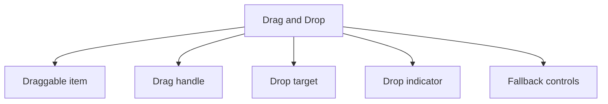

# Drag and Drop

> Build intuitive drag and drop functionality with accessibility and touch support.

**URL:** https://uxpatterns.dev/patterns/content-management/drag-and-drop
**Source:** apps/web/content/patterns/content-management/drag-and-drop.mdx

---

## Overview

A **Drag and Drop** pattern helps teams create a reliable way to let users move or reorder items spatially while preserving clear feedback, keyboard alternatives, and safe recovery. It is most useful when teams need sortable lists and priorities.

Compared with adjacent patterns, this pattern should reduce friction without hiding the state, rules, or recovery paths people need to keep moving.

## Use Cases

### When to use:

- Sortable lists and priorities
- Moving cards across stages
- Upload or placement gestures

### When not to use:

- Use explicit buttons or menus when direct manipulation would be harder to learn.
- Avoid gesture-heavy behavior if the surface must work well with keyboard-only use.
- Do not require drag or hover when a clearer alternative exists.

### Common scenarios and examples

- Sortable lists and priorities where users need a clear, repeatable interface model.
- Moving cards across stages where users need a clear, repeatable interface model.
- Upload or placement gestures where users need a clear, repeatable interface model.

## Benefits

- Clarifies how drag and drop should behave before implementation details begin to sprawl.
- Creates a reusable interaction model for teams who need to let users move or reorder items spatially while preserving clear feedback, keyboard alternatives, and safe recovery.
- Makes accessibility, edge cases, and recovery paths part of the design instead of post-launch cleanup.
- Gives product, design, and engineering a shared language for evaluating trade-offs.

## Drawbacks

- The pattern introduces more state and edge cases than its static mockups suggest.
- It requires coordination between content, interaction, and accessibility choices.
- Teams often underestimate how much polish is needed for non-happy states.
- Responsive behavior usually needs explicit planning rather than minor CSS tweaks.

## Anatomy



### Component Structure

1. **Draggable item**

- Represents the object being moved.

2. **Drag handle**

- Limits the gesture to a predictable area when needed.

3. **Drop target**

- Defines the valid destination for the item.

4. **Drop indicator**

- Shows exactly where the item will land.

5. **Fallback controls**

- Provide keyboard or menu-based movement options.

#### Summary of Components

| Component | Required? | Purpose |
| --- | --- | --- |
| Draggable item | ✅ Yes | Represents the object being moved. |
| Drag handle | ❌ No | Limits the gesture to a predictable area when needed. |
| Drop target | ✅ Yes | Defines the valid destination for the item. |
| Drop indicator | ✅ Yes | Shows exactly where the item will land. |
| Fallback controls | ❌ No | Provide keyboard or menu-based movement options. |

## Variations

### Sortable list

Reorders items within one collection.

**When to use:** Use for prioritization, playlists, and ordered lists.

### Cross-zone drag and drop

Moves items between containers or statuses.

**When to use:** Use for boards, upload zones, and categorization.

### Canvas placement

Places objects spatially in two dimensions.

**When to use:** Use when location itself carries meaning.

## Best Practices

### Content

**Do's ✅**

- State the job of the pattern clearly before layering on visual complexity.
- Keep labels, controls, and outcomes in the same mental group.
- Use supporting text to reduce ambiguity, not to restate the obvious.

**Don'ts ❌**

- Do not force users to infer system state from decoration alone.
- Do not add extra interaction steps without a clear benefit.
- Do not assume the design works equally well for novice and expert users.

### Accessibility

**Do's ✅**

- Verify that drag and drop can be completed using keyboard alone.
- Keep focus order logical when the pattern opens, updates, or reveals additional UI.
- Preserve a visible focus state that is still readable at high zoom.
- Use semantic elements first, then add ARIA only where semantics alone are not enough.
- Announce state changes such as errors, loading, or completion in the right place and with the right politeness.

**Don'ts ❌**

- Do not remove focus styles without a visible replacement.
- Do not depend on placeholder or helper text that disappears before the user can act on it.
- Do not assume pointer, touch, and assistive technologies will all interact with the pattern the same way.

### Visual Design

**Do's ✅**

- Preserve a clear hierarchy between primary content, secondary metadata, and controls.
- Use visual rhythm to make the pattern easier to scan.
- Treat hover, focus, and active states as part of the design system.

**Don'ts ❌**

- Do not overload the default view with secondary options.
- Do not use visual emphasis without meaning behind it.
- Do not let state changes shift unrelated content unexpectedly.

### Layout & Positioning

**Do's ✅**

- Keep the pattern stable across common breakpoints.
- Preserve proximity between cause and effect.
- Plan empty, loading, and error states in the same container.

**Don'ts ❌**

- Do not let layout rearrangements hide the current state.
- Do not depend on fixed heights when content length is variable.
- Do not design only for the most ideal dataset or [viewport](/glossary/viewport).
## Event Handling

- Keep drag start, drag over, drop, and cancel states explicit in the implementation model.
- Use visible drop indicators rather than asking users to guess where the item will land.
- Provide keyboard or menu-based move actions when pointer-based drag is not practical.

## Performance

- Avoid re-rendering the entire collection on every pointer move when only the placeholder position needs to change.
- Use stable item heights or preview geometry so the list does not shift unpredictably during a drag.
- Throttle expensive collision or ordering calculations when the surface contains many items.

## Common Mistakes & Anti-Patterns 🚫

### **Designing only the happy path**

**The Problem:**
The pattern feels polished until loading, empty, and failure states appear.

**How to Fix It?**
Specify the full lifecycle alongside the default state so implementation does not improvise later.

---

### **Letting interaction and content drift apart**

**The Problem:**
Users work harder when controls, status, and supporting information feel disconnected.

**How to Fix It?**
Keep the information architecture of the pattern close to the interaction model.

---

### **Treating accessibility as a final pass**

**The Problem:**
Keyboard, announcement, and reading-order issues become expensive once the interaction is already fixed.

**How to Fix It?**
Bake semantics, focus behavior, and announcements into the first implementation.

## Examples

### Live Preview

### Basic Implementation

```html
<div class="demo-shell card dnd-card">
  <p><strong>Reorder the launch checklist</strong></p>
  <ul id="dnd-list">
    <li draggable="true">Draft release notes</li>
    <li draggable="true">QA the signup flow</li>
    <li draggable="true">Prepare launch email</li>
  </ul>
</div>
```

### What this example demonstrates

- A clear baseline implementation of drag and drop that can be reviewed without framework-specific noise.
- Visible state, spacing, and content hierarchy that mirror the implementation guidance above.
- A small enough surface to copy into a design review or prototype before scaling the pattern up.

### Implementation Notes

- Start with [semantic HTML](/glossary/semantic-html) and only add JavaScript where the interaction truly requires it.
- Keep styling tokens and spacing consistent with adjacent controls or layouts.
- If the live implementation introduces async behavior, mirror those states in the code example rather than documenting them only in prose.
## Accessibility

### Keyboard Interaction

- [ ] Verify that drag and drop can be completed using keyboard alone.
- [ ] Keep focus order logical when the pattern opens, updates, or reveals additional UI.
- [ ] Preserve a visible focus state that is still readable at high zoom.

### Screen Reader Support

- [ ] Use semantic elements first, then add ARIA only where semantics alone are not enough.
- [ ] Announce state changes such as errors, loading, or completion in the right place and with the right politeness.
- [ ] Connect labels, hints, and status text with `aria-describedby` or structural headings when useful.

### Visual Accessibility

- [ ] Do not rely on color alone to convey severity, completion, or selection state.
- [ ] Test the pattern at 200% zoom and with reduced motion enabled.
- [ ] Ensure [touch targets](/glossary/touch-targets) remain comfortable on mobile and coarse pointers.
## Testing Guidelines

### Functional Testing

- [ ] Verify the default, loading, error, and success states for drag and drop.
- [ ] Test the primary action and the obvious recovery action in the same run.
- [ ] Confirm that state survives refresh, navigation, or retry in the way users would expect.

### Accessibility Testing

- [ ] Run keyboard-only checks and at least one [screen reader](/glossary/screen-reader) pass on the final implementation.
- [ ] Validate headings, labels, and announcement behavior with real content rather than lorem ipsum.
- [ ] Check color contrast and focus visibility in both default and stressed states.
### Edge Cases

- [ ] Test empty, long, duplicated, and unexpectedly formatted content.
- [ ] Check behavior on narrow screens, zoomed layouts, and slower networks.
- [ ] Verify that optimistic or asynchronous states reconcile correctly after a failure.

## Frequently Asked Questions

## Related Patterns

## Resources

### References

- [WCAG 2.2](https://www.w3.org/TR/WCAG22/) - Accessibility baseline for keyboard support, focus management, and readable state changes.
- [MDN Pointer Events](https://developer.mozilla.org/en-US/docs/Web/API/Pointer_events) - Unified input event model for drag, drawing, pen, touch, and mouse interactions.

### Guides

- [MDN WAI-ARIA basics](https://developer.mozilla.org/en-US/docs/Learn_web_development/Core/Accessibility/WAI-ARIA_basics) - Guidance on when to rely on native HTML and when to introduce ARIA roles and states.

### Articles

- [web.dev: Rendering on the Web](https://web.dev/articles/rendering-on-the-web) - Rendering tradeoffs for data-rich pages, dashboards, and result-heavy views.

### NPM Packages

- [`@dnd-kit/core`](https://www.npmjs.com/package/%40dnd-kit%2Fcore) - Headless drag-and-drop primitives for lists, cards, and board interactions.
- [`@dnd-kit/sortable`](https://www.npmjs.com/package/%40dnd-kit%2Fsortable) - Sortable helpers for drag-reorder patterns and Kanban-style boards.
- [`sortablejs`](https://www.npmjs.com/package/sortablejs) - Framework-agnostic drag sorting for simple reorder and transfer interactions.
