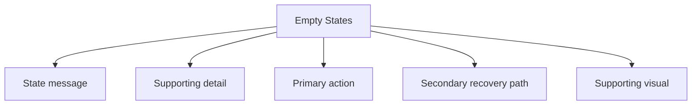

# Empty States

> Create effective empty state experiences in your web applications. Learn best practices for handling no-content scenarios with helpful messaging and clear actions.

**URL:** https://uxpatterns.dev/patterns/user-feedback/empty-states
**Source:** apps/web/content/patterns/user-feedback/empty-states.mdx

---

## Overview

A **Empty States** pattern helps teams create a reliable way to turn a blank or zero-result view into a helpful next-step moment instead of a dead end. It is most useful when teams need first-use dashboards and inboxes.

Compared with adjacent patterns, this pattern should reduce friction without hiding the state, rules, or recovery paths people need to keep moving.

## Use Cases

### When to use:

- First-use dashboards and inboxes
- Search or filter results with zero matches
- Completed queues or cleared lists

### When not to use:

- Use a quieter state when the event is too minor to interrupt the task.
- Avoid transient feedback for events users must be able to revisit later.
- Do not duplicate the same message in several channels without a hierarchy rule.

### Common scenarios and examples

- First-use dashboards and inboxes where users need a clear, repeatable interface model.
- Search or filter results with zero matches where users need a clear, repeatable interface model.
- Completed queues or cleared lists where users need a clear, repeatable interface model.

## Benefits

- Clarifies how empty states should behave before implementation details begin to sprawl.
- Creates a reusable interaction model for teams who need to turn a blank or zero-result view into a helpful next-step moment instead of a dead end.
- Makes accessibility, edge cases, and recovery paths part of the design instead of post-launch cleanup.
- Gives product, design, and engineering a shared language for evaluating trade-offs.

## Drawbacks

- Feedback becomes noise if every event gets the same visual weight.
- Timing mistakes can create anxiety, impatience, or missed announcements.
- Motion and sound need careful accessibility handling.
- Transient states are easy to implement badly because they feel small during development.

## Anatomy



### Component Structure

1. **State message**

- Explains why nothing is currently visible.

2. **Supporting detail**

- Clarifies whether the state is first-use, filtered, or already completed.

3. **Primary action**

- Gives users the most useful next step.

4. **Secondary recovery path**

- Offers a less prominent alternative such as clearing filters.

5. **Supporting visual**

- Reinforces the state without replacing the text.

#### Summary of Components

| Component | Required? | Purpose |
| --- | --- | --- |
| State message | ✅ Yes | Explains why nothing is currently visible. |
| Supporting detail | ✅ Yes | Clarifies whether the state is first-use, filtered, or already completed. |
| Primary action | ✅ Yes | Gives users the most useful next step. |
| Secondary recovery path | ❌ No | Offers a less prominent alternative such as clearing filters. |
| Supporting visual | ❌ No | Reinforces the state without replacing the text. |

## Variations

### First-use empty state

Onboards users into the feature.

**When to use:** Use when the state is expected on day one.

### No-results state

Helps users recover from filters or search terms.

**When to use:** Use when the system has data, but the current view is empty.

### Completed-state empty state

Confirms there is nothing left to process.

**When to use:** Use for inbox zero, cleared queues, or finished workflows.

## Best Practices

### Content

**Do's ✅**

- Describe what happened in direct language before adding decoration.
- Match the urgency of the message to the urgency of the event.
- Tell users what they can do next whenever recovery matters.

**Don'ts ❌**

- Do not use the same tone for success, warning, and failure states.
- Do not auto-dismiss critical feedback before it can be read.
- Do not use animation as the only sign that state has changed.

### Accessibility

**Do's ✅**

- Verify that empty states can be completed using keyboard alone.
- Keep focus order logical when the pattern opens, updates, or reveals additional UI.
- Preserve a visible focus state that is still readable at high zoom.
- Use semantic elements first, then add ARIA only where semantics alone are not enough.
- Announce state changes such as errors, loading, or completion in the right place and with the right politeness.

**Don'ts ❌**

- Do not remove focus styles without a visible replacement.
- Do not depend on placeholder or helper text that disappears before the user can act on it.
- Do not assume pointer, touch, and assistive technologies will all interact with the pattern the same way.

### Visual Design

**Do's ✅**

- Reserve visual intensity for the highest-priority moments.
- Keep transitions smooth and short enough to avoid slowing the task.
- Design idle, loading, success, and failure states as a family.

**Don'ts ❌**

- Do not stack multiple competing banners, toasts, and spinners in the same area.
- Do not rely on color-only severity mapping.
- Do not let placeholders and live content use completely different geometry.

### Layout & Positioning

**Do's ✅**

- Keep local feedback near the part of the UI that changed.
- Use consistent placement so users learn where to look.
- Plan how the feedback behaves on small screens and zoomed layouts.

**Don'ts ❌**

- Do not cover key controls unless blocking interaction is intentional.
- Do not move the [viewport](/glossary/viewport) unexpectedly to reveal transient feedback.
- Do not mix persistent and transient messages without a hierarchy rule.
## Micro-Interactions & Animations

- Use motion to reinforce state change, not to create novelty for its own sake.
- Keep entrance and exit animations short enough that they never delay the actual state users care about.
- Respect `prefers-reduced-motion` by simplifying shimmer, pulse, or slide effects rather than removing the pattern entirely.

## Timing & Announcement Guidance

| Situation | Recommended behavior | Notes |
| --- | --- | --- |
| Short local action | Use a light busy or success state | Avoid full-screen interruption for small waits. |
| Unknown-duration task | Use a loading indicator with honest status text | Escalate to a stronger state if the wait becomes long. |
| Critical warning or failure | Use a persistent alert or banner | Keep it visible until the user can acknowledge or recover. |

## Common Mistakes & Anti-Patterns 🚫

### **Over-signaling everything**

**The Problem:**
When every state uses strong color, motion, and sound, people stop paying attention.

**How to Fix It?**
Create a severity ladder and reserve the strongest treatment for the states that truly need interruption.

---

### **Mismatching timing to the job**

**The Problem:**
Short tasks feel sluggish with heavy loading UI, while long tasks feel abandoned with no progress guidance.

**How to Fix It?**
Pick the lightest possible feedback for the wait length and keep the pattern honest about how much is known.

---

### **Skipping announcement strategy**

**The Problem:**
[Screen reader](/glossary/screen-reader) users miss transient changes when live-region behavior is inconsistent or absent.
**How to Fix It?**
Define how each state is announced and test polite versus assertive updates with real assistive technology.

## Examples

### Live Preview

### Basic Implementation

```html
<div class="demo-shell">
  <section class="card empty-card">
    <div class="icon">📭</div>
    <h2>No projects yet</h2>
    <p class="muted">Create your first project to start collecting feedback and review notes.</p>
    <button type="button">Create project</button>
  </section>
</div>
```

### What this example demonstrates

- A clear baseline implementation of empty states that can be reviewed without framework-specific noise.
- Visible state, spacing, and content hierarchy that mirror the implementation guidance above.
- A small enough surface to copy into a design review or prototype before scaling the pattern up.

### Implementation Notes

- Start with [semantic HTML](/glossary/semantic-html) and only add JavaScript where the interaction truly requires it.
- Keep styling tokens and spacing consistent with adjacent controls or layouts.
- If the live implementation introduces async behavior, mirror those states in the code example rather than documenting them only in prose.
## Accessibility

### Keyboard Interaction

- [ ] Verify that empty states can be completed using keyboard alone.
- [ ] Keep focus order logical when the pattern opens, updates, or reveals additional UI.
- [ ] Preserve a visible focus state that is still readable at high zoom.

### Screen Reader Support

- [ ] Use semantic elements first, then add ARIA only where semantics alone are not enough.
- [ ] Announce state changes such as errors, loading, or completion in the right place and with the right politeness.
- [ ] Connect labels, hints, and status text with `aria-describedby` or structural headings when useful.

### Visual Accessibility

- [ ] Do not rely on color alone to convey severity, completion, or selection state.
- [ ] Test the pattern at 200% zoom and with reduced motion enabled.
- [ ] Ensure [touch targets](/glossary/touch-targets) remain comfortable on mobile and coarse pointers.
## Testing Guidelines

### Functional Testing

- [ ] Verify the default, loading, error, and success states for empty states.
- [ ] Test the primary action and the obvious recovery action in the same run.
- [ ] Confirm that state survives refresh, navigation, or retry in the way users would expect.

### Accessibility Testing

- [ ] Run keyboard-only checks and at least one screen reader pass on the final implementation.
- [ ] Validate headings, labels, and announcement behavior with real content rather than lorem ipsum.
- [ ] Check color contrast and focus visibility in both default and stressed states.

### Edge Cases

- [ ] Test empty, long, duplicated, and unexpectedly formatted content.
- [ ] Check behavior on narrow screens, zoomed layouts, and slower networks.
- [ ] Verify that optimistic or asynchronous states reconcile correctly after a failure.

## Frequently Asked Questions

## Related Patterns

## Resources

### References

- [WCAG 2.2](https://www.w3.org/TR/WCAG22/) - Accessibility baseline for keyboard support, focus management, and readable state changes.
- [MDN ARIA live regions](https://developer.mozilla.org/docs/Web/Accessibility/ARIA/Guides/Live_regions) - How to announce streaming text, status updates, and non-modal feedback to screen readers.

### Guides

- [MDN WAI-ARIA basics](https://developer.mozilla.org/en-US/docs/Learn_web_development/Core/Accessibility/WAI-ARIA_basics) - Guidance on when to rely on native HTML and when to introduce ARIA roles and states.

### Articles

- [web.dev: Building a loading bar component](https://web.dev/articles/building/a-loading-bar-component) - Accessible progress-indicator implementation details using the native progress element.
- [Smashing Magazine: Checklist for cards](https://www.smashingmagazine.com/2020/08/checklist-cards-release/) - A practical review of content hierarchy, action density, and card sizing.

### NPM Packages

- [`lucide-react`](https://www.npmjs.com/package/lucide-react) - Icon system for empty states, status chips, and action affordances.
- [`lottie-react`](https://www.npmjs.com/package/lottie-react) - Animation playback for illustrative loading and empty-state treatments.
- [`framer-motion`](https://www.npmjs.com/package/framer-motion) - Motion primitives for affordance, feedback, and progressive reveal.
