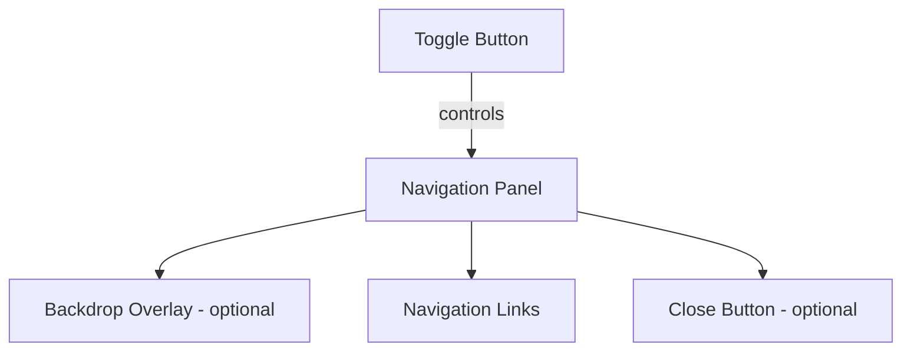

# Hamburger Menu

> Create accessible mobile menus with smooth animations and touch-friendly interactions.

**URL:** https://uxpatterns.dev/patterns/navigation/hambuger-menu
**Source:** apps/web/content/patterns/navigation/hambuger-menu.mdx

---

## Overview

**Hamburger Menu** is a three-line icon (☰) that toggles a hidden navigation panel, primarily on mobile and small-screen devices. Tapping or clicking the icon reveals the site's navigation, then hides it again when dismissed.

This pattern conserves screen real estate on smaller viewports while keeping the full navigation accessible behind a single, universally recognized affordance.

## Use Cases

### When to use:

Use **Hamburger Menu** to **provide full navigation access on small screens without consuming permanent layout space**.

**Common scenarios include:**

- Mobile or responsive websites where horizontal space is limited
- Sites with extensive navigation that cannot fit in a single row on smaller screens
- Progressive web apps that mimic native mobile app patterns
- Responsive redesigns of desktop navigation menus
- Admin dashboards or complex apps with many navigation items

### When not to use:

- Sites with only 3-4 navigation items that fit comfortably in a visible bar
- Desktop-only applications where screen space is abundant
- Kiosk or large-screen interfaces where discoverability is critical
- Pages where the primary user task depends on navigation visibility (e.g., comparison tools)
- When your analytics show users rarely find or use the hidden menu

### Common scenarios and examples

- E-commerce mobile sites hiding category navigation behind a hamburger icon
- News or media apps with section navigation revealed on tap
- SaaS dashboards collapsing sidebar navigation on tablet viewports
- Documentation sites toggling a table of contents on mobile
- Portfolio or single-page sites revealing page sections

## Benefits

- Saves valuable screen space on mobile and tablet devices
- Universally recognized icon that most users understand
- Scales to accommodate large navigation structures
- Keeps the interface clean and focused on content
- Works consistently across responsive breakpoints

## Drawbacks

- **Reduced discoverability** – Hidden navigation means users must know to look for it; some users never open the menu
- **Extra interaction required** – Every navigation action requires an additional tap to open the menu first
- **Engagement drop** – Studies show hidden navigation reduces feature discoverability by up to 50%
- **Focus management complexity** – Requires careful focus trapping and restoration for accessibility
- **Animation performance** – Smooth open/close transitions need GPU-accelerated properties to avoid jank
- **Body scroll lock** – Preventing background scrolling while the menu is open adds implementation complexity

## Anatomy



### Component Structure

1. **Toggle Button**

- The hamburger icon (☰) that opens and closes the navigation panel
- Must use `<button>` element with `aria-expanded` and `aria-controls`
- Often animates between hamburger (☰) and close (✕) states

2. **Navigation Panel**

- The container that slides in or overlays the page content
- Contains all navigation links and potentially nested submenus
- Receives focus when opened, returns focus to trigger when closed

3. **Backdrop Overlay (Optional)**

- Semi-transparent layer behind the panel that dims page content
- Clicking the overlay closes the menu
- Prevents interaction with background content

4. **Navigation Links**

- The list of navigation items within the panel
- Uses semantic `<nav>` with `<ul>` and `<li>` structure
- Supports nested submenus with expand/collapse behavior

5. **Close Button (Optional)**

- Explicit close control inside the panel
- Useful when the toggle button is hidden behind the panel
- Can be omitted if the toggle button remains visible

#### Summary of Components

| Component        | Required? | Purpose                                                        |
| ---------------- | --------- | -------------------------------------------------------------- |
| Toggle Button    | ✅ Yes    | Opens and closes the navigation panel.                         |
| Navigation Panel | ✅ Yes    | Contains the navigation links and structure.                   |
| Backdrop Overlay | ❌ No     | Dims the background and allows close-on-click.                 |
| Navigation Links | ✅ Yes    | The actual menu items users interact with.                     |
| Close Button     | ❌ No     | Provides an explicit way to close the panel from within.       |

## Variations

### 1. Slide-In (Off-Canvas)
The navigation panel slides in from the left or right edge of the screen, pushing or overlaying content.

**When to use:** Standard mobile navigation where the menu contains many items or nested sections.

### 2. Full-Screen Overlay
The menu expands to cover the entire [viewport](/glossary/viewport) with navigation options centered or listed.
**When to use:** Marketing sites, portfolios, or minimal designs where the menu is a design statement.

### 3. Dropdown Panel
The menu drops down from the top of the page, pushing content below it.

**When to use:** Sites with a small number of navigation items that benefit from staying within the page flow.

### 4. Bottom Sheet
A panel that slides up from the bottom of the screen, following native mobile conventions.

**When to use:** Mobile-first progressive web apps mimicking native iOS/Android patterns.

### 5. Icon Morphing
The hamburger icon animates into a close (✕) icon with a smooth transition between states.

**When to use:** When visual polish and micro-interactions are a priority for the brand.

### 6. Sidebar Reveal
The main content shifts to reveal a persistent sidebar-style menu underneath.

**When to use:** App-like interfaces where the navigation should feel like a permanent layer.

## Examples

### Live Preview

### Basic HTML Implementation

```html
<header>
  <button
    type="button"
    class="hamburger-toggle"
    aria-expanded="false"
    aria-controls="main-nav"
    aria-label="Open navigation menu"
  >
    <span class="hamburger-icon" aria-hidden="true"></span>
  </button>

  <nav id="main-nav" class="nav-panel" aria-label="Main navigation" hidden>
    <ul>
      <li><a href="/">Home</a></li>
      <li><a href="/about">About</a></li>
      <li><a href="/services">Services</a></li>
      <li><a href="/contact">Contact</a></li>
    </ul>
  </nav>

  <div class="nav-overlay" aria-hidden="true"></div>
</header>

<script>
  const toggle = document.querySelector('.hamburger-toggle');
  const nav = document.querySelector('#main-nav');
  const overlay = document.querySelector('.nav-overlay');

  function openMenu() {
    toggle.setAttribute('aria-expanded', 'true');
    toggle.setAttribute('aria-label', 'Close navigation menu');
    nav.removeAttribute('hidden');
    document.body.style.overflow = 'hidden';
    nav.querySelector('a').focus();
  }

  function closeMenu() {
    toggle.setAttribute('aria-expanded', 'false');
    toggle.setAttribute('aria-label', 'Open navigation menu');
    nav.setAttribute('hidden', '');
    document.body.style.overflow = '';
    toggle.focus();
  }

  toggle.addEventListener('click', () => {
    const isOpen = toggle.getAttribute('aria-expanded') === 'true';
    isOpen ? closeMenu() : openMenu();
  });

  overlay.addEventListener('click', closeMenu);

  document.addEventListener('keydown', (e) => {
    if (e.key === 'Escape' && toggle.getAttribute('aria-expanded') === 'true') {
      closeMenu();
    }
  });
</script>
```

## Best Practices

### Content

**Do's ✅**

- Use a recognizable three-line icon (☰) or labeled button ("Menu")
- Keep top-level navigation items concise and scannable
- Group related items logically with visual separators or headings
- Show the current page or section as highlighted within the menu

**Don'ts ❌**

- Don't hide critical actions (like search or cart) solely behind the hamburger menu
- Don't nest navigation more than 2 levels deep within the panel
- Don't use ambiguous icons without an accessible label

### Accessibility

**Do's ✅**

- Use a `<button>` element with `aria-expanded` and `aria-controls`
- Trap focus inside the open panel so Tab cycles through menu items only
- Close the menu on Escape key press and return focus to the toggle button
- Use `aria-label` on the toggle to describe its current action ("Open menu" / "Close menu")
- Announce state changes to screen readers via `aria-expanded`

**Don'ts ❌**

- Don't use a `<div>` or `<span>` as the toggle element
- Don't allow focus to escape behind the open overlay
- Don't remove visible focus indicators from menu links
- Don't rely solely on the icon to convey meaning—provide an accessible name

### Visual Design

**Do's ✅**

- Animate the icon between hamburger (☰) and close (✕) states for clear feedback
- Use consistent placement (top-left or top-right) across all pages
- Ensure the overlay dims background content to focus attention on the menu
- Match the panel's visual style to the site's design system

**Don'ts ❌**

- Don't make the toggle icon too small to tap on mobile (minimum 44×44px)
- Don't use jarring or slow transitions that feel unresponsive
- Don't let the panel cover important persistent elements like a phone number bar

### Mobile & Touch Considerations

**Do's ✅**

- Use a minimum touch target of 44×44px for the toggle button
- Support swipe gestures to open (swipe right) and close (swipe left) the panel
- Prevent body scrolling while the menu is open (`overflow: hidden` on body)
- Keep menu links large enough for comfortable tapping

**Don'ts ❌**

- Don't place the toggle in hard-to-reach corners on large phones
- Don't rely on hover states for mobile interactions
- Don't stack too many items without scrolling support inside the panel

### Layout & Positioning

**Do's ✅**

- Fix the toggle button position in the header so it's always accessible
- Use `position: fixed` for the panel to ensure it overlays all content
- Consider the reading direction (LTR: slide from left; RTL: slide from right)

**Don'ts ❌**

- Don't let the menu panel push behind sticky headers or footers
- Don't change the toggle's position based on scroll state

## Common Mistakes & Anti-Patterns 🚫

### Using Hamburger on Desktop
**The Problem:**
Hiding navigation behind a hamburger icon on large screens reduces discoverability and forces unnecessary clicks.

**How to Fix It:**
Only use the hamburger pattern below a responsive breakpoint (typically 768px or 1024px). Show full navigation on desktop.

---

### Missing Focus Management
**The Problem:**
When the menu opens, focus stays on the toggle or moves to the page body, leaving keyboard users stranded.

**How to Fix It:**
Move focus to the first focusable element inside the panel on open. Trap focus within the panel. Return focus to the toggle on close.

---

### No Escape Key Support
**The Problem:**
Keyboard users have no way to quickly dismiss the menu without tabbing to a close button.

**How to Fix It:**
Listen for the `Escape` key and close the menu, restoring focus to the toggle button.

---

### Background Scroll Not Locked
**The Problem:**
Users can scroll the page content behind the open menu, causing disorientation and layout issues.

**How to Fix It:**
Apply `overflow: hidden` to the `<body>` when the menu opens. Remove it when the menu closes. Consider using the CSS `overscroll-behavior` property.

---

### No Overlay Dismiss
**The Problem:**
Users expect to close the menu by tapping the dimmed area outside the panel, but nothing happens.

**How to Fix It:**
Add a click handler to the backdrop overlay that triggers the close function.

---

### Icon Without Accessible Label
**The Problem:**
Screen readers announce the button without any meaningful description because the icon is purely visual.

**How to Fix It:**
Add `aria-label="Open navigation menu"` to the toggle button. Update the label dynamically when the menu state changes.

## Micro-Interactions & Animations

### Icon Morphing Animation
- **Effect:** Three lines transform into an ✕ with rotation and position changes
- **Timing:** 300ms ease
- **Trigger:** Toggle button click
- **Implementation:** CSS transforms on pseudo-elements with transition

### Panel Slide-In
- **Effect:** Navigation panel slides in from the edge of the screen
- **Timing:** 300ms ease for open, 250ms ease-in for close
- **Trigger:** Menu toggle activation
- **Implementation:** CSS transform translateX with transition

### Overlay Fade
- **Effect:** Semi-transparent backdrop fades in behind the panel

- **Timing:** 300ms ease, synchronized with panel slide
- **Trigger:** Menu open/close
- **Implementation:** CSS opacity transition with pointer-events toggle

### Link Stagger
- **Effect:** Navigation links fade in sequentially after panel opens
- **Timing:** 50ms stagger delay per item, 200ms duration each
- **Trigger:** Panel open complete
- **Implementation:** CSS animation-delay on nth-child selectors

### Close Button Rotation
- **Effect:** Close button rotates 90° on hover for playful feedback
- **Timing:** 200ms ease-out
- **Trigger:** Hover or focus on close button
- **Implementation:** CSS transform rotate on :hover/:focus

## Tracking

### Key Events to Track

| **Event Name** | **Description** | **Why Track It?** |
| --- | --- | --- |
| `hamburger.opened` | User opens the hamburger menu | Measure how often users access hidden navigation |
| `hamburger.closed` | User closes the menu (any method) | Understand close behavior (overlay, escape, button) |
| `hamburger.link_clicked` | User clicks a navigation link inside the menu | Track which destinations are most popular from the menu |
| `hamburger.close_method` | Method used to close (overlay, escape, button, link) | Optimize close affordances based on user preference |
| `hamburger.swipe_open` | User opens menu via swipe gesture | Measure touch gesture adoption |

### Event Payload Structure

```json
{
  "event": "hamburger.link_clicked",
  "properties": {
    "link_label": "Services",
    "link_position": 3,
    "total_links": 6,
    "time_menu_open_ms": 2400,
    "close_method": "link_navigation",
    "device_type": "mobile",
    "viewport_width": 375
  }
}
```

### Key Metrics to Analyze

- **Open Rate:** Percentage of sessions where the hamburger menu is opened
- **Navigation Success Rate:** Percentage of opens that lead to a link click
- **Time to Navigate:** Average time between menu open and link click
- **Close Method Distribution:** How users close the menu (overlay, escape, button, navigation)
- **Bounce Rate Comparison:** Bounce rates for pages with visible vs. hidden navigation

### Insights & Optimization Based on Tracking

- 📉 **Low Open Rate?**
  → Users may not notice the icon. Consider adding a "Menu" label next to the icon or increasing its size.

- ⏱️ **High Time to Navigate?**
  → Navigation structure might be confusing. Simplify the menu hierarchy or reorder items by popularity.

- 🚪 **Most closes via overlay (not navigation)?**
  → Users open the menu but don't find what they need. Review menu content and information architecture.

- 📱 **Low Swipe Open Rate?**
  → Users don't discover the gesture. Consider adding a visual hint or onboarding tooltip.

- 🔄 **High Open Rate but Low Link Clicks?**
  → Menu content doesn't match user expectations. A/B test different navigation structures.

## Localization

```json
{
  "hamburger_menu": {
    "toggle": {
      "open_label": "Open navigation menu",
      "close_label": "Close navigation menu"
    },
    "panel": {
      "aria_label": "Main navigation"
    },
    "announcements": {
      "menu_opened": "Navigation menu opened",
      "menu_closed": "Navigation menu closed"
    }
  }
}
```

### RTL (Right-to-Left) Considerations

- Position the toggle button on the right side for RTL layouts
- Slide the panel in from the right edge instead of the left
- Mirror any directional swipe gestures (swipe left to open, right to close)
- Flip the hamburger-to-close animation direction

### Cultural Considerations

- **Icon recognition:** The three-line icon is globally understood but adding a "Menu" text label improves clarity in all cultures
- **Panel position:** Left-side panel for LTR, right-side panel for RTL languages
- **Touch gestures:** Some cultures are less familiar with swipe-to-open; always provide the tap toggle as primary

## Performance

### Target Metrics

- **Toggle response:** < 50ms visual feedback after tap/click
- **Panel animation:** 250-300ms slide duration at 60fps
- **First interactive:** Menu should be interactive within 100ms of toggle
- **Bundle size:** < 3KB for hamburger component with styles (no heavy dependencies)
- **Paint cost:** Use transform/opacity only for GPU-accelerated animations

### Optimization Strategies

**CSS-Only Toggle (Progressive Enhancement)**
```css
/* Use :has() or checkbox hack for no-JS base */
.nav-panel { transform: translateX(-100%); }
.hamburger-toggle[aria-expanded="true"] ~ .nav-panel {
  transform: translateX(0);
}
```

**Will-Change for Smooth Animations**
```css
.nav-panel {
  will-change: transform;
}
.nav-overlay {
  will-change: opacity;
}
```

**Lazy Load Menu Content**
```javascript
// Defer rendering nested submenus until first open
const [hasOpened, setHasOpened] = useState(false);
const open = () => { setHasOpened(true); setIsOpen(true); };
```

## Testing Guidelines

### Functional Testing

**Should ✓**

- [ ] Open the menu when the toggle button is clicked
- [ ] Close the menu when the toggle is clicked again
- [ ] Close the menu when the overlay is clicked
- [ ] Close the menu when the Escape key is pressed
- [ ] Navigate to the correct page when a menu link is clicked
- [ ] Lock body scroll while the menu is open
- [ ] Restore body scroll when the menu is closed

### Accessibility Testing

**Should ✓**

- [ ] Toggle button has `aria-expanded` reflecting the current state
- [ ] Toggle button has `aria-controls` pointing to the panel id
- [ ] Focus moves to the first link inside the panel on open
- [ ] Focus is trapped within the panel while open
- [ ] Focus returns to the toggle button on close
- [ ] Screen readers announce state changes
- [ ] All links are reachable via keyboard Tab key

### Visual Testing

**Should ✓**

- [ ] Icon animates smoothly between hamburger and close states
- [ ] Panel slides in and out without layout jank
- [ ] Overlay fades in behind the panel
- [ ] Menu is hidden at desktop breakpoints (if applicable)
- [ ] Links have visible hover and focus states

### Performance Testing

**Should ✓**

- [ ] Animations run at 60fps without dropped frames
- [ ] No layout shifts when menu opens or closes
- [ ] Body scroll lock does not cause scroll position jump
- [ ] Component does not block main thread during transitions

## SEO Considerations

- **Hidden content:** Search engines generally crawl content inside `hidden` attributes or `display: none`, but verify your navigation links are in the static HTML (not JS-only rendered)
- **Use [semantic HTML](/glossary/semantic-html):** `<nav>` with `<ul>/<li>` structure helps crawlers understand site hierarchy
- **Internal linking:** Ensure all navigation links use proper `<a>` tags with `href` attributes for crawlability
- **Mobile-first indexing:** Google uses mobile rendering, so hamburger menu content is indexed—but ensure it's not behind JavaScript-only rendering
## Design Tokens

```json
{
  "$schema": "https://design-tokens.org/schema.json",
  "hamburgerMenu": {
    "toggle": {
      "size": { "value": "2.75rem", "type": "dimension" },
      "iconWidth": { "value": "1.5rem", "type": "dimension" },
      "iconBarHeight": { "value": "2px", "type": "dimension" },
      "iconBarGap": { "value": "6px", "type": "dimension" },
      "color": { "value": "{color.gray.900}", "type": "color" }
    },
    "panel": {
      "width": { "value": "80%", "type": "dimension" },
      "maxWidth": { "value": "20rem", "type": "dimension" },
      "background": { "value": "{color.white}", "type": "color" },
      "paddingTop": { "value": "4rem", "type": "dimension" },
      "paddingX": { "value": "1.5rem", "type": "dimension" },
      "zIndex": { "value": "1000", "type": "number" }
    },
    "overlay": {
      "background": { "value": "rgba(0, 0, 0, 0.5)", "type": "color" },
      "zIndex": { "value": "999", "type": "number" }
    },
    "link": {
      "paddingY": { "value": "0.75rem", "type": "dimension" },
      "paddingX": { "value": "1rem", "type": "dimension" },
      "fontSize": { "value": "1.125rem", "type": "fontSizes" },
      "borderRadius": { "value": "{radius.md}", "type": "dimension" },
      "hoverBackground": { "value": "{color.gray.100}", "type": "color" }
    },
    "animation": {
      "duration": { "value": "300ms", "type": "duration" },
      "easing": { "value": "ease", "type": "cubicBezier" }
    }
  }
}
```

## FAQ

## Related Patterns

## Resources

### References

- [WCAG 2.2](https://www.w3.org/TR/WCAG22/) - Accessibility baseline for keyboard support, focus management, and readable state changes.
- [WAI-ARIA Authoring Practices](https://www.w3.org/WAI/ARIA/apg/) - Reference patterns for keyboard behavior, semantics, and assistive technology support.

### Guides

- [WAI Fly-out Menus Tutorial](https://www.w3.org/WAI/tutorials/menus/flyout/) - Guidance for hover intent, disclosure timing, and focus handling in nested navigation.

### Articles

- [Nielsen Norman Group: Hamburger menus](https://www.nngroup.com/articles/hamburger-menus/) - Tradeoffs between compact navigation and discoverability in responsive interfaces.

### NPM Packages

- [`@radix-ui/react-navigation-menu`](https://www.npmjs.com/package/%40radix-ui%2Freact-navigation-menu) - Structured menu primitive for complex site navigation.
- [`@headlessui/react`](https://www.npmjs.com/package/%40headlessui%2Freact) - Headless primitives for menus, tabs, popovers, and disclosure controls.
- [`focus-trap`](https://www.npmjs.com/package/focus-trap) - Keeps keyboard focus inside active modal and popover surfaces.
