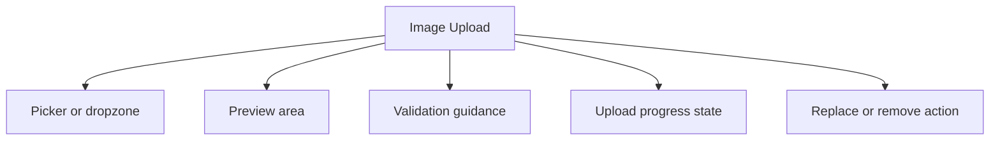

# Image Upload

> Learn how to implement image upload interfaces. Discover best practices for drag-and-drop, preview, and validation.

**URL:** https://uxpatterns.dev/patterns/media/image-upload
**Source:** apps/web/content/patterns/media/image-upload.mdx

---

## Overview

A **Image Upload** pattern helps teams create a reliable way to let users select, preview, validate, and replace an image confidently before or during upload. It is most useful when teams need profile or avatar uploads.

Compared with adjacent patterns, this pattern should reduce friction without hiding the state, rules, or recovery paths people need to keep moving.

## Use Cases

### When to use:

- Profile or avatar uploads
- Listing and catalog management
- Documenting work with screenshots or photos

### When not to use:

- Use a simpler image, link, or file input if full media handling is not actually needed.
- Avoid rich custom controls when browser-native behavior is enough for the task.
- Do not assume network-heavy media is appropriate for every audience or context.

### Common scenarios and examples

- Profile or avatar uploads where users need a clear, repeatable interface model.
- Listing and catalog management where users need a clear, repeatable interface model.
- Documenting work with screenshots or photos where users need a clear, repeatable interface model.

## Benefits

- Clarifies how image upload should behave before implementation details begin to sprawl.
- Creates a reusable interaction model for teams who need to let users select, preview, validate, and replace an image confidently before or during upload.
- Makes accessibility, edge cases, and recovery paths part of the design instead of post-launch cleanup.
- Gives product, design, and engineering a shared language for evaluating trade-offs.

## Drawbacks

- Bandwidth, device capability, and screen size all change how the experience feels.
- Media-heavy layouts expose performance issues quickly.
- Accessibility gaps are especially visible when captions, transcripts, or alternate controls are missing.
- Different browsers implement advanced media features with subtle differences.

## Anatomy



### Component Structure

1. **Picker or dropzone**

- Starts the image selection flow.

2. **Preview area**

- Shows what the chosen image looks like before submission.

3. **Validation guidance**

- Explains format, size, and dimension rules.

4. **Upload progress state**

- Shows the current transfer status.

5. **Replace or remove action**

- Lets users correct a mistaken choice.

#### Summary of Components

| Component | Required? | Purpose |
| --- | --- | --- |
| Picker or dropzone | ✅ Yes | Starts the image selection flow. |
| Preview area | ✅ Yes | Shows what the chosen image looks like before submission. |
| Validation guidance | ✅ Yes | Explains format, size, and dimension rules. |
| Upload progress state | ❌ No | Shows the current transfer status. |
| Replace or remove action | ❌ No | Lets users correct a mistaken choice. |

## Variations

### Simple picker

Uses a standard file input with preview.

**When to use:** Use when the upload is a small part of a larger form.

### Dropzone upload

Supports drag and drop with stronger affordances.

**When to use:** Use when file upload is a primary task.

### Crop-before-upload flow

Lets users frame or trim the image first.

**When to use:** Use when aspect ratio or profile framing matters.

## Best Practices

### Content

**Do's ✅**

- Tell users what the media contains before they commit to viewing or uploading it.
- Keep captions, labels, and file requirements visible.
- Use metadata such as duration, size, and status to set expectations early.

**Don'ts ❌**

- Do not autoplay or auto-upload in a way that surprises people.
- Do not rely on thumbnails alone to explain the media.
- Do not hide file restrictions until after the action starts.

### Accessibility

**Do's ✅**

- Verify that image upload can be completed using keyboard alone.
- Keep focus order logical when the pattern opens, updates, or reveals additional UI.
- Preserve a visible focus state that is still readable at high zoom.
- Use semantic elements first, then add ARIA only where semantics alone are not enough.
- Announce state changes such as errors, loading, or completion in the right place and with the right politeness.

**Don'ts ❌**

- Do not remove focus styles without a visible replacement.
- Do not depend on placeholder or helper text that disappears before the user can act on it.
- Do not assume pointer, touch, and assistive technologies will all interact with the pattern the same way.

### Visual Design

**Do's ✅**

- Reserve aspect-ratio space to avoid layout shift.
- Keep controls legible over bright or dark imagery.
- Show progress and completion states in the same visual language as the media frame.

**Don'ts ❌**

- Do not overlay controls on top of important content without contrast support.
- Do not let placeholders use completely different aspect ratios from the final media.
- Do not assume hover-only affordances are enough.

### Layout & Positioning

**Do's ✅**

- Adapt the controls and chrome to portrait and landscape contexts.
- Keep supporting metadata close to the media frame.
- Test zoom, orientation changes, and small-screen control spacing.

**Don'ts ❌**

- Do not make the media surface so dominant that supporting actions disappear.
- Do not move core controls into hidden menus by default on desktop.
- Do not ignore offline or poor-network scenarios.

## Platform-Specific Considerations

- Touch targets need more room on mobile than on desktop, especially for scrubbers, thumbnails, and upload affordances.
- Test camera, gallery, fullscreen, and share behaviors on real mobile devices instead of assuming browser desktop emulation is enough.
- If the media pattern appears inside a native shell or hybrid app, confirm focus, keyboard, and permission prompts still work in the right order.

## Common Mistakes & Anti-Patterns 🚫

### **Treating media as decoration only**

**The Problem:**
Important uploads and playback flows break when the design assumes the media is just visual garnish.

**How to Fix It?**
Design state, metadata, and controls as first-class parts of the pattern, not as overlays added later.

---

### **Skipping fallback behavior**

**The Problem:**
Different devices support different codecs, capture flows, and bandwidth envelopes.

**How to Fix It?**
Plan graceful fallbacks for unsupported APIs, low data conditions, and failed loads.

---

### **Forgetting accessibility artifacts**

**The Problem:**
Media patterns become exclusionary quickly when captions, transcripts, alt text, or visible status are missing.

**How to Fix It?**
Treat alternate access paths as part of the core experience, not as post-launch polish.

## Examples

### Live Preview

### Basic Implementation

```html
<div class="demo-shell card upload-card">
  <label for="upload-input">Upload an image</label>
  <input id="upload-input" type="file" accept="image/*" />
  <div id="upload-preview" class="preview muted">PNG or JPG up to 5 MB.</div>
</div>
```

### What this example demonstrates

- A clear baseline implementation of image upload that can be reviewed without framework-specific noise.
- Visible state, spacing, and content hierarchy that mirror the implementation guidance above.
- A small enough surface to copy into a design review or prototype before scaling the pattern up.

### Implementation Notes

- Start with semantic HTML and only add JavaScript where the interaction truly requires it.
- Keep styling tokens and spacing consistent with adjacent controls or layouts.
- If the live implementation introduces async behavior, mirror those states in the code example rather than documenting them only in prose.

## Accessibility

### Keyboard Interaction

- [ ] Verify that image upload can be completed using keyboard alone.
- [ ] Keep focus order logical when the pattern opens, updates, or reveals additional UI.
- [ ] Preserve a visible focus state that is still readable at high zoom.

### Screen Reader Support

- [ ] Use semantic elements first, then add ARIA only where semantics alone are not enough.
- [ ] Announce state changes such as errors, loading, or completion in the right place and with the right politeness.
- [ ] Connect labels, hints, and status text with `aria-describedby` or structural headings when useful.

### Visual Accessibility

- [ ] Do not rely on color alone to convey severity, completion, or selection state.
- [ ] Test the pattern at 200% zoom and with reduced motion enabled.
- [ ] Ensure touch targets remain comfortable on mobile and coarse pointers.

## Testing Guidelines

### Functional Testing

- [ ] Verify the default, loading, error, and success states for image upload.
- [ ] Test the primary action and the obvious recovery action in the same run.
- [ ] Confirm that state survives refresh, navigation, or retry in the way users would expect.

### Accessibility Testing

- [ ] Run keyboard-only checks and at least one screen reader pass on the final implementation.
- [ ] Validate headings, labels, and announcement behavior with real content rather than lorem ipsum.
- [ ] Check color contrast and focus visibility in both default and stressed states.

### Edge Cases

- [ ] Test empty, long, duplicated, and unexpectedly formatted content.
- [ ] Check behavior on narrow screens, zoomed layouts, and slower networks.
- [ ] Verify that optimistic or asynchronous states reconcile correctly after a failure.

## Frequently Asked Questions

## Related Patterns

## Resources

### References

- [WCAG 2.2](https://www.w3.org/TR/WCAG22/) - Accessibility baseline for keyboard support, focus management, and readable state changes.
- [MDN file input](https://developer.mozilla.org/en-US/docs/Web/HTML/Element/input/file) - Native file selection, accepted formats, and form submission behavior.

### Guides

- [web.dev: Browser-level lazy loading for CMSs](https://web.dev/articles/browser-level-lazy-loading-for-cmss) - Recommendations for below-the-fold media loading without hurting initial rendering.

### Articles

- [web.dev: Browser-level lazy loading for CMSs](https://web.dev/articles/browser-level-lazy-loading-for-cmss) - Recommendations for below-the-fold media loading without hurting initial rendering.

### NPM Packages

- [`react-dropzone`](https://www.npmjs.com/package/react-dropzone) - Drag-and-drop and click-to-upload file selection helpers.
- [`uppy`](https://www.npmjs.com/package/uppy) - File upload orchestration with progress, retries, and remote provider support.
- [`filepond`](https://www.npmjs.com/package/filepond) - Polished upload UI with previews, validation, and async processing hooks.
