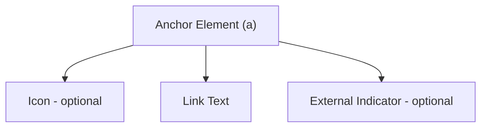

# Link

> Build accessible links with proper styling, hover states, and keyboard navigation support.

**URL:** https://uxpatterns.dev/patterns/navigation/link
**Source:** apps/web/content/patterns/navigation/link.mdx

---

## Overview

**Links** are the fundamental building blocks of web navigation, connecting pages, resources, and actions through clickable text or elements. They are the most basic and ubiquitous interactive pattern on the web.

Getting links right means choosing between `<a>` and `<button>`, styling clear interactive states, ensuring color contrast, and providing context about where the link leads — especially for external destinations, downloads, and new-tab behavior.

## Use Cases

### When to use:

Use **Links** to **navigate users to another page, resource, or section within the current page**.

**Common scenarios include:**

- Navigating to a different page within the same site
- Linking to external websites or resources
- Jumping to a section within the current page (anchor links)
- Downloading a file (PDFs, images, documents)
- Linking to email addresses (`mailto:`) or phone numbers (`tel:`)

### When not to use:

- Triggering an in-page action (use a `<button>` instead)
- Submitting a form (use `<button type="submit">`)
- Toggling UI state like opening a modal or expanding an accordion
- When the action doesn't have a meaningful URL destination
- As a wrapper around large interactive areas (use a card pattern with a single anchor)

### Common scenarios and examples

- Inline text links within paragraphs and articles
- Navigation menu items linking to site sections
- "Read more" links on content cards or teasers
- Footer links to policies, terms, and legal pages
- Skip navigation links for keyboard and [screen reader](/glossary/screen-reader) users

## Benefits

- The most fundamental and well-understood web interaction pattern
- Native browser support with built-in [keyboard navigation](/glossary/keyboard-navigation), history, and bookmarking
- Screen readers announce links and allow users to list all links on a page
- Search engines follow links to discover and [index](/glossary/index) content
- Progressive enhancement — links work without JavaScript

## Drawbacks

- **Styling complexity** – Maintaining consistent, accessible states (visited, hover, focus, active) across a design system requires discipline
- **Ambiguous affordance** – Without underlines or clear visual cues, users may not recognize text as clickable
- **Color-only distinction** – Relying solely on color to indicate a link fails users with color vision deficiencies
- **External link confusion** – Users may not realize a link opens a new tab or leaves the site without clear indicators
- **Click target size** – Inline text links can be difficult to tap on mobile if surrounding text is dense

## Anatomy



### Component Structure

1. **Anchor Element (`<a>`)**

- The core HTML element providing navigation functionality
- Must include a valid `href` attribute for proper semantics
- Receives keyboard focus and can be activated with Enter

2. **Link Text (Label)**

- The visible, clickable text describing the destination
- Must be descriptive enough to make sense out of context
- Avoid generic text like "click here" or "read more" without context

3. **Icon (Optional)**

- A visual indicator placed before or after the link text
- Common icons: external link arrow, download arrow, mail icon
- Must be decorative (`aria-hidden="true"`) if the text already conveys meaning

4. **External Indicator (Optional)**

- Visual cue that the link opens a new tab or leaves the site
- Often a small arrow icon or "(opens in new tab)" text
- Required for accessibility when using `target="_blank"`

#### Summary of Components

| Component          | Required? | Purpose                                                      |
| ------------------ | --------- | ------------------------------------------------------------ |
| Anchor Element     | ✅ Yes    | Provides navigation semantics and keyboard interaction.      |
| Link Text          | ✅ Yes    | Describes the destination or action to users and assistive tech. |
| Icon               | ❌ No     | Provides additional visual context (external, download).     |
| External Indicator | ❌ No     | Warns users the link opens elsewhere or in a new tab.        |

## Variations

### 1. Inline Text Link
Standard link within a paragraph or body text, typically underlined and colored differently.

**When to use:** Running text where links are embedded within sentences.

### 2. Standalone Link
A link that stands alone outside of paragraph text, often used in navigation or action contexts.

**When to use:** Call-to-action areas, card footers, or sidebar navigation.

### 3. External Link
A link that navigates to a different domain, often opening in a new tab with a visual indicator.

**When to use:** Referencing third-party resources, documentation, or partner sites.

### 4. Anchor Link (Jump Link)
A link that scrolls to a specific section within the same page using a fragment identifier.

**When to use:** Table of contents, FAQ navigation, or long-form content with defined sections.

### 5. Skip Link
A visually hidden link that becomes visible on focus, allowing keyboard users to bypass repetitive content.

**When to use:** Every page should have a skip link as the first focusable element to jump past navigation.

### 6. Download Link
A link that initiates a file download instead of navigating to a new page.

**When to use:** Providing downloadable resources like PDFs, images, or data files.

## Examples

### Live Preview

### Basic HTML Implementation

```html
<!-- Inline text link -->
<p>Read the <a href="/docs/getting-started">getting started guide</a> to begin.</p>

<!-- External link with indicator -->
<a href="https://w3.org/WAI/" target="_blank" rel="noopener noreferrer">
  WAI Guidelines
  <span aria-hidden="true">↗</span>
  <span class="sr-only">(opens in new tab)</span>
</a>

<!-- Anchor / jump link -->
<a href="#pricing">Jump to pricing</a>

<!-- Download link -->
<a href="/files/report.pdf" download>
  Download annual report (PDF, 2.4 MB)
</a>

<!-- Skip navigation link -->
<a href="#main-content" class="skip-link">Skip to main content</a>
```

## Best Practices

### Content

**Do's ✅**

- Write descriptive link text that makes sense out of context ("View pricing plans" not "Click here")
- Include file type and size for download links ("Download report (PDF, 2.4 MB)")
- Use sentence case for inline links and match surrounding text style
- Differentiate between links and plain text through underlines, color, or both

**Don'ts ❌**

- Don't use "click here", "read more", or "learn more" as standalone link text
- Don't link entire paragraphs or excessively long text strings
- Don't use the full URL as link text unless the URL itself is the content
- Don't make link text identical for different destinations on the same page

### Accessibility

**Do's ✅**

- Use the native `<a>` element with a valid `href` for all navigation links
- Ensure a 4.5:1 contrast ratio between link text and background (WCAG AA)
- Provide a non-color visual cue (underline, icon) to distinguish links from surrounding text
- Add `aria-label` or `aria-describedby` when the visible text is insufficient (e.g., icon-only links)
- Warn users when a link opens in a new tab (`target="_blank"`) with visible text or `aria-label`
- Include a skip navigation link as the first focusable element on every page

**Don'ts ❌**

- Don't use `<span>` or `<div>` with click handlers as a link substitute
- Don't remove the default focus outline without providing a visible alternative
- Don't use `javascript:void(0)` as an href value
- Don't use color alone to distinguish links from surrounding text
- Don't use `tabindex` values greater than 0 on links

### Visual Design

**Do's ✅**

- Underline links in body text to ensure they are distinguishable
- Use a distinct color for unvisited, visited, hover, focus, and active states
- Maintain consistent link styling throughout the application
- Use `text-underline-offset` to improve readability of underlined text

**Don'ts ❌**

- Don't remove underlines from inline text links without an equally strong alternative indicator
- Don't make links look like buttons unless they serve a button-like primary action
- Don't use the same color for link text and non-link text
- Don't style non-link elements to look like links

### Mobile & Touch Considerations

**Do's ✅**

- Ensure a minimum tap target of 44×44px for standalone links
- Add adequate spacing between adjacent links to prevent mis-taps
- Use `touch-action: manipulation` to remove tap delay on mobile

**Don'ts ❌**

- Don't place small inline links too close together without adequate spacing
- Don't rely on hover states to reveal important information on touch devices

### Layout & Positioning

**Do's ✅**

- Position skip links at the very top of the [DOM](/glossary/dom) (first focusable element)
- Align inline links with surrounding text baseline
- Group related links together with proper list semantics
**Don'ts ❌**

- Don't wrap block-level content inside inline `<a>` elements without setting `display: block` or `display: inline-block`
- Don't nest interactive elements (buttons, other links) inside links

## Common Mistakes & Anti-Patterns 🚫

### Using "Click Here" as Link Text
**The Problem:**
Screen readers can list all links on a page. Multiple "click here" links are meaningless out of context.

**How to Fix It:**
Write descriptive link text. Instead of "Click here to view pricing", write "View pricing plans".

---

### Using a Link When a Button Is Needed
**The Problem:**
A link with `href="#"` or `javascript:void(0)` that triggers a JavaScript action instead of navigating. Breaks expected browser behavior.

**How to Fix It:**
Use `<button>` for in-page actions. Use `<a>` only when there is a real URL destination.

---

### Missing New-Tab Warning
**The Problem:**
Links with `target="_blank"` open in a new tab without warning, disorienting users — especially screen reader users.

**How to Fix It:**
Add visible text like "(opens in new tab)" or use `aria-label` to include the warning: `aria-label="W3C guidelines (opens in new tab)"`.

---

### Color-Only Link Distinction
**The Problem:**
Links distinguished from body text solely by color are invisible to users with color vision deficiencies.

**How to Fix It:**
Always combine color with another visual indicator: underline, font weight, icon, or border-bottom.

---

### Broken Focus Styles
**The Problem:**
Removing the default focus outline with `outline: none` makes links invisible to keyboard users.

**How to Fix It:**
Replace the default outline with a custom focus-visible style: `a:focus-visible { outline: 2px solid #2563eb; outline-offset: 2px; }`.

---

### Empty or Missing href
**The Problem:**
An `<a>` tag without an `href` attribute is not focusable and not announced as a link by screen readers.

**How to Fix It:**
Always include a valid `href`. If the link is not yet active, use `aria-disabled="true"` with the href still present.

## Micro-Interactions & Animations

### Underline Thickness Transition
- **Effect:** Underline grows thicker on hover for a subtle emphasis
- **Timing:** 150ms ease
- **Trigger:** Mouse hover
- **Implementation:** CSS `text-decoration-thickness` transition

### Color State Transition
- **Effect:** Smooth color change across hover, focus, and active states
- **Timing:** 150ms ease-in-out
- **Trigger:** Hover, focus, or active interaction
- **Implementation:** CSS transition on `color` property

### Focus Ring Appearance
- **Effect:** A visible focus ring appears around the link on keyboard focus
- **Timing:** Immediate (< 16ms)
- **Trigger:** Keyboard Tab navigation
- **Implementation:** CSS `:focus-visible` with outline and outline-offset

### External Link Icon Shift
- **Effect:** External link icon shifts slightly up-right on hover
- **Timing:** 150ms ease-out
- **Trigger:** Mouse hover
- **Implementation:** CSS transform `translate(1px, -1px)` on the icon span

### Skip Link Reveal
- **Effect:** Skip link slides into view from the top when focused
- **Timing:** 200ms ease-out
- **Trigger:** Keyboard focus on the skip link
- **Implementation:** CSS transition on `top` and `opacity` from hidden state

## Tracking

### Key Events to Track

| **Event Name** | **Description** | **Why Track It?** |
| --- | --- | --- |
| `link.click` | User clicks any tracked link | Measure overall link engagement |
| `link.external_click` | User clicks a link leading to an external domain | Track outbound traffic and referral patterns |
| `link.download_click` | User clicks a download link | Measure file download engagement |
| `link.skip_nav_used` | User activates the skip navigation link | Track accessibility feature usage |
| `link.anchor_click` | User clicks an in-page anchor link | Understand content navigation behavior |

### Event Payload Structure

```json
{
  "event": "link.click",
  "properties": {
    "link_text": "View pricing plans",
    "link_url": "/pricing",
    "link_type": "internal",
    "link_position": "body_content",
    "page_path": "/features",
    "is_new_tab": false
  }
}
```

### Key Metrics to Analyze

- **Click-Through Rate (CTR):** Percentage of users who click a specific link after viewing the page
- **External vs Internal Ratio:** Balance between outbound and inbound link clicks
- **Download Completion Rate:** How often download links lead to successful downloads
- **Skip Navigation Usage:** Indicates keyboard/screen reader user population
- **Anchor Link Engagement:** Which page sections users jump to most

### Insights & Optimization Based on Tracking

- 📉 **Low CTR on important links?**
  → Link text may be unclear or visually indistinct. A/B test more descriptive text or stronger visual styling.

- 🌐 **High external link exits?**
  → Consider whether external links should open in new tabs to retain users on your site.

- 📥 **Low download rates?**
  → File type and size may not be clear. Add explicit metadata: "Download report (PDF, 2.4 MB)".

- ♿ **Zero skip nav usage?**
  → The skip link may be incorrectly implemented. Verify it is the first focusable element and the target exists.

- 🔗 **High anchor link usage on specific pages?**
  → Those pages likely benefit from a persistent table of contents or breadcrumb navigation.

## Localization

```json
{
  "link": {
    "indicators": {
      "external": "(opens in new tab)",
      "download": "Download",
      "file_info": "({fileType}, {fileSize})"
    },
    "skip_navigation": {
      "label": "Skip to main content"
    },
    "announcements": {
      "navigating": "Navigating to {destination}"
    }
  }
}
```

### RTL (Right-to-Left) Considerations

- External link icon position flips to the left side of the text
- Underline direction and text-underline-offset remain consistent
- Skip link positioning mirrors to top-right for RTL layouts

### Cultural Considerations

- **Link color:** Blue is universally associated with links, but visited purple may not carry the same meaning in all cultures
- **Underline convention:** Underlined text signifies a link in Western web conventions; ensure this holds in your target markets
- **Icon semantics:** The external arrow (↗) is widely understood but verify with localization teams

## Performance

### Target Metrics

- **Interaction response:** < 50ms visual feedback on hover/focus
- **Navigation start:** Browser navigation should begin immediately on click (native behavior)
- **Focus outline render:** Immediate (< 16ms)
- **Bundle size:** 0KB JavaScript for basic links (pure HTML/CSS)

### Optimization Strategies

**Prefetching for Internal Links**
```html
<link rel="prefetch" href="/pricing" />
<!-- Or use framework-specific prefetch on hover -->
```

**Native CSS States (No JavaScript)**
```css
a:link { color: #2563eb; }
a:visited { color: #7c3aed; }
a:hover { color: #1d4ed8; }
a:active { color: #1e40af; }
```

**Avoiding Layout Shifts**
```css
/* Use text-decoration instead of border-bottom to avoid layout shift */
a {
  text-decoration: underline;
  text-decoration-thickness: 1px;
}
a:hover {
  text-decoration-thickness: 2px;
}
```

## Testing Guidelines

### Functional Testing

**Should ✓**

- [ ] Navigate to the correct destination when clicked
- [ ] Open in a new tab when `target="_blank"` is set
- [ ] Initiate download when the `download` attribute is present
- [ ] Scroll to the correct section for anchor links
- [ ] Show visited state after navigation (if styled)

### Accessibility Testing

**Should ✓**

- [ ] Be focusable and activatable via keyboard (Enter key)
- [ ] Have a visible focus indicator on keyboard navigation
- [ ] Announce link text and role to screen readers
- [ ] Warn about new-tab behavior for external links
- [ ] Achieve 4.5:1 contrast ratio against the background
- [ ] Skip link is the first focusable element and targets the correct content area
- [ ] Be distinguishable from non-link text without relying on color alone

### Visual Testing

**Should ✓**

- [ ] Display distinct styles for unvisited, visited, hover, focus, and active states
- [ ] Show external link indicator for off-site destinations
- [ ] Underline inline text links consistently
- [ ] Maintain visual consistency across light and dark themes

### Performance Testing

**Should ✓**

- [ ] Not require JavaScript for basic navigation
- [ ] Not cause layout shifts when hover state changes
- [ ] Prefetch targets efficiently without overwhelming the network
- [ ] Respond to interaction within 50ms

## SEO Considerations

- **Descriptive anchor text** helps search engines understand the destination page's content — avoid "click here"
- **Internal linking** distributes page authority and helps crawlers discover content
- **External links** with `rel="noopener noreferrer"` don't pass referrer but don't harm SEO
- **Use `rel="nofollow"`** only when you explicitly don't want to pass authority (e.g., user-generated content)
- **Avoid excessive links** on a single page — search engines may devalue pages with hundreds of links
- **Broken links** harm both user experience and SEO rankings — audit regularly

## Design Tokens

```json
{
  "$schema": "https://design-tokens.org/schema.json",
  "link": {
    "color": {
      "default": { "value": "{color.blue.600}", "type": "color" },
      "visited": { "value": "{color.purple.600}", "type": "color" },
      "hover": { "value": "{color.blue.700}", "type": "color" },
      "active": { "value": "{color.blue.800}", "type": "color" }
    },
    "textDecoration": {
      "style": { "value": "underline", "type": "textDecoration" },
      "thickness": {
        "default": { "value": "1px", "type": "dimension" },
        "hover": { "value": "2px", "type": "dimension" }
      },
      "offset": { "value": "0.15em", "type": "dimension" }
    },
    "focus": {
      "outlineWidth": { "value": "2px", "type": "dimension" },
      "outlineOffset": { "value": "2px", "type": "dimension" },
      "outlineColor": { "value": "{color.blue.600}", "type": "color" }
    },
    "externalIcon": {
      "size": { "value": "0.8em", "type": "dimension" },
      "marginLeft": { "value": "0.2em", "type": "dimension" }
    },
    "skipLink": {
      "background": { "value": "{color.gray.900}", "type": "color" },
      "color": { "value": "{color.white}", "type": "color" },
      "padding": { "value": "0.75rem 1.5rem", "type": "dimension" },
      "borderRadius": { "value": "{radius.md}", "type": "dimension" },
      "zIndex": { "value": "9999", "type": "number" }
    }
  }
}
```

## FAQ

 for navigation and <button> for actions.",
    },
    {
      question: "Should links always be underlined?",
      answer:
        "Inline text links should be underlined or have a non-color visual indicator to be accessible. WCAG requires that links be distinguishable from surrounding text without relying solely on color. Navigation links in menus or button-styled links may omit underlines if their clickable nature is otherwise obvious.",
    },
    {
      question: "When should links open in a new tab?",
      answer:
        "Open links in a new tab only when doing so benefits the user, such as links to external sites, reference documentation, or resources the user may want while continuing their current task. Always warn users with visible text or an aria-label that the link opens in a new tab.",
    },
    {
      question: "How do I make icon-only links accessible?",
      answer:
        "Provide an accessible name using aria-label on the link element (e.g., aria-label='Visit our GitHub') or include visually hidden text inside the link. The icon itself should have aria-hidden='true' since the link text provides the meaning.",
    },
    {
      question: "What is a skip navigation link?",
      answer:
        "A skip navigation link is a hidden link that becomes visible on keyboard focus, allowing keyboard users to bypass repetitive content like navigation menus and jump directly to the main content area. It should be the first focusable element on every page.",
    },
  ]}
/>

## Related Patterns

## Resources

### References

- [WCAG 2.2](https://www.w3.org/TR/WCAG22/) - Accessibility baseline for keyboard support, focus management, and readable state changes.
- [MDN anchor element](https://developer.mozilla.org/en-US/docs/Web/HTML/Element/a) - Native link semantics, navigation behavior, and accessible labeling.

### Guides

- [MDN WAI-ARIA basics](https://developer.mozilla.org/en-US/docs/Learn_web_development/Core/Accessibility/WAI-ARIA_basics) - Guidance on when to rely on native HTML and when to introduce ARIA roles and states.

### Articles

- [Nielsen Norman Group: Writing links](https://www.nngroup.com/articles/writing-links/) - How link text influences comprehension, scanning, and navigation confidence.

### NPM Packages

- [`next`](https://www.npmjs.com/package/next) - Routing, image, and navigation primitives commonly used in app shell and commerce UIs.
- [`react-router-dom`](https://www.npmjs.com/package/react-router-dom) - Client-side route primitives useful for links, breadcrumbs, and tab navigation.
- [`@tanstack/react-router`](https://www.npmjs.com/package/%40tanstack%2Freact-router) - Typed route primitives for navigation-heavy interfaces.
