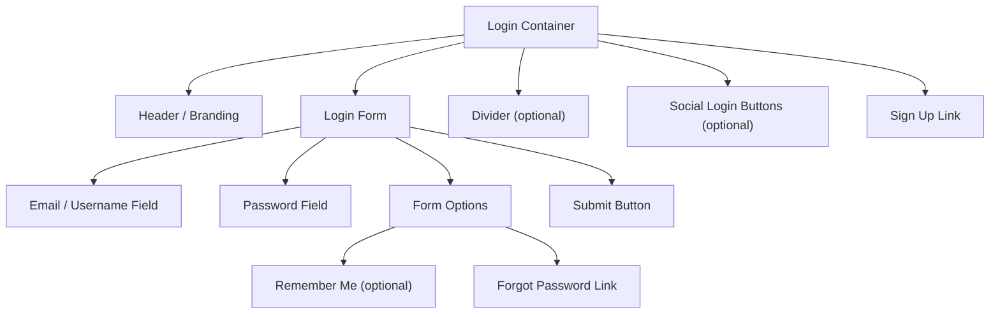

# Login Form

> Learn how to implement secure and user-friendly login forms. Discover best practices for authentication, password fields, and remember me functionality.

**URL:** https://uxpatterns.dev/patterns/authentication/login
**Source:** apps/web/content/patterns/authentication/login.mdx

---

## Overview

**Login Form** is the primary gateway through which users authenticate and gain access to protected content and features. It typically consists of an identifier field (email or username), a password field, and a submit button, often accompanied by "Remember me", "Forgot password", and social login options.

A well-designed login form balances security with usability — minimizing friction for legitimate users while protecting against unauthorized access.

## Use Cases

### When to use:

Use **Login Form** to **authenticate returning users and grant access to protected resources**.

**Common scenarios include:**

- Web applications requiring user authentication before accessing features
- E-commerce sites where users sign in to view orders, wishlists, and saved addresses
- SaaS platforms gating features behind user accounts
- Community or social platforms requiring identity for participation
- Admin dashboards and internal tools with role-based access

### When not to use:

- Public-facing pages that don't require authentication
- Read-only content that benefits from open access (blogs, documentation)
- One-time interactions where authentication creates unnecessary friction
- Kiosk or shared-device interfaces where session management is impractical

### Common scenarios and examples

- Email + password login on a SaaS platform
- Username + password login on a gaming service
- Magic link (passwordless) login for a newsletter platform
- Login with biometric authentication on a banking app
- Combined login/signup page with social providers and email options

## Benefits

- Provides a clear, familiar interface for returning users
- Protects sensitive data and features behind authentication
- Enables personalized experiences based on user identity
- Supports session management for persistent access across visits
- Compatible with a wide range of authentication strategies (password, passwordless, biometric)

## Drawbacks

- **Password fatigue** – Users manage dozens of passwords, leading to weak or reused credentials
- **Friction for returning users** – Forgotten passwords cause drop-offs and support costs
- **Security vulnerabilities** – Login forms are targets for brute force, credential stuffing, and phishing
- **Accessibility challenges** – Password masking, autofill behavior, and error messages need careful implementation
- **Mobile input difficulty** – Complex passwords are hard to type on mobile keyboards

## Anatomy



### Component Structure

1. **Login Container**

- Wraps the entire login interface
- Typically centered on the page with a card-style layout
- May include branding, illustration, or a split-screen design

2. **Identifier Field (Email / Username)**

- The primary input for user identification
- Uses `type="email"` for email-based login or `type="text"` for username
- Supports `autocomplete="email"` or `autocomplete="username"` for autofill

3. **Password Field**

- Masked input for the user's password
- Includes a show/hide toggle for password visibility
- Uses `autocomplete="current-password"` for browser autofill

4. **Remember Me (Optional)**

- Checkbox that extends the session duration
- Must clearly communicate its behavior to users
- Uses persistent cookies or extended token expiry

5. **Forgot Password Link**

- Navigates to the [password reset](/patterns/authentication/password-reset) flow
- Positioned near the password field for easy discovery
- Should not disrupt the login form layout

6. **Submit Button**

- Triggers form submission and authentication
- Shows loading state during the authentication request
- Disabled until required fields are valid (optional)

7. **Social Login Buttons (Optional)**

- Alternative authentication via third-party providers
- Visually separated with a divider ("or continue with")
- Links to the [social login](/patterns/authentication/social-login) flow

8. **Sign Up Link**

- Directs new users to the [registration flow](/patterns/authentication/signup)
- Positioned below the form to keep focus on login

#### Summary of Components

| Component          | Required? | Purpose                                                      |
| ------------------ | --------- | ------------------------------------------------------------ |
| Login Container    | ✅ Yes    | Wraps the login interface with layout and branding.          |
| Identifier Field   | ✅ Yes    | Collects the user's email or username.                       |
| Password Field     | ✅ Yes    | Collects the user's password with masking.                   |
| Remember Me        | ❌ No     | Extends session duration for returning users.                |
| Forgot Password    | ✅ Yes    | Provides access to password recovery.                        |
| Submit Button      | ✅ Yes    | Triggers the authentication request.                         |
| Social Login       | ❌ No     | Provides alternative third-party authentication.             |
| Sign Up Link       | ✅ Yes    | Directs new users to registration.                           |

## Variations

### 1. Email + Password (Standard)
The classic login form with an email and password field.

**When to use:** Most web applications with traditional authentication.

### 2. Username + Password
Uses a username instead of email as the identifier.

**When to use:** Gaming platforms, internal tools, or systems where email is not the primary identifier.

### 3. Magic Link (Passwordless)
Sends a one-time login link to the user's email — no password required.

**When to use:** Low-friction applications, newsletter platforms, or sites prioritizing convenience over traditional security.

### 4. Passkey / Biometric
Uses device biometrics (fingerprint, face) or a passkey for authentication.

**When to use:** Modern applications targeting devices with biometric hardware, high-security contexts.

### 5. Phone Number + OTP
Uses a phone number and a one-time SMS or app code for login.

**When to use:** Markets where phone-based identity is dominant, ride-sharing apps, messaging platforms.

### 6. Split-Screen Login
The form occupies one half of the screen with branding or illustration on the other half.

**When to use:** Marketing-oriented sites where the login page doubles as a brand touchpoint.

## Examples

### Live Preview

### Basic HTML Implementation

```html
<div class="login-container">
  <h1>Sign in</h1>
  <p>Welcome back. Enter your credentials to access your account.</p>

  <form action="/api/auth/login" method="POST" novalidate>
    <div class="form-field">
      <label for="email">Email address</label>
      <input
        type="email"
        id="email"
        name="email"
        autocomplete="email"
        required
        aria-describedby="email-error"
      />
      <span id="email-error" class="field-error" role="alert" hidden></span>
    </div>

    <div class="form-field">
      <label for="password">Password</label>
      <div class="password-wrapper">
        <input
          type="password"
          id="password"
          name="password"
          autocomplete="current-password"
          required
          aria-describedby="password-error"
        />
        <button type="button" class="password-toggle" aria-label="Show password">
          <span aria-hidden="true">👁</span>
        </button>
      </div>
      <span id="password-error" class="field-error" role="alert" hidden></span>
    </div>

    <div class="form-options">
      <label class="remember-me">
        <input type="checkbox" name="remember" />
        Remember me
      </label>
      <a href="/forgot-password">Forgot password?</a>
    </div>

    <button type="submit" class="login-btn">Sign in</button>
  </form>

  <div class="divider"><span>or continue with</span></div>

  <div class="social-buttons">
    <button type="button" class="social-btn">Google</button>
    <button type="button" class="social-btn">GitHub</button>
  </div>

  <p class="signup-link">
    Don't have an account? <a href="/signup">Create one</a>
  </p>
</div>
```

## Best Practices

### Content

**Do's ✅**

- Use clear, specific field labels ("Email address" not "Username/Email")
- Provide helpful placeholder text as examples, not as labels
- Show a clear call-to-action ("Sign in" not "Submit")
- Include a link to registration for new users
- Display a "Forgot password?" link near the password field

**Don'ts ❌**

- Don't use vague error messages ("Invalid credentials" is fine; "Wrong password" reveals account existence)
- Don't require users to remember whether they used email or username if you support both
- Don't auto-clear form fields on failed login attempts
- Don't show a CAPTCHA on the first attempt — reserve it for suspicious behavior

### Accessibility

**Do's ✅**

- Associate all fields with `<label>` elements using `for`/`id` pairing
- Use `autocomplete="email"` and `autocomplete="current-password"` for browser autofill
- Display errors with `role="alert"` and link them to fields via `aria-describedby`
- Mark invalid fields with `aria-invalid="true"`
- Ensure the password toggle updates its `aria-label` when toggled
- Support form submission via Enter key

**Don'ts ❌**

- Don't use `placeholder` as a replacement for labels
- Don't disable the submit button without explaining why (use validation messages instead)
- Don't remove focus styles from inputs or buttons
- Don't auto-focus the email field without considering screen reader announcement flow

### Visual Design

**Do's ✅**

- Center the form on the page with adequate whitespace
- Use a card-style container with subtle borders or shadows
- Differentiate the submit button from social login buttons visually
- Show loading state on the submit button during authentication

**Don'ts ❌**

- Don't make the form too wide — 24rem (384px) is a comfortable maximum
- Don't clutter the form with too many options (hide advanced options)
- Don't use red for field borders until validation fails

### Mobile & Touch Considerations

**Do's ✅**

- Use `inputmode="email"` to show the email keyboard on mobile
- Make touch targets at least 44×44px for the submit button and toggle
- Keep the form short enough to avoid scrolling on small screens
- Use `autocomplete` attributes to enable credential manager autofill

**Don'ts ❌**

- Don't place the form below the fold on mobile
- Don't use multi-column layouts for login forms on small screens
- Don't rely on hover states for mobile interactions

### Layout & Positioning

**Do's ✅**

- Center the form vertically and horizontally on dedicated login pages
- Place the signup link below the form to keep focus on login
- Position "Forgot password?" near the password field for easy discovery
- Separate social login from the main form with a clear visual divider

**Don'ts ❌**

- Don't bury the login form within other page content
- Don't separate the form fields across multiple views without reason

## Common Mistakes & Anti-Patterns 🚫

### Revealing Account Existence
**The Problem:**
Error messages like "No account with that email" or "Wrong password" let attackers enumerate valid accounts.

**How to Fix It:**
Use a generic message: "Invalid email or password. Please try again." Apply the same response time for both cases.

---

### No Rate Limiting Feedback
**The Problem:**
Users can submit the form endlessly with no indication that their account is being locked or rate-limited.

**How to Fix It:**
After 3-5 failed attempts, show a message: "Too many attempts. Please wait 30 seconds before trying again." Implement server-side rate limiting with exponential backoff.

---

### Clearing Fields on Error
**The Problem:**
The form clears the email field on failed login

**How to Fix It:**
Preserve the email value after a failed attempt. Only clear the password field, as retyping the password is a security best practice.

---

### No Password Visibility Toggle
**The Problem:**
Users can't verify what they've typed, leading to repeated failed attempts from typos — especially on mobile.

**How to Fix It:**
Add a show/hide toggle button inside the password field. Update `aria-label` to reflect the current state.

---

### Missing Autocomplete Attributes
**The Problem:**
Without `autocomplete` attributes, browsers and password managers can't fill in saved credentials, adding friction.

**How to Fix It:**
Use `autocomplete="email"` on the email field and `autocomplete="current-password"` on the password field.

---

### Form Not Accessible via Keyboard
**The Problem:**
Users can't tab through fields, toggle password visibility, or submit the form with Enter.

**How to Fix It:**
Use native `<form>`, `<input>`, `<label>`, and `<button>` elements. Ensure the form submits on Enter key press.

## Security Considerations

### Credential Protection

- **HTTPS only** — Never transmit credentials over unencrypted connections
- **Hash passwords server-side** — Use bcrypt, scrypt, or Argon2 for password hashing
- **Never store plaintext passwords** — Neither in databases nor in logs
- **Sanitize inputs** — Prevent SQL injection and XSS via form fields

### Brute Force Protection

- **Rate limiting** — Limit login attempts per IP and per account (e.g., 5 attempts per 15 minutes)
- **Account lockout** — Temporarily lock accounts after repeated failures
- **CAPTCHA escalation** — Show CAPTCHA after 3 failed attempts, not on the first try
- **Exponential backoff** — Increase delay between allowed attempts

### Session Management

- **Secure cookies** — Use `Secure`, `HttpOnly`, and `SameSite` attributes
- **Session expiry** — Expire sessions after a reasonable inactivity period
- **CSRF protection** — Include CSRF tokens in the form
- **Session fixation** — Regenerate session IDs after successful login

### Passwordless Considerations

- **Magic link expiry** — Tokens should expire within 10-15 minutes
- **One-time use** — Magic links should be invalidated after first use
- **Passkey fallback** — Always provide an alternative authentication method

## Micro-Interactions & Animations

### Submit Button Loading State
- **Effect:** Button text changes to "Signing in…" with a spinner, button becomes disabled
- **Timing:** Immediate on click, resolves on server response
- **Trigger:** Form submission
- **Implementation:** Disable button, swap text, show CSS spinner animation

### Field Validation Feedback
- **Effect:** Border color changes to red with a shake animation on invalid fields
- **Timing:** 300ms shake, immediate color change
- **Trigger:** Form submission with invalid fields or blur with empty required field
- **Implementation:** CSS `border-color` transition and `@keyframes shake`

### Password Toggle
- **Effect:** Eye icon toggles between open and closed states, input type switches
- **Timing:** Immediate
- **Trigger:** Toggle button click
- **Implementation:** Swap `type="password"` and `type="text"`, update `aria-label`

### Success Redirect
- **Effect:** Brief success state (green checkmark or "Welcome back!") before redirect
- **Timing:** 500-800ms display before navigation
- **Trigger:** Successful authentication response
- **Implementation:** JavaScript state change with `setTimeout` redirect

### Focus Ring on Tab Navigation
- **Effect:** Visible focus ring appears on focused form elements
- **Timing:** Immediate
- **Trigger:** Keyboard Tab navigation
- **Implementation:** CSS `:focus-visible` with outline or box-shadow

## Tracking

### Key Events to Track

| **Event Name** | **Description** | **Why Track It?** |
| --- | --- | --- |
| `login.page_viewed` | User views the login page | Measure funnel entry |
| `login.attempted` | User submits the login form | Track authentication attempts |
| `login.succeeded` | Authentication is successful | Measure conversion rate |
| `login.failed` | Authentication fails | Identify error patterns |
| `login.social_clicked` | User clicks a social login button | Track social vs. email preference |
| `login.forgot_password_clicked` | User clicks "Forgot password" | Measure password recovery need |
| `login.signup_clicked` | User clicks the signup link | Track new user flow discovery |

### Event Payload Structure

```json
{
  "event": "login.attempted",
  "properties": {
    "method": "email_password",
    "has_remember_me": true,
    "autofill_used": true,
    "attempt_number": 1,
    "page_referrer": "/pricing",
    "device_type": "mobile"
  }
}
```

### Key Metrics to Analyze

- **Login Success Rate:** Percentage of attempts that succeed
- **Failure Reason Distribution:** Breakdown of error types (wrong password, no account, rate limited)
- **Social vs. Email Split:** Preference distribution across login methods
- **Forgot Password Rate:** Percentage of login sessions that lead to password reset
- **Time to Login:** Average time from page view to successful authentication
- **Autofill Adoption:** How often browser autofill is used

### Insights & Optimization Based on Tracking

- 📉 **Low Success Rate?**
  → Users may have password issues. Promote passwordless options or social login more prominently.

- 🔑 **High Forgot Password Rate?**
  → Users struggle with passwords. Consider magic link login or passkey support.

- 📱 **Higher Failure on Mobile?**
  → Password input is harder on mobile. Ensure the password toggle is prominent and autofill works.

- 🔗 **High Social Login Clicks but Low Conversion?**
  → OAuth flow may have errors. Audit the social login redirect chain.

- ⏱️ **Long Time to Login?**
  → Form may be confusing. Simplify by reducing fields or improving label clarity.

## Localization

```json
{
  "login": {
    "heading": "Sign in",
    "subheading": "Welcome back. Enter your credentials to access your account.",
    "fields": {
      "email_label": "Email address",
      "email_placeholder": "you@example.com",
      "password_label": "Password",
      "password_placeholder": "Enter your password"
    },
    "actions": {
      "submit": "Sign in",
      "submitting": "Signing in…",
      "forgot_password": "Forgot password?",
      "signup_prompt": "Don't have an account?",
      "signup_link": "Create one"
    },
    "remember_me": "Remember me",
    "divider": "or continue with",
    "errors": {
      "invalid_credentials": "Invalid email or password. Please try again.",
      "email_required": "Email is required",
      "email_invalid": "Enter a valid email address",
      "password_required": "Password is required",
      "rate_limited": "Too many attempts. Please wait {seconds} seconds."
    },
    "password_toggle": {
      "show": "Show password",
      "hide": "Hide password"
    }
  }
}
```

### RTL (Right-to-Left) Considerations

- Flip the form layout so labels and inputs align to the right
- Position the password toggle on the left side of the input
- Mirror the "Forgot password?" link position
- Reverse the remember me checkbox + label order

### Cultural Considerations

- **Identifier field:** Some markets prefer phone number over email
- **Social providers:** Available providers vary by region (WeChat in China, LINE in Japan)
- **Password requirements:** Translated password hints should reflect actual requirements
- **Remember me:** In shared-device cultures, this option may be inappropriate

## Performance

### Target Metrics

- **Form render:** < 100ms for the complete login form
- **Input response:** < 50ms keystroke-to-display
- **Validation feedback:** < 100ms for inline validation
- **Authentication request:** < 1000ms perceived (show loading immediately)
- **Redirect after success:** < 200ms navigation start

### Optimization Strategies

**Prefetch the Post-Login Destination**
```html
<link rel="prefetch" href="/dashboard" />
```

**Minimal Client-Side Validation**
```javascript
// Validate on submit, not on every keystroke
form.addEventListener('submit', validate);
```

**Lazy Load Social Login SDKs**
```javascript
// Load Google/GitHub SDKs only when social buttons are visible
const observer = new IntersectionObserver(loadSocialSDK);
observer.observe(socialButtonContainer);
```

## Testing Guidelines

### Functional Testing

**Should ✓**

- [ ] Successfully authenticate with valid credentials
- [ ] Show appropriate error for invalid credentials
- [ ] Preserve email field value after failed login
- [ ] Clear password field after failed login
- [ ] Toggle password visibility when clicking the show/hide button
- [ ] Submit the form when pressing Enter in any field
- [ ] Navigate to forgot password page when clicking the link
- [ ] Navigate to signup page when clicking the link

### Accessibility Testing

**Should ✓**

- [ ] All fields have associated `<label>` elements
- [ ] Errors use `role="alert"` and are linked via `aria-describedby`
- [ ] Invalid fields have `aria-invalid="true"`
- [ ] Password toggle has an accurate `aria-label`
- [ ] Form is fully operable via keyboard (Tab, Enter, Space)
- [ ] Focus indicators are visible on all interactive elements
- [ ] Browser autofill works correctly with `autocomplete` attributes

### Security Testing

**Should ✓**

- [ ] Form is served over HTTPS
- [ ] Credentials are not logged in client-side console or network tools
- [ ] Rate limiting activates after repeated failures
- [ ] CSRF token is present and validated
- [ ] Generic error messages don't reveal account existence
- [ ] Session cookies use `Secure`, `HttpOnly`, and `SameSite` attributes

### Visual Testing

**Should ✓**

- [ ] Form renders correctly across viewport sizes
- [ ] Error states are visually clear with red borders and messages
- [ ] Loading state is visible on the submit button
- [ ] Social login buttons are clearly separated from the main form
- [ ] Focus states are visible in both light and dark themes

### Performance Testing

**Should ✓**

- [ ] Form renders without layout shifts
- [ ] Authentication request completes within acceptable time
- [ ] Social login SDKs don't block initial page render
- [ ] Form is usable on slow network connections

## SEO Considerations

- **Login pages should be noindexed** — Use `<meta name="robots" content="noindex">` to prevent search engine indexing
- **Canonical URL** — Set a canonical URL if login is accessible from multiple paths
- **Don't block crawlers entirely** — Allow crawlers to reach the page but prevent indexing
- **Internal linking** — Ensure login is linked from the main navigation for user discoverability
- **Structured data** — No specific structured data applies to login forms

## Design Tokens

```json
{
  "$schema": "https://design-tokens.org/schema.json",
  "loginForm": {
    "container": {
      "maxWidth": { "value": "24rem", "type": "dimension" },
      "padding": { "value": "2rem", "type": "dimension" },
      "borderRadius": { "value": "{radius.lg}", "type": "dimension" },
      "borderColor": { "value": "{color.gray.200}", "type": "color" },
      "background": { "value": "{color.white}", "type": "color" },
      "shadow": { "value": "0 1px 3px rgba(0, 0, 0, 0.06)", "type": "shadow" }
    },
    "field": {
      "paddingY": { "value": "0.625rem", "type": "dimension" },
      "paddingX": { "value": "0.75rem", "type": "dimension" },
      "borderRadius": { "value": "{radius.md}", "type": "dimension" },
      "borderColor": {
        "default": { "value": "{color.gray.300}", "type": "color" },
        "focus": { "value": "{color.blue.600}", "type": "color" },
        "error": { "value": "{color.red.600}", "type": "color" }
      },
      "focusRing": { "value": "0 0 0 3px rgba(37, 99, 235, 0.15)", "type": "shadow" }
    },
    "submitButton": {
      "background": {
        "default": { "value": "{color.blue.600}", "type": "color" },
        "hover": { "value": "{color.blue.700}", "type": "color" }
      },
      "color": { "value": "{color.white}", "type": "color" },
      "borderRadius": { "value": "{radius.md}", "type": "dimension" },
      "paddingY": { "value": "0.75rem", "type": "dimension" },
      "fontSize": { "value": "1rem", "type": "fontSizes" },
      "fontWeight": { "value": "500", "type": "fontWeights" }
    },
    "error": {
      "color": { "value": "{color.red.600}", "type": "color" },
      "fontSize": { "value": "0.8125rem", "type": "fontSizes" }
    }
  }
}
```

## FAQ

## Related Patterns

## Resources

### References

- [WCAG 2.2](https://www.w3.org/TR/WCAG22/) - Accessibility baseline for keyboard support, focus management, and readable state changes.
- [WAI Forms Tips and Tricks](https://www.w3.org/WAI/tutorials/forms/tips/) - Practical guidance for formatting, grouping, timing, and forgiving user input rules.

### Guides

- [WAI Forms Tutorial](https://www.w3.org/WAI/tutorials/forms/) - Accessible labels, instructions, validation, and grouping for forms and input controls.

### Articles

- [Nielsen Norman Group: Login walls](https://www.nngroup.com/articles/login-walls/) - When forced authentication harms discovery and conversion in account flows.
- [Nielsen Norman Group: Login walls](https://www.nngroup.com/articles/login-walls/) - When forced authentication harms discovery and conversion in account flows.

### NPM Packages

- [`next-auth`](https://www.npmjs.com/package/next-auth) - Open-source authentication framework for session, provider, and credential flows.
- [`@clerk/nextjs`](https://www.npmjs.com/package/%40clerk%2Fnextjs) - Hosted authentication flows and account-management building blocks for Next.js apps.
- [`@auth0/auth0-react`](https://www.npmjs.com/package/%40auth0%2Fauth0-react) - Hosted OAuth and enterprise identity integration for React apps.
