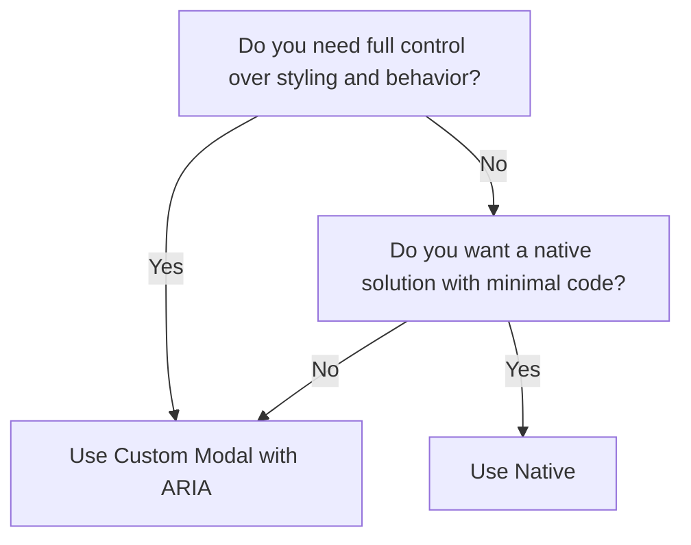

# Modal

Display focused content or actions

> Full examples, anatomy diagrams, and testing notes live in `references/pattern.md`.

## What it solves

A **modal** appears on top of the main application screen, blocking page interaction until closed.
Modals display important information, request user input, or confirm actions in a focused way.

## Quick-start example

_More variations and full anatomy in `references/pattern.md`._

## When to use and when to avoid

**Use when:**

Use modals to **interrupt user flow** for important information or required user input before proceeding.
**Common scenarios include:**
- **Confirmation dialogs** – "Are you sure you want to delete this item?"
- **Critical system messages** – session expiration warnings, important alerts
- **Forms requiring user input** – login, payment, or signup flows
- **Media previews** – images or videos in lightbox overlays
- **Multi-step processes** – checkout steps or onboarding flows
- **Terms and conditions** – requiring user agreement before proceeding

**Avoid when:**

- Non-essential information doesn't need immediate attention
- Content or interaction fits inline on the page
- Same information needs frequent access
- Large content requires significant scrolling - dedicated pages work better for UX and accessibility
- Users must interact with the main page while modal is open

## Implementation workflow

1. Read `references/pattern.md` — review the anatomy section and pick the smallest variation that fits the use case.
2. Copy the starter markup from the quick-start example above (or reference examples). Adapt element names and props to the project's component library.
3. Wire up accessibility: apply ARIA roles, keyboard handlers, and focus management from the guardrails below.
4. Add performance safeguards (lazy loading, virtualization) when the pattern handles large data or frequent updates.
5. Validate: tab through the component, test with a screen reader, resize to mobile, and simulate error/empty states.

## Accessibility guardrails

### Keyboard Interaction Pattern
The following table outlines the standard keyboard interactions for modal components. These interactions ensure that users can navigate and operate modals effectively using only a keyboard.
| Key         | Action                                                                                               |
| ----------- | ---------------------------------------------------------------------------------------------------- |
| Escape      | Closes the modal                                                                                     |
| Tab         | Moves focus to the next focusable element within the modal. Focus should be trapped within the modal |
| Shift + Tab | Moves focus to the previous focusable element within the modal                                       |
| Enter/Space | Activates the focused button or control                                                              |
> **Note**: When the modal opens, focus should automatically move to the first focusable element within the modal (usually the close button or the first form field). When the modal closes, focus should return to the element that triggered the modal.

## Common mistakes

### Forcing Users Into a Modal (No Close Option)
**The Problem:**
Users feel trapped if they can't exit a modal.

**How to Fix It?**
Always provide a clear **close button (X)** and support the `Esc` key for dismissal.

### Triggering Modals on Page Load
**The Problem:**
Unrequested modals on page load can feel like pop-ups that disrupt user flow.

**How to Fix It?**
Only show modals when the user **intentionally** initiates them.

### Disrupting Background Page Focus
**The Problem:**
Some modals allow interaction with background content while open, causing layered focus.

**How to Fix It?**
Add a **focus trap** inside the modal and prevent background interaction until it's closed.

## Related patterns

- https://uxpatterns.dev/patterns/content-management/popover
- https://uxpatterns.dev/patterns/content-management/tooltip
- https://uxpatterns.dev/patterns/user-feedback/loading-indicator

---

For full implementation detail, examples, and testing notes, see `references/pattern.md`.

Pattern page: https://uxpatterns.dev/patterns/content-management/modal
