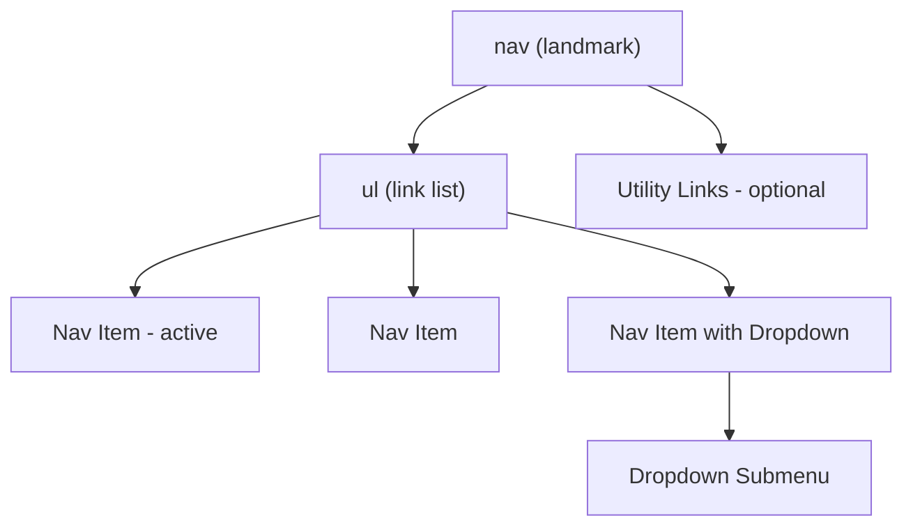

# Navigation Menu

> Build effective navigation menus for your website. Learn best practices for creating accessible, responsive navigation with proper keyboard support and mobile-friendly interactions.

**URL:** https://uxpatterns.dev/patterns/navigation/navigation-menu
**Source:** apps/web/content/patterns/navigation/navigation-menu.mdx

---

## Overview

**Navigation Menu** is the primary horizontal or vertical bar of links that helps users move between the main sections of a website or application. It is the backbone of site architecture, giving users a persistent map of what the site offers and where they currently are.

A well-built navigation menu balances visibility, hierarchy, and responsiveness — always adapting to [viewport](/glossary/viewport) size while remaining accessible to keyboard and [screen reader](/glossary/screen-reader) users.
## Use Cases

### When to use:

Use **Navigation Menu** to **provide persistent, structured access to the main sections of a website or app**.

**Common scenarios include:**

- Every multi-page website needs a primary navigation structure
- Web applications with distinct feature sections or views
- Marketing sites with product, pricing, about, and contact pages
- Documentation sites with category-level navigation
- Intranets and portals with department-level sections

### When not to use:

- Single-page sites with no distinct sections (use anchor links or scroll instead)
- Deeply nested hierarchies where a sidebar or megamenu is more appropriate
- Mobile-only apps where a bottom tab bar follows platform conventions
- Wizard or checkout flows where linear step navigation replaces free navigation

### Common scenarios and examples

- Horizontal top navigation bar on a corporate marketing site
- Vertical navigation menu in a web application's sidebar area
- Combined primary and secondary navigation (main sections + utility links like Login, Search)
- Navigation with dropdown submenus for sections with child pages
- Sticky navigation that remains visible on scroll

## Benefits

- Provides a consistent, predictable way to navigate the site
- Establishes information architecture visually for all users
- Improves SEO through clear internal linking structure
- Supports active state indication so users always know where they are
- Works as a navigation landmark for screen reader users

## Drawbacks

- **Limited horizontal space** – Can only hold a finite number of items before wrapping or overflowing
- **Responsive complexity** – Must collapse or transform for mobile viewports (often into a hamburger menu)
- **Dropdown challenges** – Submenus introduce hover/click/keyboard interaction complexity
- **Sticky positioning costs** – Persistent navigation consumes vertical viewport space
- **Active state management** – Keeping the correct item highlighted requires routing integration
- **Content vs. chrome trade-off** – The navigation bar takes space away from page content

## Anatomy



### Component Structure

1. **Navigation Container (`<nav>`)**

- Wraps the entire navigation using the semantic `<nav>` element
- Labeled with `aria-label` (e.g., "Main navigation") for screen reader landmarks
- Typically positioned at the top of the page or in the header

2. **Link List (`<ul>`)**

- An unordered list containing all top-level navigation items
- Provides structure that screen readers can count and enumerate
- Horizontal layout achieved via CSS flexbox

3. **Navigation Items (`<li>` + `<a>`)**

- Individual links to main site sections
- The active item is marked with `aria-current="page"` and styled distinctly
- May include icons alongside text labels

4. **Dropdown Submenu (Optional)**

- A secondary list of links revealed on hover or click from a parent item
- The parent uses `aria-expanded` and `aria-haspopup` attributes
- Positioned below the parent item with `position: absolute`

5. **Utility Links (Optional)**

- Secondary actions like Login, Sign Up, Search, or Language Selector
- Typically right-aligned and visually separated from the primary navigation
- May use a separate `<nav>` with a distinct `aria-label`

#### Summary of Components

| Component            | Required? | Purpose                                                       |
| -------------------- | --------- | ------------------------------------------------------------- |
| Navigation Container | ✅ Yes    | Semantic landmark wrapping the navigation structure.          |
| Link List            | ✅ Yes    | Contains the ordered set of navigation links.                 |
| Navigation Items     | ✅ Yes    | Individual links to the main sections of the site.            |
| Dropdown Submenu     | ❌ No     | Reveals child pages for items with nested content.            |
| Utility Links        | ❌ No     | Secondary actions like login, search, or language selection.   |

## Variations

### 1. Horizontal Top Bar
The classic horizontal navigation bar positioned at the top of the page.

**When to use:** Most websites — this is the default and most expected navigation pattern.

### 2. Sticky / Fixed Navigation
The navigation bar remains fixed at the top of the viewport as the user scrolls.

**When to use:** Long pages or apps where users need constant access to navigation without scrolling up.

### 3. Navigation with Dropdowns
Top-level items expand to reveal a submenu of child pages on hover or click.

**When to use:** Sites with a moderate number of child pages per section (2-7 items per dropdown).

### 4. Split Navigation
Primary navigation on the left and utility links (login, cart, search) on the right.

**When to use:** E-commerce, SaaS, and sites with both content navigation and action-oriented utility links.

### 5. Vertical Navigation
A vertically stacked list of navigation links, often used in applications or admin panels.

**When to use:** Web applications, admin dashboards, and settings pages.

### 6. Responsive Collapsing Navigation
Horizontal on desktop, collapses into a [hamburger menu](/patterns/navigation/hambuger-menu) on mobile.

**When to use:** Nearly every responsive website — this is the most common responsive strategy.

## Examples

### Live Preview

### Basic HTML Implementation

```html
<header>
  <nav aria-label="Main navigation">
    <ul class="nav-list">
      <li><a href="/" aria-current="page">Home</a></li>
      <li><a href="/products">Products</a></li>
      <li class="has-dropdown">
        <button
          type="button"
          aria-expanded="false"
          aria-haspopup="true"
        >
          Services
          <span aria-hidden="true">▾</span>
        </button>
        <ul class="dropdown" hidden>
          <li><a href="/services/consulting">Consulting</a></li>
          <li><a href="/services/development">Development</a></li>
          <li><a href="/services/support">Support</a></li>
        </ul>
      </li>
      <li><a href="/about">About</a></li>
      <li><a href="/contact">Contact</a></li>
    </ul>
  </nav>
</header>

<script>
  document.querySelectorAll('.has-dropdown button').forEach(trigger => {
    const dropdown = trigger.nextElementSibling;

    trigger.addEventListener('click', () => {
      const isOpen = trigger.getAttribute('aria-expanded') === 'true';
      trigger.setAttribute('aria-expanded', String(!isOpen));
      dropdown.toggleAttribute('hidden');

      if (!isOpen) {
        dropdown.querySelector('a')?.focus();
      }
    });

    trigger.addEventListener('keydown', (e) => {
      if (e.key === 'Escape') {
        trigger.setAttribute('aria-expanded', 'false');
        dropdown.setAttribute('hidden', '');
        trigger.focus();
      }
    });
  });

  document.addEventListener('click', (e) => {
    document.querySelectorAll('.has-dropdown').forEach(item => {
      if (!item.contains(e.target)) {
        const btn = item.querySelector('button');
        btn.setAttribute('aria-expanded', 'false');
        item.querySelector('.dropdown').setAttribute('hidden', '');
      }
    });
  });
</script>
```

## Best Practices

### Content

**Do's ✅**

- Use clear, concise labels that match the destination page titles
- Limit primary navigation to 5-7 items for scannability
- Order items by importance or user frequency (most used first)
- Indicate the current page with visual styling and `aria-current="page"`

**Don'ts ❌**

- Don't use jargon or internal terminology unfamiliar to users
- Don't include more than 7 top-level items without grouping or megamenu treatment
- Don't duplicate navigation items across primary and secondary nav without clear purpose
- Don't use different labels for the same destination in different parts of the site

### Accessibility

**Do's ✅**

- Use the `<nav>` element with `aria-label` for screen reader landmark navigation
- Mark the current page with `aria-current="page"` on the active link
- Use `<button>` with `aria-expanded` and `aria-haspopup` for dropdown triggers
- Support keyboard navigation: Tab between items, Enter to activate, Escape to close dropdowns
- Ensure visible focus indicators on all interactive elements

**Don'ts ❌**

- Don't use `<div>` with click handlers instead of semantic `<nav>`, `<ul>`, `<a>`, or `<button>`
- Don't open dropdowns only on hover without a click/keyboard alternative
- Don't nest multiple `<nav>` elements without distinct `aria-label` values
- Don't suppress focus outlines without providing a visible alternative

### Visual Design

**Do's ✅**

- Make the active item visually distinct with color, weight, or an underline indicator
- Use consistent spacing and alignment across all navigation items
- Provide clear hover states for all interactive elements
- Align dropdown panels with their parent item for spatial connection

**Don'ts ❌**

- Don't use low-contrast text that blends with the background
- Don't make the navigation visually compete with page content
- Don't use animations so slow they impede quick navigation

### Mobile & Touch Considerations

**Do's ✅**

- Collapse the navigation into a [hamburger menu](/patterns/navigation/hambuger-menu) on mobile
- Ensure [touch targets](/glossary/touch-targets) are at least 44×44px
- Use tap-to-expand for dropdown items on touch devices
- Provide a clear visual toggle button to reveal collapsed navigation
**Don'ts ❌**

- Don't attempt to display a full horizontal navigation bar on mobile screens
- Don't rely on hover interactions for touch devices
- Don't place navigation items too close together without adequate spacing

### Layout & Positioning

**Do's ✅**

- Position the navigation at the top of the page within the header
- Use `position: sticky` for navigation that should persist on scroll
- Right-align utility links (login, cart, search) to separate them from primary nav
- Ensure the navigation spans the full width of its container

**Don'ts ❌**

- Don't let the navigation wrap to multiple lines — collapse it before wrapping
- Don't let dropdown menus extend beyond the viewport without adjustment
- Don't change the navigation position or order based on scroll direction

## Common Mistakes & Anti-Patterns 🚫

### Too Many Top-Level Items
**The Problem:**
Cramming 10+ items into the primary navigation bar causes wrapping, overflow, or truncated labels.

**How to Fix It:**
Limit to 5-7 top-level items. Group excess items under broader categories or move them to a secondary navigation bar.

---

### No Active State Indication
**The Problem:**
Users can't tell which page they're on because no navigation item is visually highlighted.

**How to Fix It:**
Style the current page's navigation link distinctly (color, weight, underline) and add `aria-current="page"` for screen readers.

---

### Dropdown Opens on Hover Only
**The Problem:**
Keyboard users and touch-device users cannot access dropdown submenus that only respond to mouse hover.

**How to Fix It:**
Use click/tap to toggle dropdowns. Support Enter/Space to open and Escape to close for keyboard users.

---

### Click-Outside Doesn't Close Dropdown
**The Problem:**
Users click elsewhere on the page expecting the dropdown to close, but it remains open.

**How to Fix It:**
Add a click-outside handler that closes any open dropdown when the user interacts with the page outside the menu.

---

### Navigation Disappears on Mobile Without Alternative
**The Problem:**
The horizontal nav is hidden at mobile breakpoints but no hamburger menu or alternative is provided.

**How to Fix It:**
Always provide a mobile navigation alternative (hamburger menu, bottom tab bar, or slide-out panel) when collapsing the desktop navigation.

---

### Missing Landmark Label
**The Problem:**
Multiple `<nav>` elements without `aria-label` confuse screen reader users who can't distinguish between them.

**How to Fix It:**
Add `aria-label="Main navigation"` and `aria-label="Utility navigation"` to each `<nav>` element.

## Micro-Interactions & Animations

### Dropdown Entry
- **Effect:** Dropdown slides down and fades in below the trigger
- **Timing:** 150ms ease
- **Trigger:** Click or keyboard activation of dropdown trigger
- **Implementation:** CSS animation on opacity and transform translateY

### Active Item Indicator
- **Effect:** An underline or bar slides to the active item position
- **Timing:** 250ms ease-in-out
- **Trigger:** Route change or [page navigation](/glossary/pagination)
- **Implementation:** CSS transition on a pseudo-element's width/position
### Hover Highlight
- **Effect:** Background color fills subtly behind the hovered item
- **Timing:** 100ms ease
- **Trigger:** Mouse hover or keyboard focus
- **Implementation:** CSS background-color transition

### Sticky Scroll Shadow
- **Effect:** A subtle shadow appears below the navigation when it

- **Timing:** 200ms ease
- **Trigger:** Scroll position changes and nav becomes fixed
- **Implementation:** CSS box-shadow transition triggered by scroll observer

## Tracking

### Key Events to Track

| **Event Name** | **Description** | **Why Track It?** |
| --- | --- | --- |
| `nav.item_clicked` | User clicks a top-level navigation item | Measure primary navigation usage |
| `nav.dropdown_opened` | User opens a dropdown submenu | Track which sections users explore |
| `nav.dropdown_item_clicked` | User clicks an item within a dropdown | Identify popular sub-section destinations |
| `nav.active_page` | Current page on load | Understand entry points and navigation flow |
| `nav.mobile_toggle` | User opens/closes mobile navigation | Measure mobile navigation engagement |

### Event Payload Structure

```json
{
  "event": "nav.item_clicked",
  "properties": {
    "link_label": "Products",
    "link_url": "/products",
    "position": 2,
    "total_items": 5,
    "has_dropdown": false,
    "is_mobile": false,
    "viewport_width": 1280
  }
}
```

### Key Metrics to Analyze

- **Navigation Click Rate:** Percentage of pageviews with at least one navigation click
- **Item Distribution:** Click frequency per navigation item
- **Dropdown Engagement:** How often dropdowns are opened vs. leading to a click
- **Mobile vs. Desktop Navigation:** Usage patterns across viewport sizes
- **Entry vs. Exit Navigation:** Which items are used to enter the site vs. navigate within it

### Insights & Optimization Based on Tracking

- 📉 **Low Click Rate on Specific Items?**
  → Labels may be unclear. A/B test different wording or reorder items by popularity.

- 📊 **Uneven Item Distribution?**
  → Some items are used far more. Move popular items to prominent positions.

- 🔽 **High Dropdown Open but Low Click Rate?**
  → Users explore but don't find what they need. Reorganize dropdown content.

- 📱 **Low Mobile Navigation Usage?**
  → Mobile users may not find the hamburger toggle. Increase its visibility or add a label.

- 🔄 **Frequent Same-Page Clicks?**
  → Users may be clicking the active item expecting something to happen. Ensure the active state is clearly distinguished.

## Localization

```json
{
  "navigation_menu": {
    "landmarks": {
      "main_nav": "Main navigation",
      "utility_nav": "Utility navigation"
    },
    "dropdown": {
      "open_label": "Open {section} submenu",
      "close_label": "Close {section} submenu"
    },
    "mobile": {
      "toggle_open": "Open menu",
      "toggle_close": "Close menu"
    },
    "active": {
      "current_page": "Current page"
    }
  }
}
```

### RTL (Right-to-Left) Considerations

- Flip the navigation item order so the first item is on the right
- Utility links move to the left side
- Dropdown alignment changes to right-to-left
- Chevron icons point in the opposite direction

### Cultural Considerations

- **Label length:** Navigation labels may expand 30-200% in translation — test with longest expected translations
- **Item ordering:** Some cultures read right-to-left, so importance ordering reverses
- **Icon semantics:** Ensure icons (home, search, cart) are universally understood in target markets

## Performance

### Target Metrics

- **Initial render:** < 50ms for navigation component
- **Dropdown open:** < 100ms from trigger to visible dropdown
- **Sticky behavior:** No jank during scroll (use `position: sticky` not JavaScript-based)
- **Bundle size:** < 3KB for navigation component with styles
- **Layout shift:** CLS of 0 — navigation should never shift after initial render

### Optimization Strategies

**[Semantic HTML](/glossary/semantic-html) (No JS Needed for Basic Nav)**```html
<nav aria-label="Main navigation">
  <ul>
    <li><a href="/" aria-current="page">Home</a></li>
    <li><a href="/about">About</a></li>
  </ul>
</nav>
```

**CSS-Only Sticky**
```css
nav {
  position: sticky;
  top: 0;
  z-index: 40;
}
```

**Lazy Load Dropdown Content**
```javascript
const [hasOpened, setHasOpened] = useState(false);
const toggleDropdown = () => {
  setHasOpened(true);
  setIsOpen(prev => !prev);
};
```

## Testing Guidelines

### Functional Testing

**Should ✓**

- [ ] Navigate to the correct page when clicking a navigation link
- [ ] Open and close dropdown submenus on click
- [ ] Close dropdown when clicking outside the menu
- [ ] Highlight the correct active item based on the current route
- [ ] Collapse to mobile navigation at the defined breakpoint
- [ ] Mobile toggle shows and hides the navigation items

### Accessibility Testing

**Should ✓**

- [ ] Navigation uses `<nav>` with `aria-label`
- [ ] Active page link has `aria-current="page"`
- [ ] Dropdown triggers have `aria-expanded` and `aria-haspopup`
- [ ] Keyboard Tab navigates between items
- [ ] Enter/Space opens dropdowns, Escape closes them
- [ ] Focus indicators are visible on all interactive elements
- [ ] Screen readers can enumerate navigation items

### Visual Testing

**Should ✓**

- [ ] Active item is visually distinct from other items
- [ ] Hover and focus states are clearly visible
- [ ] Dropdown aligns with its trigger without overlap
- [ ] Navigation does not wrap to multiple lines at supported widths
- [ ] Sticky navigation does not overlap page content

### Performance Testing

**Should ✓**

- [ ] Navigation renders without layout shifts
- [ ] Sticky behavior runs smoothly at 60fps
- [ ] Dropdowns open without perceptible delay
- [ ] Navigation works without JavaScript (progressive enhancement)

## SEO Considerations

- **Internal linking structure:** Navigation menus provide the strongest internal linking signals — ensure all main sections are linked
- **Semantic HTML:** Use `<nav>`, `<ul>`, `<li>`, `<a>` for maximum crawlability
- **Consistent across pages:** The same navigation on every page helps search engines understand site structure
- **Active page marking:** `aria-current="page"` helps accessibility but doesn't directly affect SEO
- **Avoid JavaScript-only rendering:** Ensure navigation links are in the server-rendered HTML for crawler access
- **Dropdown content:** Links in dropdowns are crawlable if they are in the HTML — avoid rendering them only on interaction

## Design Tokens

```json
{
  "$schema": "https://design-tokens.org/schema.json",
  "navigationMenu": {
    "container": {
      "background": { "value": "{color.white}", "type": "color" },
      "borderBottom": { "value": "1px solid {color.gray.200}", "type": "border" },
      "height": { "value": "3.5rem", "type": "dimension" },
      "zIndex": { "value": "40", "type": "number" }
    },
    "item": {
      "paddingY": { "value": "0.75rem", "type": "dimension" },
      "paddingX": { "value": "1rem", "type": "dimension" },
      "fontSize": { "value": "0.9375rem", "type": "fontSizes" },
      "color": {
        "default": { "value": "{color.gray.700}", "type": "color" },
        "hover": { "value": "{color.gray.900}", "type": "color" },
        "active": { "value": "{color.blue.600}", "type": "color" }
      },
      "borderRadius": { "value": "{radius.md}", "type": "dimension" },
      "hoverBackground": { "value": "{color.gray.100}", "type": "color" },
      "activeBackground": { "value": "{color.blue.50}", "type": "color" },
      "activeFontWeight": { "value": "600", "type": "fontWeights" }
    },
    "dropdown": {
      "background": { "value": "{color.white}", "type": "color" },
      "borderColor": { "value": "{color.gray.200}", "type": "color" },
      "borderRadius": { "value": "{radius.lg}", "type": "dimension" },
      "shadow": { "value": "0 4px 12px rgba(0, 0, 0, 0.1)", "type": "shadow" },
      "padding": { "value": "0.5rem", "type": "dimension" },
      "minWidth": { "value": "12rem", "type": "dimension" },
      "zIndex": { "value": "50", "type": "number" }
    },
    "focus": {
      "outlineWidth": { "value": "2px", "type": "dimension" },
      "outlineOffset": { "value": "2px", "type": "dimension" },
      "outlineColor": { "value": "{color.blue.600}", "type": "color" }
    }
  }
}
```

## FAQ

## Related Patterns

## Resources

### References

- [WCAG 2.2](https://www.w3.org/TR/WCAG22/) - Accessibility baseline for keyboard support, focus management, and readable state changes.
- [WAI-ARIA Authoring Practices](https://www.w3.org/WAI/ARIA/apg/) - Reference patterns for keyboard behavior, semantics, and assistive technology support.

### Guides

- [WAI Fly-out Menus Tutorial](https://www.w3.org/WAI/tutorials/menus/flyout/) - Guidance for hover intent, disclosure timing, and focus handling in nested navigation.

### Articles

- [Nielsen Norman Group: Mega menus work well](https://www.nngroup.com/articles/mega-menus-work-well/) - Evidence for structured large-menu layouts and hover/focus handling tradeoffs.

### NPM Packages

- [`@radix-ui/react-navigation-menu`](https://www.npmjs.com/package/%40radix-ui%2Freact-navigation-menu) - Structured menu primitive for complex site navigation.
- [`@headlessui/react`](https://www.npmjs.com/package/%40headlessui%2Freact) - Headless primitives for menus, tabs, popovers, and disclosure controls.
- [`@floating-ui/react`](https://www.npmjs.com/package/%40floating-ui%2Freact) - Positioning engine for tooltips, popovers, dropdowns, and anchored surfaces.
