# Password Reset

> Learn how to implement secure password reset functionality. Discover best practices for recovery emails, token validation, and security considerations.

**URL:** https://uxpatterns.dev/patterns/authentication/password-reset
**Source:** apps/web/content/patterns/authentication/password-reset.mdx

---

## Overview

**Password Reset** is a multi-step recovery flow that allows users to regain access to their account when they've forgotten their password. The typical flow involves requesting a reset via email, receiving a time-limited token link, and setting a new password.

A well-designed password reset balances security (preventing unauthorized resets) with usability (getting legitimate users back into their accounts quickly and without frustration).

## Use Cases

### When to use:

Use **Password Reset** to **allow users to recover access to their account when they've forgotten their password**.

**Common scenarios include:**

- User forgot their password and cannot log in
- User wants to change a potentially compromised password
- Administrator triggers a mandatory password reset for security
- Account recovery after detecting suspicious activity
- Periodic password rotation required by security policies

### When not to use:

- Passwordless authentication systems (magic links replace the need)
- Applications using only social login without local passwords
- SSO-only environments where the identity provider handles password management
- Systems where admins provision temporary credentials directly

### Common scenarios and examples

- "Forgot password?" link on the login page leading to an email request form
- Verification link in email with a time-limited token
- Reset form where the user enters and confirms a new password
- Success confirmation with a redirect to the login page
- Expired token handling with an option to request a new link

## Benefits

- Provides a self-service recovery path without support intervention
- Reduces customer support costs for locked accounts
- Time-limited tokens prevent stale reset links from being exploited
- Familiar multi-step flow that users understand from other services
- Can be combined with 2FA for stronger identity verification

## Drawbacks

- **Email dependency** – Users must have access to the email account associated with their profile
- **Phishing vulnerability** – Reset emails can be mimicked by attackers
- **Token expiry frustration** – Users who take too long must restart the process
- **Email deliverability** – Reset emails can land in spam folders
- **Account enumeration risk** – Confirming whether an email exists in the system reveals information to attackers
- **Multi-step friction** – Switching between app and email client breaks the flow

## Anatomy

```mermaid
flowchart TB
Step1[Step 1: Request Reset] --> Email[Enter Email Address]
Email --> Submit1[Submit Request]
Submit1 --> Confirmation[Email Sent Confirmation]
Confirmation --> Step2[Step 2: Email with Token Link]
Step2 --> Step3[Step 3: Set New Password]
Step3 --> NewPassword[New Password Field]
Step3 --> ConfirmPassword[Confirm Password Field]
Step3 --> Submit2[Submit New Password]
Submit2 --> Success[Success / Redirect to Login]
```



### Component Structure

1. **Request Form (Step 1)**

- Single email input field
- Submit button to trigger the reset email
- Link back to the login page

2. **Email Sent Confirmation**

- Confirms that a reset email has been sent (shown regardless of whether the email exists)
- Includes guidance on checking spam/junk folders
- Provides a resend option with rate limiting

3. **Reset Email (Step 2)**

- Contains a time-limited reset link with a secure token
- Clear call-to-action button
- Includes the user's email for confirmation and mentions the expiry time

4. **New Password Form (Step 3)**

- New password field with strength indicator
- Confirm password field
- Uses `autocomplete="new-password"` for both fields
- Submit button to complete the reset

5. **Success Confirmation**

- Confirms the password was successfully changed
- Provides a link or auto-redirect to the login page
- May invalidate all existing sessions for security

#### Summary of Components

| Component              | Required? | Purpose                                                      |
| ---------------------- | --------- | ------------------------------------------------------------ |
| Request Form           | ✅ Yes    | Collects the user's email to initiate the reset.             |
| Email Sent Confirmation| ✅ Yes    | Confirms the request without revealing account existence.    |
| Reset Email            | ✅ Yes    | Delivers the time-limited reset link.                        |
| New Password Form      | ✅ Yes    | Allows the user to set a new password.                       |
| Success Confirmation   | ✅ Yes    | Confirms the reset and directs to login.                     |

## Variations

### 1. Standard Email Token Reset
The classic flow: enter email, receive a link, set a new password.

**When to use:** Most web applications with email-based accounts.

### 2. Security Questions + Email
Requires answering a security question before the reset email is sent.

**When to use:** Legacy systems with an additional identity verification layer (not recommended for new systems).

### 3. SMS / Phone Verification Reset
Sends an OTP to the user's registered phone number instead of or alongside email.

**When to use:** Systems where phone number is a primary identifier or for additional security.

### 4. Admin-Initiated Reset
An administrator triggers a password reset email or sets a temporary password.

**When to use:** Enterprise environments where admins manage user credentials.

### 5. Inline Password Change
A "change password" flow for logged-in users that requires the current password before setting a new one.

**When to use:** Account settings pages where users proactively change their password.

## Examples

### Live Preview

### Request Form (Step 1) HTML

```html
<div class="reset-container">
  <h1>Reset your password</h1>
  <p>Enter your email address and we'll send you a link to reset your password.</p>

  <form action="/api/auth/forgot-password" method="POST" novalidate>
    <div class="form-field">
      <label for="email">Email address</label>
      <input
        type="email"
        id="email"
        name="email"
        autocomplete="email"
        required
        aria-describedby="email-error"
      />
      <span id="email-error" class="field-error" role="alert" hidden></span>
    </div>

    <button type="submit" class="reset-btn">Send reset link</button>
  </form>

  <a href="/login" class="back-link">Back to sign in</a>
</div>
```

### New Password Form (Step 3) HTML

```html
<div class="reset-container">
  <h1>Set a new password</h1>
  <p>Your new password must be at least 8 characters long.</p>

  <form action="/api/auth/reset-password" method="POST" novalidate>
    <input type="hidden" name="token" value="RESET_TOKEN_VALUE" />

    <div class="form-field">
      <label for="new-password">New password</label>
      <input
        type="password"
        id="new-password"
        name="password"
        autocomplete="new-password"
        required
        minlength="8"
        aria-describedby="password-hint"
      />
      <div id="password-hint" class="password-requirements">
        At least 8 characters
      </div>
    </div>

    <div class="form-field">
      <label for="confirm-password">Confirm new password</label>
      <input
        type="password"
        id="confirm-password"
        name="password_confirmation"
        autocomplete="new-password"
        required
        aria-describedby="confirm-error"
      />
      <span id="confirm-error" class="field-error" role="alert" hidden></span>
    </div>

    <button type="submit" class="reset-btn">Reset password</button>
  </form>
</div>
```

## Best Practices

### Content

**Do's ✅**

- Show the same confirmation message regardless of whether the email exists in the system
- Clearly state the token expiry time in the reset email ("This link expires in 1 hour")
- Include guidance to check spam/junk folders on the confirmation screen
- Provide a resend option for the reset email

**Don'ts ❌**

- Don't reveal whether an email is registered ("No account found with that email")
- Don't display the raw token in the URL query string in a visible way
- Don't allow unlimited resend requests — rate limit to prevent abuse
- Don't auto-expire the user's session immediately after requesting a reset

### Accessibility

**Do's ✅**

- Associate labels with inputs via `for`/`id`
- Announce errors with `role="alert"` and `aria-describedby`
- Use `autocomplete="email"` on the request form and `autocomplete="new-password"` on the reset form
- Ensure all steps are navigable via keyboard
- Provide clear heading hierarchy across the multi-step flow

**Don'ts ❌**

- Don't use time-sensitive CAPTCHAs that penalize slower users
- Don't rely on color alone to indicate field errors
- Don't auto-submit forms — let users confirm with an explicit button press

### Visual Design

**Do's ✅**

- Use a consistent card-style layout across all steps
- Show a clear progress indicator or step label so users know where they are
- Use a prominent call-to-action button for each step
- Display success states with positive visual feedback (checkmark, green)

**Don'ts ❌**

- Don't style the reset form differently from the login form — maintain consistency
- Don't use tiny text for important instructions like token expiry

### Mobile & Touch Considerations

**Do's ✅**

- Use `inputmode="email"` for the email keyboard on mobile
- Ensure the reset link in the email works on mobile devices
- Make the "Reset password" button in the email large and tappable (minimum 44×44px)

**Don'ts ❌**

- Don't break deep links — the token URL must work on any device
- Don't require app installation to complete the reset

### Layout & Positioning

**Do's ✅**

- Center all reset steps on the page with consistent max-width
- Include a "Back to sign in" link on every step
- Position password requirements near the password field

**Don'ts ❌**

- Don't split the new password and confirm password fields across pages
- Don't hide the password requirements until after the user makes an error

## Common Mistakes & Anti-Patterns 🚫

### Revealing Account Existence
**The Problem:**
"No account found with that email" lets attackers enumerate valid accounts.

**How to Fix It:**
Always show "If an account exists, we've sent a reset link." Apply consistent response times for both cases.

---

### Token Never Expires
**The Problem:**
Reset tokens that never expire can be intercepted and used indefinitely.

**How to Fix It:**
Set tokens to expire in 1 hour (or less). Show a clear error when an expired token is used, with an option to request a new one.

---

### No Rate Limiting on Reset Requests
**The Problem:**
Attackers flood a user's inbox with reset emails or use the endpoint for email enumeration timing attacks.

**How to Fix It:**
Limit reset requests to 3 per email per hour. Return the same response and timing regardless of whether the email exists.

---

### Password Mismatch Not Caught
**The Problem:**
Users type different passwords in the "New password" and "Confirm password" fields and only discover the error after submission.

**How to Fix It:**
Validate that both fields match in real-time (on blur of the confirm field). Show a clear inline error.

---

### No "Back to Login" Path
**The Problem:**
Users who remember their password or landed on the reset page by mistake have no easy way to get back.

**How to Fix It:**
Include a "Back to sign in" link on every step of the reset flow.

---

### Expired Token Without Guidance
**The Problem:**
Users click the reset link after it expires and see a generic error with no next steps.

**How to Fix It:**
Show a specific message: "This link has expired. Request a new password reset link." Include a direct link to the request form.

## Security Considerations

### Token Security

- **Cryptographically random** — Use `crypto.randomBytes(32)` or equivalent for token generation
- **One-time use** — Invalidate the token immediately after successful reset
- **Time-limited** — Expire tokens within 1 hour (15-60 minutes recommended)
- **Hashed storage** — Store only the hash of the token in the database, not the plaintext

### Account Enumeration Prevention

- **Consistent responses** — Return the same message and HTTP status for existing and non-existing emails
- **Consistent timing** — Ensure response times are identical to prevent timing attacks
- **No email confirmation** — Never confirm whether an email is registered in the system

### Session Invalidation

- **Invalidate existing sessions** — After a successful password reset, log out all active sessions
- **Notify the user** — Send an email confirming the password was changed
- **Log the event** — Record the reset for security audit purposes

### Email Security

- **SPF/DKIM/DMARC** — Configure email authentication to prevent spoofing
- **Branded email** — Use a recognizable sender name and email address
- **No sensitive data in email** — The email should contain only the reset link, not the new password

## Micro-Interactions & Animations

### Submit Button Loading
- **Effect:** Button text changes to "Sending…" with a spinner
- **Timing:** Immediate on submission
- **Trigger:** Form submit event
- **Implementation:** Disable button, swap text, show spinner

### Step Transition
- **Effect:** Current step fades out, next step fades in
- **Timing:** 200ms crossfade
- **Trigger:** Successful form submission or navigation
- **Implementation:** CSS opacity transitions with state management

### Password Match Indicator
- **Effect:** Checkmark appears when confirm password matches, ✕ when it doesn't
- **Timing:

- **Trigger:** Input event on confirm password field
- **Implementation:** Compare values, toggle icon visibility with CSS

### Token Expiry Warning
- **Effect:** Countdown timer or warning message appears when token is close to expiry
- **Timing:** Shows at 5 minutes remaining
- **Trigger:** Time-based calculation from token creation
- **Implementation:** JavaScript interval checking remaining time

## Tracking

### Key Events to Track

| **Event Name** | **Description** | **Why Track It?** |
| --- | --- | --- |
| `password_reset.requested` | User submits the reset request form | Measure how often resets are needed |
| `password_reset.email_sent` | Reset email is successfully sent | Track delivery success |
| `password_reset.link_clicked` | User clicks the reset link in the email | Measure email engagement |
| `password_reset.completed` | User successfully sets a new password | Track completion rate |
| `password_reset.token_expired` | User attempts to use an expired token | Identify token expiry issues |
| `password_reset.resend_requested` | User requests a new reset email | Track email delivery problems |

### Event Payload Structure

```json
{
  "event": "password_reset.completed",
  "properties": {
    "time_request_to_completion_ms": 180000,
    "token_age_ms": 120000,
    "device_type": "mobile",
    "email_client": "gmail",
    "attempt_number": 1
  }
}
```

### Key Metrics to Analyze

- **Reset Request Rate:** Percentage of login attempts that lead to a password reset
- **Completion Rate:** Percentage of requested resets that are successfully completed
- **Time to Complete:** Average time from request to password change
- **Token Expiry Rate:** How often users let tokens expire before using them
- **Resend Rate:** How often users need to request a new reset email

### Insights & Optimization Based on Tracking

- 📉 **High Reset Request Rate?**
  → Users frequently forget passwords. Consider adding social login or passwordless options.

- ⏱️ **Long Time to Complete?**
  → Reset emails may be slow or landing in spam. Improve deliverability and check email send times.

- 🔄 **High Resend Rate?**
  → Email isn't arriving. Check spam filters, deliverability, and subject line clarity.

- ⌛ **High Token Expiry Rate?**
  → Expiry may be too short. Consider extending from 15 minutes to 1 hour.

- 📱 **Lower Completion on Mobile?**
  → The flow may break when switching between email app and browser. Test deep link handling.

## Localization

```json
{
  "password_reset": {
    "request": {
      "heading": "Reset your password",
      "description": "Enter your email address and we'll send you a link to reset your password.",
      "email_label": "Email address",
      "submit": "Send reset link",
      "submitting": "Sending…",
      "back_to_login": "Back to sign in"
    },
    "confirmation": {
      "heading": "Check your email",
      "message": "If an account exists for {email}, we sent a password reset link.",
      "spam_note": "Don't see it? Check your spam folder.",
      "resend": "Resend reset link"
    },
    "reset_form": {
      "heading": "Set a new password",
      "new_password_label": "New password",
      "confirm_password_label": "Confirm new password",
      "password_hint": "At least 8 characters",
      "submit": "Reset password",
      "submitting": "Resetting…"
    },
    "success": {
      "heading": "Password updated",
      "message": "Your password has been successfully reset. You can now sign in with your new password.",
      "login_link": "Go to sign in"
    },
    "errors": {
      "email_required": "Email is required",
      "email_invalid": "Enter a valid email address",
      "password_required": "Password is required",
      "password_too_short": "Password must be at least 8 characters",
      "passwords_mismatch": "Passwords do not match",
      "token_expired": "This reset link has expired. Please request a new one.",
      "token_invalid": "This reset link is invalid."
    }
  }
}
```

### RTL (Right-to-Left) Considerations

- Mirror form layouts and button alignment
- Flip the "Back to sign in" link position
- Ensure email in confirmation text reads correctly in RTL context

### Cultural Considerations

- **Email reliance:** In some markets, SMS-based reset is more reliable than email
- **Support expectations:** Some cultures expect phone-based support over self-service
- **Security messaging:** Tone of security-related messages varies by culture

## Performance

### Target Metrics

- **Form render:** < 100ms for each step
- **Reset email delivery:** < 30 seconds after request
- **Token validation:** < 200ms server-side
- **Password update:** < 500ms server-side
- **Redirect after success:** < 200ms navigation start

### Optimization Strategies

**Immediate Confirmation UI**
```javascript
// Show confirmation immediately; send email in background
setSubmitted(true);
await sendResetEmail(email);
```

**Prefetch Login Page**
```html
<link rel="prefetch" href="/login" />
```

**Client-Side Token Validation**
```javascript
// Check token format before making API call
const isValidFormat = /^[a-f0-9]{64}$/.test(token);
if (!isValidFormat) showExpiredMessage();
```

## Testing Guidelines

### Functional Testing

**Should ✓**

- [ ] Send a reset email when a valid email is submitted
- [ ] Show the same confirmation for both existing and non-existing emails
- [ ] Validate the token on the reset page
- [ ] Show an expired message for expired tokens
- [ ] Require password confirmation to match
- [ ] Successfully update the password with a valid token
- [ ] Invalidate the token after successful use
- [ ] Redirect to login after success

### Accessibility Testing

**Should ✓**

- [ ] All fields have associated labels
- [ ] Errors use `role="alert"` and `aria-describedby`
- [ ] Forms are operable via keyboard
- [ ] Focus indicators are visible on all elements
- [ ] Success and error states are announced to screen readers

### Security Testing

**Should ✓**

- [ ] Tokens are cryptographically random
- [ ] Tokens expire within the configured time
- [ ] Tokens are one-time use
- [ ] Rate limiting prevents abuse
- [ ] Account enumeration is prevented (consistent responses)
- [ ] All sessions are invalidated after password reset
- [ ] Reset is only accepted over HTTPS

### Visual Testing

**Should ✓**

- [ ] All steps render consistently across viewports
- [ ] Loading states display correctly
- [ ] Error states are clear with appropriate styling
- [ ] Success state provides clear next steps

## SEO Considerations

- **Noindex all reset pages** — Password reset pages should not be indexed by search engines
- **Block token URLs from crawlers** — Use `robots.txt` or meta noindex to prevent token URL indexing
- **Don't generate sitemap entries** — Reset page URLs should not appear in sitemaps

## Design Tokens

```json
{
  "$schema": "https://design-tokens.org/schema.json",
  "passwordReset": {
    "container": {
      "maxWidth": { "value": "24rem", "type": "dimension" },
      "padding": { "value": "2rem", "type": "dimension" },
      "borderRadius": { "value": "{radius.lg}", "type": "dimension" },
      "background": { "value": "{color.white}", "type": "color" }
    },
    "submitButton": {
      "background": { "value": "{color.blue.600}", "type": "color" },
      "hoverBackground": { "value": "{color.blue.700}", "type": "color" },
      "color": { "value": "{color.white}", "type": "color" },
      "borderRadius": { "value": "{radius.md}", "type": "dimension" }
    },
    "success": {
      "iconColor": { "value": "{color.green.500}", "type": "color" },
      "headingColor": { "value": "{color.gray.900}", "type": "color" }
    }
  }
}
```

## FAQ

## Related Patterns

## Resources

### References

- [WCAG 2.2](https://www.w3.org/TR/WCAG22/) - Accessibility baseline for keyboard support, focus management, and readable state changes.
- [WAI Forms Tips and Tricks](https://www.w3.org/WAI/tutorials/forms/tips/) - Practical guidance for formatting, grouping, timing, and forgiving user input rules.

### Guides

- [WAI Forms Tutorial](https://www.w3.org/WAI/tutorials/forms/) - Accessible labels, instructions, validation, and grouping for forms and input controls.

### Articles

- [Nielsen Norman Group: Login walls](https://www.nngroup.com/articles/login-walls/) - When forced authentication harms discovery and conversion in account flows.
- [Nielsen Norman Group: Password creation](https://www.nngroup.com/articles/password-creation/) - Research on password rules, reveal controls, and frustration in sign-in flows.

### NPM Packages

- [`@clerk/nextjs`](https://www.npmjs.com/package/%40clerk%2Fnextjs) - Hosted authentication flows and account-management building blocks for Next.js apps.
- [`next-auth`](https://www.npmjs.com/package/next-auth) - Open-source authentication framework for session, provider, and credential flows.
- [`zod`](https://www.npmjs.com/package/zod) - Schema validation for typed parsing, normalization, and field-level error handling.
