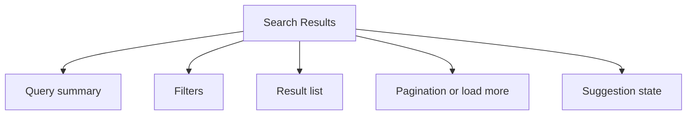

# Search Results

> Learn how to implement search results pages. Discover best practices for result ranking, filtering, and pagination.

**URL:** https://uxpatterns.dev/patterns/advanced/search-results
**Source:** apps/web/content/patterns/advanced/search-results.mdx

---

## Overview

A **Search Results** pattern helps teams create a reliable way to turn a query into a ranked, filterable list that helps users recover from broad or imperfect searches. It is most useful when teams need docs and knowledge-base retrieval.

Compared with adjacent patterns, this pattern should reduce friction without hiding the state, rules, or recovery paths people need to keep moving.

## Use Cases

### When to use:

- Docs and knowledge-base retrieval
- Catalog and directory search
- Internal admin and operational search

### When not to use:

- Use a simpler visible navigation or single-page flow when the product surface is still small.
- Avoid advanced interaction patterns if the team cannot support their state complexity well.
- Do not introduce hidden power-user behavior before the plain path is already strong.

### Common scenarios and examples

- Docs and knowledge-base retrieval where users need a clear, repeatable interface model.
- Catalog and directory search where users need a clear, repeatable interface model.
- Internal admin and operational search where users need a clear, repeatable interface model.

## Benefits

- Clarifies how search results should behave before implementation details begin to sprawl.
- Creates a reusable interaction model for teams who need to turn a query into a ranked, filterable list that helps users recover from broad or imperfect searches.
- Makes accessibility, edge cases, and recovery paths part of the design instead of post-launch cleanup.
- Gives product, design, and engineering a shared language for evaluating trade-offs.

## Drawbacks

- The pattern introduces more state and edge cases than its static mockups suggest.
- It requires coordination between content, interaction, and accessibility choices.
- Teams often underestimate how much polish is needed for non-happy states.
- Responsive behavior usually needs explicit planning rather than minor CSS tweaks.

## Anatomy



### Component Structure

1. **Query summary**

- Confirms the current term, count, and active sort.

2. **Filters**

- Lets people narrow the result set without rewriting the query.

3. **Result list**

- Shows titles, snippets, and metadata in ranked order.

4. **Pagination or load more**

- Controls how users continue through large result sets.

5. **Suggestion state**

- Offers spelling, related searches, or empty-state recovery.

#### Summary of Components

| Component | Required? | Purpose |
| --- | --- | --- |
| Query summary | ✅ Yes | Confirms the current term, count, and active sort. |
| Filters | ✅ Yes | Lets people narrow the result set without rewriting the query. |
| Result list | ✅ Yes | Shows titles, snippets, and metadata in ranked order. |
| Pagination or load more | ✅ Yes | Controls how users continue through large result sets. |
| Suggestion state | ❌ No | Offers spelling, related searches, or empty-state recovery. |

## Variations

### Editorial results

Ranks curated content with descriptive snippets and sections.

**When to use:** Use for docs, blogs, and reference sites.

### Transactional results

Highlights price, stock, and fulfillment details.

**When to use:** Use for catalogs and marketplaces.

### Operational results

Prioritizes exact matches, filters, and sort persistence.

**When to use:** Use for admin tools and internal search.

## Best Practices

### Content

**Do's ✅**

- State the job of the pattern clearly before layering on visual complexity.
- Keep labels, controls, and outcomes in the same mental group.
- Use supporting text to reduce ambiguity, not to restate the obvious.

**Don'ts ❌**

- Do not force users to infer system state from decoration alone.
- Do not add extra interaction steps without a clear benefit.
- Do not assume the design works equally well for novice and expert users.

### Accessibility

**Do's ✅**

- Verify that search results can be completed using keyboard alone.
- Keep focus order logical when the pattern opens, updates, or reveals additional UI.
- Preserve a visible focus state that is still readable at high zoom.
- Use semantic elements first, then add ARIA only where semantics alone are not enough.
- Announce state changes such as errors, loading, or completion in the right place and with the right politeness.

**Don'ts ❌**

- Do not remove focus styles without a visible replacement.
- Do not depend on placeholder or helper text that disappears before the user can act on it.
- Do not assume pointer, touch, and assistive technologies will all interact with the pattern the same way.

### Visual Design

**Do's ✅**

- Preserve a clear hierarchy between primary content, secondary metadata, and controls.
- Use visual rhythm to make the pattern easier to scan.
- Treat hover, focus, and active states as part of the design system.

**Don'ts ❌**

- Do not overload the default view with secondary options.
- Do not use visual emphasis without meaning behind it.
- Do not let state changes shift unrelated content unexpectedly.

### Layout & Positioning

**Do's ✅**

- Keep the pattern stable across common breakpoints.
- Preserve proximity between cause and effect.
- Plan empty, loading, and error states in the same container.

**Don'ts ❌**

- Do not let layout rearrangements hide the current state.
- Do not depend on fixed heights when content length is variable.
- Do not design only for the most ideal dataset or [viewport](/glossary/viewport).
## State Management

- Keep the canonical state small and derivable so advanced UI behaviors do not fork into several contradictory versions.
- Persist enough context that users can leave and return without feeling like the system forgot their progress or place.
- Treat URL state, stored preferences, and in-memory interaction state separately so restoration rules stay clear.

## Implementation Checklist

- [ ] Define the canonical state model before implementation starts.
- [ ] Specify empty, loading, and failure states alongside the default interaction.
- [ ] Test the full pattern with keyboard-only use before polishing advanced visuals.
- [ ] Document how the pattern behaves on narrow screens and with reduced motion enabled.

## Common Mistakes & Anti-Patterns 🚫

### **Designing only the happy path**

**The Problem:**
The pattern feels polished until loading, empty, and failure states appear.

**How to Fix It?**
Specify the full lifecycle alongside the default state so implementation does not improvise later.

---

### **Letting interaction and content drift apart**

**The Problem:**
Users work harder when controls, status, and supporting information feel disconnected.

**How to Fix It?**
Keep the information architecture of the pattern close to the interaction model.

---

### **Treating accessibility as a final pass**

**The Problem:**
Keyboard, announcement, and reading-order issues become expensive once the interaction is already fixed.

**How to Fix It?**
Bake semantics, focus behavior, and announcements into the first implementation.

## Examples

### Live Preview

### Basic Implementation

```html
<div class="demo-shell card results">
  <div class="results-header">
    <strong>24 results for “design systems”</strong>
    <span class="muted">Sorted by relevance</span>
  </div>
  <div class="chips">
    <button type="button">Guides</button>
    <button type="button">Patterns</button>
    <button type="button">Articles</button>
  </div>
  <div class="result-list">
    <article><h3>Design system foundations</h3><p class="muted">Start with tokens, components, and documentation that teams can actually keep current.</p></article>
    <article><h3>Pattern libraries that scale</h3><p class="muted">Compare maintenance models for component inventories, examples, and review workflows.</p></article>
  </div>
</div>
```

### What this example demonstrates

- A clear baseline implementation of search results that can be reviewed without framework-specific noise.
- Visible state, spacing, and content hierarchy that mirror the implementation guidance above.
- A small enough surface to copy into a design review or prototype before scaling the pattern up.

### Implementation Notes

- Start with [semantic HTML](/glossary/semantic-html) and only add JavaScript where the interaction truly requires it.
- Keep styling tokens and spacing consistent with adjacent controls or layouts.
- If the live implementation introduces async behavior, mirror those states in the code example rather than documenting them only in prose.
## Accessibility

### Keyboard Interaction

- [ ] Verify that search results can be completed using keyboard alone.
- [ ] Keep focus order logical when the pattern opens, updates, or reveals additional UI.
- [ ] Preserve a visible focus state that is still readable at high zoom.

### Screen Reader Support

- [ ] Use semantic elements first, then add ARIA only where semantics alone are not enough.
- [ ] Announce state changes such as errors, loading, or completion in the right place and with the right politeness.
- [ ] Connect labels, hints, and status text with `aria-describedby` or structural headings when useful.

### Visual Accessibility

- [ ] Do not rely on color alone to convey severity, completion, or selection state.
- [ ] Test the pattern at 200% zoom and with reduced motion enabled.
- [ ] Ensure [touch targets](/glossary/touch-targets) remain comfortable on mobile and coarse pointers.
## Testing Guidelines

### Functional Testing

- [ ] Verify the default, loading, error, and success states for search results.
- [ ] Test the primary action and the obvious recovery action in the same run.
- [ ] Confirm that state survives refresh, navigation, or retry in the way users would expect.

### Accessibility Testing

- [ ] Run keyboard-only checks and at least one [screen reader](/glossary/screen-reader) pass on the final implementation.
- [ ] Validate headings, labels, and announcement behavior with real content rather than lorem ipsum.
- [ ] Check color contrast and focus visibility in both default and stressed states.
### Edge Cases

- [ ] Test empty, long, duplicated, and unexpectedly formatted content.
- [ ] Check behavior on narrow screens, zoomed layouts, and slower networks.
- [ ] Verify that optimistic or asynchronous states reconcile correctly after a failure.

## Frequently Asked Questions

## Related Patterns

## Resources

### References

- [WCAG 2.2](https://www.w3.org/TR/WCAG22/) - Accessibility baseline for keyboard support, focus management, and readable state changes.
- [WAI-ARIA Authoring Practices](https://www.w3.org/WAI/ARIA/apg/) - Reference patterns for keyboard behavior, semantics, and assistive technology support.

### Guides

- [web.dev: Rendering on the Web](https://web.dev/articles/rendering-on-the-web) - Rendering tradeoffs for data-rich pages, dashboards, and result-heavy views.
- [web.dev: Virtualize large lists](https://web.dev/articles/virtualize-long-lists-react-window) - Rendering and scrolling guidance for large result sets, feeds, and data-heavy interfaces.

### Articles

- [Stephanie Walter: Designing complex data tables](https://stephaniewalter.design/blog/essential-resources-design-complex-data-tables/) - Design considerations for dense tables, column behavior, and analytical workflows.
- [Baymard: Autocomplete design](https://baymard.com/blog/autocomplete-design) - Patterns for query suggestions, highlighted matches, and keyboard interaction.

### NPM Packages

- [`algoliasearch`](https://www.npmjs.com/package/algoliasearch) - Search API client for fast, ranked search results and filtering flows.
- [`react-instantsearch`](https://www.npmjs.com/package/react-instantsearch) - React bindings for search results, faceting, and query-state UIs.
- [`@tanstack/react-query`](https://www.npmjs.com/package/%40tanstack%2Freact-query) - Server-state management for async data, optimistic UI, and background refresh.
