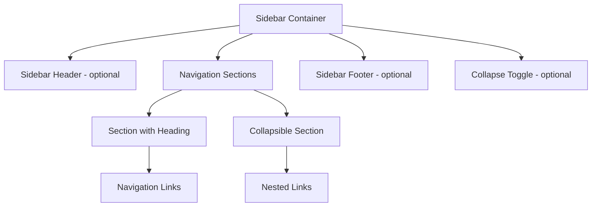

# Sidebar

> Build responsive and accessible sidebar navigation with collapsible sections and keyboard navigation support.

**URL:** https://uxpatterns.dev/patterns/navigation/sidebar
**Source:** apps/web/content/patterns/navigation/sidebar.mdx

---

## Overview

**Sidebar** is a persistent vertical navigation panel positioned along the left or right edge of the screen, providing access to the main sections and features of an application. Sidebars are the dominant navigation pattern in dashboards, admin panels, documentation sites, and complex web applications.

Unlike horizontal navigation menus, sidebars accommodate deep hierarchies through nested, collapsible sections while keeping all navigation visible and accessible without obscuring page content.

## Use Cases

### When to use:

Use **Sidebar** to **provide persistent, structured access to many navigation items organized in a hierarchy**.

**Common scenarios include:**

- Admin dashboards with multiple feature areas and settings
- Documentation sites with chapter and section navigation
- Email clients, project management tools, and SaaS applications
- File management interfaces with folder trees
- Analytics platforms with report categories

### When not to use:

- Marketing or brochure websites where a horizontal nav is more conventional
- Sites with fewer than 5-6 navigation items (a simple top bar is sufficient)
- Mobile-only applications where a bottom tab bar is the platform convention
- Full-screen content experiences (reading apps, media players) where the sidebar competes with content

### Common scenarios and examples

- GitHub-style repository navigation with nested file trees
- VS Code sidebar with explorer, search, source control, and extensions panels
- Notion sidebar with workspaces, pages, and nested subpages
- Stripe dashboard with product areas, settings, and developer tools
- Documentation sites like MDN or Docusaurus with chapter navigation

## Benefits

- Persistent visibility keeps all navigation options accessible without additional clicks
- Vertical layout accommodates many items and deep nested hierarchies
- Collapsible sections let users control information density
- Works well for applications where users frequently switch between sections
- Provides clear spatial separation between navigation and content

## Drawbacks

- **Consumes horizontal space** – The sidebar takes 200-300px of screen width from the content area
- **Mobile adaptation required** – Must collapse to an overlay or off-canvas panel on small screens
- **Complexity for nested trees** – Deeply nested structures need careful expand/collapse state management
- **Scroll management** – Long navigation lists need independent scrolling within the sidebar
- **Active state synchronization** – Keeping the correct item expanded and highlighted requires route integration
- **Mini mode challenges** – Collapsed icon-only mode reduces usability and requires tooltip support

## Anatomy



### Component Structure

1. **Sidebar Container**

- The root panel fixed to the left (or right) edge of the viewport
- Uses `<aside>` or `<nav>` with proper ARIA labeling
- Independently scrollable when content overflows the viewport

2. **Sidebar Header (Optional)**

- Contains the application logo, workspace name, or user info
- Often includes a collapse/expand toggle button
- Stays fixed at the top of the sidebar

3. **Navigation Sections**

- Groups of related links, each with an optional heading
- Some sections are collapsible with expand/collapse toggle
- Use `<ul>/<li>` semantics within each section

4. **Navigation Links**

- Individual items linking to pages or views
- The active link is visually highlighted and marked with `aria-current="page"`
- May include icons alongside text labels

5. **Collapsible Section**

- A section that can be expanded or collapsed to show/hide nested links
- Uses `aria-expanded` on the toggle and hides content when collapsed
- Maintains expand/collapse state across navigation

6. **Sidebar Footer (Optional)**

- Contains persistent actions like settings, help, or user profile
- Pinned to the bottom of the sidebar
- Remains visible regardless of scroll position

7. **Collapse Toggle (Optional)**

- A button that collapses the sidebar to a narrow icon-only strip
- Useful for maximizing content area on medium-width screens
- Toggles between full and mini (icon-only) modes

#### Summary of Components

| Component          | Required? | Purpose                                                       |
| ------------------ | --------- | ------------------------------------------------------------- |
| Sidebar Container  | ✅ Yes    | Root panel providing the vertical navigation structure.       |
| Sidebar Header     | ❌ No     | Contains branding, workspace info, or collapse toggle.        |
| Navigation Sections| ✅ Yes    | Groups of links organized by category or feature area.        |
| Navigation Links   | ✅ Yes    | Individual items linking to pages or views.                   |
| Collapsible Section| ❌ No     | Expandable groups for nested hierarchies.                     |
| Sidebar Footer     | ❌ No     | Persistent actions pinned to the bottom.                      |
| Collapse Toggle    | ❌ No     | Switches between full and mini sidebar modes.                 |

## Variations

### 1. Fixed Full Sidebar
A permanently visible sidebar that stays in place as the user scrolls the content area.

**When to use:** Dashboards and applications where users frequently switch between sections.

### 2. Collapsible Sidebar
A sidebar that can be toggled between full width and a narrow icon-only (mini) mode.

**When to use:** Applications where users may want to maximize content area while keeping navigation accessible.

### 3. Overlay Sidebar (Mobile)
A sidebar that slides in as an overlay from the edge, covering the content area with a backdrop.

**When to use:** Mobile and small tablet viewports where permanent sidebar display is impractical.

### 4. Tree Navigation Sidebar
A sidebar with expandable/collapsible nested tree structures, similar to a file explorer.

**When to use:** Documentation, file management, or any deeply hierarchical content.

### 5. Multi-Level Sidebar
A sidebar with two panels — the first shows top-level categories, selecting one reveals a second panel with subcategories.

**When to use:** Very complex applications with hundreds of navigation items (enterprise software, CMS).

### 6. Sidebar with Sections and Dividers
A sidebar divided into distinct groups with headings and visual separators.

**When to use:** Applications with logically distinct feature areas (e.g., "Content", "Settings", "Account").

## Examples

### Basic HTML Implementation

```html
<aside class="sidebar" aria-label="Application navigation">
  <div class="sidebar-header">
    <a href="/" class="sidebar-logo">AppName</a>
    <button
      type="button"
      class="sidebar-collapse-toggle"
      aria-label="Collapse sidebar"
      aria-expanded="true"
    >
      <span aria-hidden="true">◀</span>
    </button>
  </div>

  <nav class="sidebar-nav">
    <div class="sidebar-section">
      <h3 class="sidebar-section-heading">Main</h3>
      <ul>
        <li><a href="/dashboard" aria-current="page">Dashboard</a></li>
        <li><a href="/projects">Projects</a></li>
        <li><a href="/analytics">Analytics</a></li>
      </ul>
    </div>

    <div class="sidebar-section">
      <button
        type="button"
        class="sidebar-section-toggle"
        aria-expanded="true"
        aria-controls="settings-links"
      >
        <span>Settings</span>
        <span class="chevron" aria-hidden="true">▾</span>
      </button>
      <ul id="settings-links">
        <li><a href="/settings/general">General</a></li>
        <li><a href="/settings/team">Team</a></li>
        <li><a href="/settings/billing">Billing</a></li>
      </ul>
    </div>
  </nav>

  <div class="sidebar-footer">
    <a href="/settings/profile">Profile</a>
    <a href="/help">Help</a>
  </div>
</aside>

<script>
  document.querySelectorAll('.sidebar-section-toggle').forEach(toggle => {
    toggle.addEventListener('click', () => {
      const isExpanded = toggle.getAttribute('aria-expanded') === 'true';
      toggle.setAttribute('aria-expanded', String(!isExpanded));
      const target = document.getElementById(toggle.getAttribute('aria-controls'));
      target.toggleAttribute('hidden');
    });
  });

  const collapseToggle = document.querySelector('.sidebar-collapse-toggle');
  const sidebar = document.querySelector('.sidebar');

  collapseToggle.addEventListener('click', () => {
    const isExpanded = collapseToggle.getAttribute('aria-expanded') === 'true';
    collapseToggle.setAttribute('aria-expanded', String(!isExpanded));
    sidebar.classList.toggle('is-collapsed');
    collapseToggle.setAttribute('aria-label',
      isExpanded ? 'Expand sidebar' : 'Collapse sidebar'
    );
  });
</script>
```

### React Implementation

```jsx

function SidebarSection({ title, items, collapsible, currentPath }) {
  const [isExpanded, setIsExpanded] = useState(true);

  return (
    <div className="sidebar-section">
      {collapsible ? (
        <button
          type="button"
          className="sidebar-section-toggle"
          aria-expanded={isExpanded}
          onClick={() => setIsExpanded(!isExpanded)}
        >
          <span>{title}</span>
          <span className={`chevron ${isExpanded ? 'expanded' : ''}`} aria-hidden="true">▾</span>
        </button>
      ) : (
        <h3 className="sidebar-section-heading">{title}</h3>
      )}

      {(!collapsible || isExpanded) && (
        <ul>
          {items.map((item) => (
            <li key={item.href}>
              <a
                href={item.href}
                aria-current={item.href === currentPath ? 'page' : undefined}
                className={item.href === currentPath ? 'active' : ''}
              >
                {item.icon && <span className="sidebar-icon" aria-hidden="true">{item.icon}</span>}
                <span className="sidebar-label">{item.label}</span>
              </a>
            </li>
          ))}
        </ul>
      )}
    </div>
  );
}

function Sidebar({ sections, currentPath, footer }) {
  const [isCollapsed, setIsCollapsed] = useState(false);

  const toggleCollapse = useCallback(() => {
    setIsCollapsed(prev => !prev);
  }, []);

  return (
    <aside
      className={`sidebar ${isCollapsed ? 'is-collapsed' : ''}`}
      aria-label="Application navigation"
    >
      <div className="sidebar-header">
        <a href="/" className="sidebar-logo">
          {isCollapsed ? 'A' : 'AppName'}
        </a>
        <button
          type="button"
          className="sidebar-collapse-toggle"
          aria-label={isCollapsed ? 'Expand sidebar' : 'Collapse sidebar'}
          aria-expanded={!isCollapsed}
          onClick={toggleCollapse}
        >
          <span aria-hidden="true">{isCollapsed ? '▶' : '◀'}</span>
        </button>
      </div>

      <nav className="sidebar-nav">
        {sections.map((section) => (
          
        ))}
      </nav>

      {footer && (
        <div className="sidebar-footer">
          {footer.map((item) => (
            <a key={item.href} href={item.href}>
              {item.icon && <span aria-hidden="true">{item.icon}</span>}
              {!isCollapsed && <span>{item.label}</span>}
            </a>
          ))}
        </div>
      )}
    </aside>
  );
}
```

### CSS Styling

```css
.sidebar {
  position: fixed;
  top: 0;
  left: 0;
  width: 16rem;
  height: 100dvh;
  display: flex;
  flex-direction: column;
  background: #f9fafb;
  border-right: 1px solid #e5e7eb;
  z-index: 30;
  transition: width 200ms ease;
  overflow: hidden;
}

.sidebar.is-collapsed {
  width: 4rem;
}

.sidebar-header {
  display: flex;
  align-items: center;
  justify-content: space-between;
  padding: 1rem;
  border-bottom: 1px solid #e5e7eb;
  flex-shrink: 0;
}

.sidebar-logo {
  font-weight: 700;
  font-size: 1.125rem;
  color: #111827;
  text-decoration: none;
}

.sidebar-collapse-toggle {
  display: flex;
  align-items: center;
  justify-content: center;
  width: 1.75rem;
  height: 1.75rem;
  border: 1px solid #d1d5db;
  border-radius: 0.375rem;
  background: #fff;
  cursor: pointer;
  font-size: 0.75rem;
}

.sidebar-collapse-toggle:focus-visible {
  outline: 2px solid #2563eb;
  outline-offset: 2px;
}

.sidebar-nav {
  flex: 1;
  overflow-y: auto;
  padding: 0.75rem 0;
}

.sidebar-section + .sidebar-section {
  margin-top: 0.5rem;
  padding-top: 0.5rem;
  border-top: 1px solid #e5e7eb;
}

.sidebar-section-heading {
  padding: 0.25rem 1rem;
  font-size: 0.75rem;
  font-weight: 600;
  text-transform: uppercase;
  letter-spacing: 0.05em;
  color: #6b7280;
  margin: 0;
}

.sidebar-section-toggle {
  display: flex;
  align-items: center;
  justify-content: space-between;
  width: 100%;
  padding: 0.375rem 1rem;
  border: none;
  background: transparent;
  font-size: 0.75rem;
  font-weight: 600;
  text-transform: uppercase;
  letter-spacing: 0.05em;
  color: #6b7280;
  cursor: pointer;
}

.sidebar-section-toggle:hover {
  color: #374151;
}

.sidebar-section-toggle:focus-visible {
  outline: 2px solid #2563eb;
  outline-offset: -2px;
}

.chevron {
  font-size: 0.625rem;
  transition: transform 200ms ease;
}

.chevron.expanded {
  transform: rotate(0deg);
}

.sidebar-section-toggle[aria-expanded="false"] .chevron {
  transform: rotate(-90deg);
}

.sidebar-nav ul {
  list-style: none;
  margin: 0;
  padding: 0;
}

.sidebar-nav a {
  display: flex;
  align-items: center;
  gap: 0.75rem;
  padding: 0.5rem 1rem;
  margin: 0.125rem 0.5rem;
  border-radius: 0.375rem;
  text-decoration: none;
  color: #374151;
  font-size: 0.875rem;
}

.sidebar-nav a:hover {
  background-color: #e5e7eb;
  color: #111827;
}

.sidebar-nav a:focus-visible {
  outline: 2px solid #2563eb;
  outline-offset: -2px;
}

.sidebar-nav a.active,
.sidebar-nav a[aria-current="page"] {
  background-color: #dbeafe;
  color: #1d4ed8;
  font-weight: 500;
}

.sidebar-footer {
  border-top: 1px solid #e5e7eb;
  padding: 0.75rem 0.5rem;
  flex-shrink: 0;
}

.sidebar-footer a {
  display: flex;
  align-items: center;
  gap: 0.75rem;
  padding: 0.5rem;
  border-radius: 0.375rem;
  text-decoration: none;
  color: #6b7280;
  font-size: 0.875rem;
}

.sidebar-footer a:hover {
  background-color: #e5e7eb;
  color: #374151;
}

@media (max-width: 768px) {
  .sidebar {
    transform: translateX(-100%);
    z-index: 50;
  }
  .sidebar.is-open {
    transform: translateX(0);
  }
}

@media (prefers-reduced-motion: reduce) {
  .sidebar,
  .chevron {
    transition: none;
  }
}
```

## Best Practices

### Content

**Do's ✅**

- Organize navigation into logical groups with clear section headings
- Use concise, scannable labels — ideally 1-2 words per item
- Place the most frequently used items at the top
- Include icons alongside labels for quicker visual scanning

**Don'ts ❌**

- Don't overload the sidebar with too many ungrouped items
- Don't use long, multi-line labels that cause wrapping
- Don't mix navigation items with unrelated actions (like global settings) without clear separation
- Don't hide essential navigation items inside deeply nested, collapsed sections

### Accessibility

**Do's ✅**

- Use `<nav>` or `<aside>` with `aria-label` for the sidebar landmark
- Mark the current page with `aria-current="page"` on the active link
- Use `aria-expanded` on collapsible section toggles
- Support keyboard navigation: Tab between items, Enter to activate, Escape to collapse
- Ensure the sidebar is scrollable independently when content overflows

**Don'ts ❌**

- Don't make the sidebar only operable via mouse or touch
- Don't use non-semantic elements (`<div>`) for links or toggles
- Don't remove focus indicators from sidebar navigation items
- Don't announce decorative icons to screen readers (use `aria-hidden="true"`)

### Visual Design

**Do's ✅**

- Use a subtle background color or border to distinguish the sidebar from the content area
- Highlight the active item with a distinct background, text color, or left border
- Use consistent icon sizing and alignment across all items
- Keep the sidebar visually subordinate to the main content area

**Don'ts ❌**

- Don't use high-contrast or bright colors that distract from the content
- Don't change the sidebar width dynamically based on content (use fixed widths)
- Don't make the mini (icon-only) mode too narrow to display icons clearly

### Mobile & Touch Considerations

**Do's ✅**

- Convert to an overlay sidebar on mobile with a visible toggle button
- Add a backdrop overlay that dismisses the sidebar on tap
- Ensure touch targets are at least 44×44px for all links
- Support swipe-to-close gestures for the overlay sidebar

**Don'ts ❌**

- Don't display the full sidebar permanently on mobile screens
- Don't rely on hover states for showing tooltips in mini mode on touch devices
- Don't make the overlay sidebar cover the toggle button

### Layout & Positioning

**Do's ✅**

- Fix the sidebar to the left edge with `position: fixed` or use CSS grid layout
- Make the main content area offset by the sidebar width
- Allow the sidebar navigation to scroll independently from the page content
- Pin the header and footer to the top and bottom of the sidebar

**Don'ts ❌**

- Don't let the sidebar overlap the main content without an overlay mode
- Don't use absolute positioning that breaks when content scrolls
- Don't let the sidebar push the page content off-screen without user control

## Common Mistakes & Anti-Patterns 🚫

### No Collapse Option on Medium Screens
**The Problem:**
The sidebar takes up 200-300px of horizontal space that could be used for content on medium-width screens like tablets.

**How to Fix It:**
Provide a collapse toggle that switches to a mini (icon-only) mode. Use tooltips on hover to show full labels in mini mode.

---

### Deeply Nested Items Without Expand State Persistence
**The Problem:**
Users expand nested sections, navigate to a child page, and when the page reloads, all sections collapse again, losing their place.

**How to Fix It:**
Persist expand/collapse state in localStorage or derive it from the current route — auto-expand the section containing the active page.

---

### No Active State Highlight
**The Problem:**
Users can't tell which page they're on because no sidebar item is visually distinguished.

**How to Fix It:**
Highlight the active item with a background color, text color change, or left border indicator. Add `aria-current="page"` for screen readers.

---

### Sidebar Not Independently Scrollable
**The Problem:**
When the sidebar has more items than fit in the viewport, users can't scroll the sidebar without scrolling the main content.

**How to Fix It:**
Make the sidebar `overflow-y: auto` with a fixed height (e.g., `height: 100dvh`). Pin header and footer with flexbox.

---

### Overlay Sidebar Without Backdrop
**The Problem:**
On mobile, the sidebar opens over the content but there's no way to close it by tapping outside the panel.

**How to Fix It:**
Add a semi-transparent backdrop behind the sidebar that closes the menu on tap. Also support Escape key to close.

---

### Mini Mode Without Tooltips
**The Problem:**
In collapsed icon-only mode, users can't tell what each icon represents because there are no labels or tooltips.

**How to Fix It:**
Show tooltips on hover/focus that display the full label. Ensure tooltips have proper `role="tooltip"` and `aria-describedby` association.

## Micro-Interactions & Animations

### Collapse/Expand Transition
- **Effect:** Sidebar width smoothly transitions between full and mini mode
- **Timing:** 200ms ease
- **Trigger:** Collapse toggle button click
- **Implementation:** CSS transition on `width` property

### Section Toggle
- **Effect:** Chevron rotates and content slides in/out when a collapsible section is toggled
- **Timing:** 200ms ease for chevron, 150ms for content height
- **Trigger:** Section heading click
- **Implementation:** CSS transform rotate on chevron, height transition on content

### Active Item Highlight
- **Effect:** Background color slides to the newly active item
- **Timing:** 150ms ease-in-out
- **Trigger:** Route change (page navigation)
- **Implementation:** CSS background-color transition on the active link

### Mobile Overlay Entry
- **Effect:** Sidebar slides in from the left edge with a fading backdrop
- **Timing:** 250ms ease for slide, 300ms for backdrop fade
- **Trigger:** Mobile toggle button activation
- **Implementation:** CSS transform translateX with opacity transition on the overlay

### Tooltip Appearance
- **Effect:** Tooltip fades in next to the icon when hovering in mini mode
- **Timing:** 200ms ease, 100ms delay before showing
- **Trigger:** Mouse hover or keyboard focus on mini-mode item
- **Implementation:** CSS opacity transition with transition-delay

## Tracking

### Key Events to Track

| **Event Name** | **Description** | **Why Track It?** |
| --- | --- | --- |
| `sidebar.item_clicked` | User clicks a sidebar navigation item | Measure primary navigation usage |
| `sidebar.section_toggled` | User expands or collapses a section | Understand which sections users explore |
| `sidebar.collapsed` | User collapses the sidebar to mini mode | Track how often users prefer more content space |
| `sidebar.expanded` | User expands the sidebar from mini mode | Understand when users need full navigation |
| `sidebar.mobile_toggled` | User opens or closes mobile overlay sidebar | Measure mobile navigation engagement |

### Event Payload Structure

```json
{
  "event": "sidebar.item_clicked",
  "properties": {
    "item_label": "Analytics",
    "item_href": "/analytics",
    "section": "Main",
    "item_position": 3,
    "sidebar_mode": "full",
    "is_mobile": false,
    "viewport_width": 1440
  }
}
```

### Key Metrics to Analyze

- **Item Click Distribution:** Which sidebar items are used most/least
- **Section Toggle Rate:** How often collapsible sections are opened/closed
- **Collapse Usage Rate:** How frequently users switch to mini mode
- **Mobile Toggle Rate:** How often mobile users access the overlay sidebar
- **Session Navigation Depth:** How many different sidebar items users click per session

### Insights & Optimization Based on Tracking

- 📉 **Low Click Rate on Certain Items?**
  → Items may be poorly labeled or positioned. Move low-engagement items lower or group them differently.

- 🔽 **Sections Rarely Expanded?**
  → Users may not realize sections are collapsible. Consider showing them expanded by default.

- 📐 **High Collapse Rate?**
  → Users prefer more content space. Consider making mini mode the default.

- 📱 **Low Mobile Toggle Rate?**
  → The toggle button may not be visible enough. Increase its prominence or add a label.

- 🔄 **High Section Toggle Frequency?**
  → Users are constantly expanding/collapsing. Persist state or restructure the navigation to be flatter.

## Localization

```json
{
  "sidebar": {
    "landmarks": {
      "aria_label": "Application navigation"
    },
    "collapse": {
      "collapse_label": "Collapse sidebar",
      "expand_label": "Expand sidebar"
    },
    "sections": {
      "toggle_label": "Toggle {section} section"
    },
    "mobile": {
      "open_label": "Open navigation",
      "close_label": "Close navigation"
    },
    "tooltip": {
      "aria_describedby_prefix": "Navigate to {item}"
    }
  }
}
```

### RTL (Right-to-Left) Considerations

- Position the sidebar on the right edge of the screen for RTL layouts
- Flip the collapse toggle icon direction
- Mirror the slide-in animation direction for mobile overlay
- Align section headings and icons to the right

### Cultural Considerations

- **Icon choice:** Use universally understood icons; avoid culturally specific symbols
- **Label length:** Sidebar labels should remain short but translations can be longer — test with longest expected strings
- **Color semantics:** Active/highlight colors should not carry negative cultural connotations in target markets

## Performance

### Target Metrics

- **Initial render:** < 100ms for full sidebar with sections
- **Collapse animation:** 200ms at 60fps
- **Section toggle:** < 50ms response time
- **Scroll performance:** 60fps independent scrolling
- **Bundle size:** < 5KB for sidebar component with styles

### Optimization Strategies

**CSS Grid Layout (Avoid JS for Positioning)**
```css
.app-layout {
  display: grid;
  grid-template-columns: 16rem 1fr;
  height: 100dvh;
}

.sidebar { overflow-y: auto; }
.main-content { overflow-y: auto; }
```

**Virtual Scrolling for Long Lists**
```javascript
// For sidebars with 100+ items, consider virtualizing

```

**Defer Collapsed Section Rendering**
```jsx
const [hasExpanded, setHasExpanded] = useState(false);
const toggle = () => { setHasExpanded(true); setIsExpanded(prev => !prev); };
{hasExpanded && isExpanded && }
```

## Testing Guidelines

### Functional Testing

**Should ✓**

- [ ] Navigate to the correct page when clicking a sidebar item
- [ ] Expand and collapse sections when clicking the toggle
- [ ] Highlight the active item based on the current route
- [ ] Collapse to mini mode when the collapse toggle is clicked
- [ ] Show tooltips in mini mode on hover/focus
- [ ] Open and close the mobile overlay sidebar
- [ ] Persist section expand/collapse state across navigations

### Accessibility Testing

**Should ✓**

- [ ] Sidebar uses `<nav>` or `<aside>` with `aria-label`
- [ ] Active item has `aria-current="page"`
- [ ] Section toggles have `aria-expanded` reflecting current state
- [ ] All items are reachable via keyboard Tab
- [ ] Focus indicators are visible on all interactive elements
- [ ] Mini mode tooltips are accessible to screen readers
- [ ] Mobile overlay traps focus and supports Escape to close

### Visual Testing

**Should ✓**

- [ ] Active item is clearly distinguishable from others
- [ ] Collapse animation is smooth without layout jank
- [ ] Section expand/collapse transitions are smooth
- [ ] Sidebar does not overlap main content in desktop mode
- [ ] Mobile overlay has a visible backdrop

### Performance Testing

**Should ✓**

- [ ] Independent sidebar scrolling runs at 60fps
- [ ] Collapse/expand transitions don't cause layout shifts in the content area
- [ ] Large navigation trees render without blocking the main thread
- [ ] Component cleanup happens properly on unmount

## Browser Support

## SEO Considerations

- **Sidebar links are crawlable** — ensure all links use proper `<a>` tags with `href`
- **Avoid duplicate content** — if sidebar and main content link to the same pages, search engines handle it well, but keep it intentional
- **Mobile overlay content** — hidden sidebar content is still in the DOM and crawlable
- **Navigation structure** — sidebar navigation helps search engines understand site hierarchy
- **Render server-side** — ensure sidebar links are in the server-rendered HTML for crawler access

## Design Tokens

```json
{
  "$schema": "https://design-tokens.org/schema.json",
  "sidebar": {
    "container": {
      "width": {
        "full": { "value": "16rem", "type": "dimension" },
        "mini": { "value": "4rem", "type": "dimension" }
      },
      "background": { "value": "{color.gray.50}", "type": "color" },
      "borderColor": { "value": "{color.gray.200}", "type": "color" },
      "zIndex": { "value": "30", "type": "number" }
    },
    "item": {
      "paddingY": { "value": "0.5rem", "type": "dimension" },
      "paddingX": { "value": "1rem", "type": "dimension" },
      "marginX": { "value": "0.5rem", "type": "dimension" },
      "fontSize": { "value": "0.875rem", "type": "fontSizes" },
      "borderRadius": { "value": "{radius.md}", "type": "dimension" },
      "color": {
        "default": { "value": "{color.gray.700}", "type": "color" },
        "hover": { "value": "{color.gray.900}", "type": "color" },
        "active": { "value": "{color.blue.700}", "type": "color" }
      },
      "hoverBackground": { "value": "{color.gray.200}", "type": "color" },
      "activeBackground": { "value": "{color.blue.100}", "type": "color" }
    },
    "sectionHeading": {
      "fontSize": { "value": "0.75rem", "type": "fontSizes" },
      "fontWeight": { "value": "600", "type": "fontWeights" },
      "color": { "value": "{color.gray.500}", "type": "color" },
      "letterSpacing": { "value": "0.05em", "type": "dimension" }
    },
    "animation": {
      "collapseDuration": { "value": "200ms", "type": "duration" },
      "sectionToggleDuration": { "value": "150ms", "type": "duration" }
    },
    "focus": {
      "outlineWidth": { "value": "2px", "type": "dimension" },
      "outlineColor": { "value": "{color.blue.600}", "type": "color" }
    }
  }
}
```

## FAQ

## Related Patterns

## Resources

### Libraries & Frameworks

#### React Components
- [Radix Navigation Menu](https://www.radix-ui.com/primitives/docs/components/navigation-menu) – Accessible navigation primitives
- [shadcn/ui Sidebar](https://ui.shadcn.com/docs/components/sidebar) – Composable sidebar component
- [React Pro Sidebar](https://github.com/azouaoui-med/react-pro-sidebar) – Customizable sidebar component

#### Vue Components
- [Vue Sidebar Menu](https://github.com/yaminncco/vue-sidebar-menu) – Sidebar navigation for Vue.js

#### CSS Frameworks
- [Tailwind UI Sidebar](https://tailwindui.com/components/application-ui/navigation/sidebar-navigation) – Sidebar navigation layouts
- [Bootstrap Sidebar](https://getbootstrap.com/docs/5.3/examples/sidebars/) – Sidebar examples

### Articles

- [Sidebar Navigation: Best Practices](https://www.nngroup.com/articles/sidebar-navigation/) by Nielsen Norman Group
- [Building an Accessible Sidebar](https://www.smashingmagazine.com/2021/08/accessible-sidebar-navigation/) by Smashing Magazine
- [ARIA Authoring Practices: Tree View](https://www.w3.org/WAI/ARIA/apg/patterns/treeview/) by W3C
