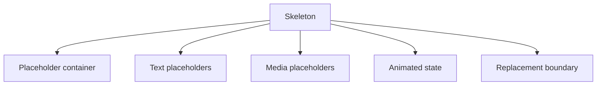

# Skeleton

> Build effective skeleton loading states for your web applications. Learn best practices for implementing content placeholders and loading animations with proper accessibility.

**URL:** https://uxpatterns.dev/patterns/user-feedback/skeleton
**Source:** apps/web/content/patterns/user-feedback/skeleton.mdx

---

## Overview

A **Skeleton** pattern helps teams create a reliable way to preserve the shape of the final interface during loading so the page feels stable and easier to scan. It is most useful when teams need content feeds and card grids.

Compared with adjacent patterns, this pattern should reduce friction without hiding the state, rules, or recovery paths people need to keep moving.

## Use Cases

### When to use:

- Content feeds and card grids
- Dashboards with known layout
- Loading states where reducing layout shift matters

### When not to use:

- Use a quieter state when the event is too minor to interrupt the task.
- Avoid transient feedback for events users must be able to revisit later.
- Do not duplicate the same message in several channels without a hierarchy rule.

### Common scenarios and examples

- Content feeds and card grids where users need a clear, repeatable interface model.
- Dashboards with known layout where users need a clear, repeatable interface model.
- Loading states where reducing layout shift matters where users need a clear, repeatable interface model.

## Benefits

- Clarifies how skeleton should behave before implementation details begin to sprawl.
- Creates a reusable interaction model for teams who need to preserve the shape of the final interface during loading so the page feels stable and easier to scan.
- Makes accessibility, edge cases, and recovery paths part of the design instead of post-launch cleanup.
- Gives product, design, and engineering a shared language for evaluating trade-offs.

## Drawbacks

- Feedback becomes noise if every event gets the same visual weight.
- Timing mistakes can create anxiety, impatience, or missed announcements.
- Motion and sound need careful accessibility handling.
- Transient states are easy to implement badly because they feel small during development.

## Anatomy



### Component Structure

1. **Placeholder container**

- Matches the geometry of the eventual content.

2. **Text placeholders**

- Hint at headline and body line lengths.

3. **Media placeholders**

- Reserve space for images, charts, or avatars.

4. **Animated state**

- Adds optional shimmer or pulse feedback.

5. **Replacement boundary**

- Defines when the placeholder hands off to live content.

#### Summary of Components

| Component | Required? | Purpose |
| --- | --- | --- |
| Placeholder container | ✅ Yes | Matches the geometry of the eventual content. |
| Text placeholders | ✅ Yes | Hint at headline and body line lengths. |
| Media placeholders | ❌ No | Reserve space for images, charts, or avatars. |
| Animated state | ❌ No | Adds optional shimmer or pulse feedback. |
| Replacement boundary | ❌ No | Defines when the placeholder hands off to live content. |

## Variations

### Card skeleton

Mirrors a card or feed item layout.

**When to use:** Use when several items share the same geometry.

### Article skeleton

Reserves a larger content frame with text rhythm.

**When to use:** Use for long-form reading surfaces.

### Table or list skeleton

Keeps rows aligned before data arrives.

**When to use:** Use for structured operational views.

## Best Practices

### Content

**Do's ✅**

- Describe what happened in direct language before adding decoration.
- Match the urgency of the message to the urgency of the event.
- Tell users what they can do next whenever recovery matters.

**Don'ts ❌**

- Do not use the same tone for success, warning, and failure states.
- Do not auto-dismiss critical feedback before it can be read.
- Do not use animation as the only sign that state has changed.

### Accessibility

**Do's ✅**

- Verify that skeleton can be completed using keyboard alone.
- Keep focus order logical when the pattern opens, updates, or reveals additional UI.
- Preserve a visible focus state that is still readable at high zoom.
- Use semantic elements first, then add ARIA only where semantics alone are not enough.
- Announce state changes such as errors, loading, or completion in the right place and with the right politeness.

**Don'ts ❌**

- Do not remove focus styles without a visible replacement.
- Do not depend on placeholder or helper text that disappears before the user can act on it.
- Do not assume pointer, touch, and assistive technologies will all interact with the pattern the same way.

### Visual Design

**Do's ✅**

- Reserve visual intensity for the highest-priority moments.
- Keep transitions smooth and short enough to avoid slowing the task.
- Design idle, loading, success, and failure states as a family.

**Don'ts ❌**

- Do not stack multiple competing banners, toasts, and spinners in the same area.
- Do not rely on color-only severity mapping.
- Do not let placeholders and live content use completely different geometry.

### Layout & Positioning

**Do's ✅**

- Keep local feedback near the part of the UI that changed.
- Use consistent placement so users learn where to look.
- Plan how the feedback behaves on small screens and zoomed layouts.

**Don'ts ❌**

- Do not cover key controls unless blocking interaction is intentional.
- Do not move the [viewport](/glossary/viewport) unexpectedly to reveal transient feedback.
- Do not mix persistent and transient messages without a hierarchy rule.
## Micro-Interactions & Animations

- Use motion to reinforce state change, not to create novelty for its own sake.
- Keep entrance and exit animations short enough that they never delay the actual state users care about.
- Respect `prefers-reduced-motion` by simplifying shimmer, pulse, or slide effects rather than removing the pattern entirely.

## Timing & Announcement Guidance

| Situation | Recommended behavior | Notes |
| --- | --- | --- |
| Short local action | Use a light busy or success state | Avoid full-screen interruption for small waits. |
| Unknown-duration task | Use a loading indicator with honest status text | Escalate to a stronger state if the wait becomes long. |
| Critical warning or failure | Use a persistent alert or banner | Keep it visible until the user can acknowledge or recover. |

## Common Mistakes & Anti-Patterns 🚫

### **Over-signaling everything**

**The Problem:**
When every state uses strong color, motion, and sound, people stop paying attention.

**How to Fix It?**
Create a severity ladder and reserve the strongest treatment for the states that truly need interruption.

---

### **Mismatching timing to the job**

**The Problem:**
Short tasks feel sluggish with heavy loading UI, while long tasks feel abandoned with no progress guidance.

**How to Fix It?**
Pick the lightest possible feedback for the wait length and keep the pattern honest about how much is known.

---

### **Skipping announcement strategy**

**The Problem:**
[Screen reader](/glossary/screen-reader) users miss transient changes when live-region behavior is inconsistent or absent.
**How to Fix It?**
Define how each state is announced and test polite versus assertive updates with real assistive technology.

## Examples

### Live Preview

### Basic Implementation

```html
<div class="demo-shell grid">
  <article class="card skeleton-card">
    <div class="skeleton box image"></div>
    <div class="skeleton box title"></div>
    <div class="skeleton box line"></div>
    <div class="skeleton box line short"></div>
  </article>
  <article class="card skeleton-card">
    <div class="skeleton box image"></div>
    <div class="skeleton box title"></div>
    <div class="skeleton box line"></div>
    <div class="skeleton box line short"></div>
  </article>
</div>
```

### What this example demonstrates

- A clear baseline implementation of skeleton that can be reviewed without framework-specific noise.
- Visible state, spacing, and content hierarchy that mirror the implementation guidance above.
- A small enough surface to copy into a design review or prototype before scaling the pattern up.

### Implementation Notes

- Start with [semantic HTML](/glossary/semantic-html) and only add JavaScript where the interaction truly requires it.
- Keep styling tokens and spacing consistent with adjacent controls or layouts.
- If the live implementation introduces async behavior, mirror those states in the code example rather than documenting them only in prose.
## Accessibility

### Keyboard Interaction

- [ ] Verify that skeleton can be completed using keyboard alone.
- [ ] Keep focus order logical when the pattern opens, updates, or reveals additional UI.
- [ ] Preserve a visible focus state that is still readable at high zoom.

### Screen Reader Support

- [ ] Use semantic elements first, then add ARIA only where semantics alone are not enough.
- [ ] Announce state changes such as errors, loading, or completion in the right place and with the right politeness.
- [ ] Connect labels, hints, and status text with `aria-describedby` or structural headings when useful.

### Visual Accessibility

- [ ] Do not rely on color alone to convey severity, completion, or selection state.
- [ ] Test the pattern at 200% zoom and with reduced motion enabled.
- [ ] Ensure [touch targets](/glossary/touch-targets) remain comfortable on mobile and coarse pointers.
## Testing Guidelines

### Functional Testing

- [ ] Verify the default, loading, error, and success states for skeleton.
- [ ] Test the primary action and the obvious recovery action in the same run.
- [ ] Confirm that state survives refresh, navigation, or retry in the way users would expect.

### Accessibility Testing

- [ ] Run keyboard-only checks and at least one screen reader pass on the final implementation.
- [ ] Validate headings, labels, and announcement behavior with real content rather than lorem ipsum.
- [ ] Check color contrast and focus visibility in both default and stressed states.

### Edge Cases

- [ ] Test empty, long, duplicated, and unexpectedly formatted content.
- [ ] Check behavior on narrow screens, zoomed layouts, and slower networks.
- [ ] Verify that optimistic or asynchronous states reconcile correctly after a failure.

## Frequently Asked Questions

## Related Patterns

## Resources

### References

- [WCAG 2.2](https://www.w3.org/TR/WCAG22/) - Accessibility baseline for keyboard support, focus management, and readable state changes.
- [MDN ARIA live regions](https://developer.mozilla.org/docs/Web/Accessibility/ARIA/Guides/Live_regions) - How to announce streaming text, status updates, and non-modal feedback to screen readers.

### Guides

- [MDN WAI-ARIA basics](https://developer.mozilla.org/en-US/docs/Learn_web_development/Core/Accessibility/WAI-ARIA_basics) - Guidance on when to rely on native HTML and when to introduce ARIA roles and states.

### Articles

- [web.dev: Building a loading bar component](https://web.dev/articles/building/a-loading-bar-component) - Accessible progress-indicator implementation details using the native progress element.
- [web.dev: The performance effects of too much lazy loading](https://web.dev/articles/lcp-lazy-loading) - Tradeoffs and pitfalls when loading images or UI fragments too late.

### NPM Packages

- [`react-loading-skeleton`](https://www.npmjs.com/package/react-loading-skeleton) - Skeleton placeholders for content loading states.
- [`@tanstack/react-query`](https://www.npmjs.com/package/%40tanstack%2Freact-query) - Server-state management for async data, optimistic UI, and background refresh.
- [`framer-motion`](https://www.npmjs.com/package/framer-motion) - Motion primitives for affordance, feedback, and progressive reveal.
