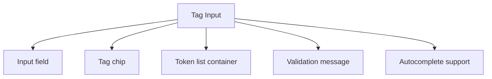

# Tag Input

> Create tag input components for dynamic keyword entry with validation and accessibility support.

**URL:** https://uxpatterns.dev/patterns/forms/tag-input
**Source:** apps/web/content/patterns/forms/tag-input.mdx

---

## Overview

A **Tag Input** pattern helps teams create a reliable way to let users enter, review, and remove several short values without losing readability or keyboard efficiency. It is most useful when teams need labels and keywords.

Compared with adjacent patterns, this pattern should reduce friction without hiding the state, rules, or recovery paths people need to keep moving.

## Use Cases

### When to use:

- Labels and keywords
- Recipient entry
- Topic and taxonomy assignment

### When not to use:

- Use a simpler native control when the value is binary, tiny, or fully constrained.
- Avoid custom behavior when a native browser input already solves the main job well.
- Do not add extra formatting or validation if the product does not benefit from it.

### Common scenarios and examples

- Labels and keywords where users need a clear, repeatable interface model.
- Recipient entry where users need a clear, repeatable interface model.
- Topic and taxonomy assignment where users need a clear, repeatable interface model.

## Benefits

- Clarifies how tag input should behave before implementation details begin to sprawl.
- Creates a reusable interaction model for teams who need to let users enter, review, and remove several short values without losing readability or keyboard efficiency.
- Makes accessibility, edge cases, and recovery paths part of the design instead of post-launch cleanup.
- Gives product, design, and engineering a shared language for evaluating trade-offs.

## Drawbacks

- It introduces more states to design and test than a plain text field.
- Validation timing can feel noisy when the pattern reacts too early.
- Mobile input modes and autofill behavior often need explicit tuning.
- If labels, hints, and errors drift apart, completion rates drop quickly.

## Anatomy



### Component Structure

1. **Input field**

- Captures the next tag value.

2. **Tag chip**

- Displays each accepted value with a remove action.

3. **Token list container**

- Keeps the entered tags readable as the list grows.

4. **Validation message**

- Explains duplicates, invalid tokens, or limits.

5. **Autocomplete support**

- Suggests or normalizes likely tag values.

#### Summary of Components

| Component | Required? | Purpose |
| --- | --- | --- |
| Input field | ✅ Yes | Captures the next tag value. |
| Tag chip | ✅ Yes | Displays each accepted value with a remove action. |
| Token list container | ✅ Yes | Keeps the entered tags readable as the list grows. |
| Validation message | ❌ No | Explains duplicates, invalid tokens, or limits. |
| Autocomplete support | ❌ No | Suggests or normalizes likely tag values. |

## Variations

### Freeform tags

Accepts any valid token the user types.

**When to use:** Use for labels, keywords, or internal organization.

### Suggested tags

Combines typing with a constrained suggestion set.

**When to use:** Use when taxonomy consistency matters.

### Managed tags

Adds permissions, colors, or structured metadata to each token.

**When to use:** Use when tags carry workflow meaning.

## Examples

### Live Preview

### Basic Implementation

```html
<div class="demo-shell card tag-card">
  <label for="tag-input">Topics</label>
  <div class="tag-list" id="tag-list">
    <span class="tag">Accessibility <button type="button" aria-label="Remove Accessibility">×</button></span>
  </div>
  <input id="tag-input" type="text" placeholder="Type a tag and press Enter" />
</div>
```

### What this example demonstrates

- A clear baseline implementation of tag input that can be reviewed without framework-specific noise.
- Visible state, spacing, and content hierarchy that mirror the implementation guidance above.
- A small enough surface to copy into a design review or prototype before scaling the pattern up.

### Implementation Notes

- Start with [semantic HTML](/glossary/semantic-html) and only add JavaScript where the interaction truly requires it.
- Keep styling tokens and spacing consistent with adjacent controls or layouts.
- If the live implementation introduces async behavior, mirror those states in the code example rather than documenting them only in prose.
## Best Practices

### Content

**Do's ✅**

- Lead with a clear label that tells users exactly what belongs in the field.
- Keep helper text short and move edge-case guidance into secondary copy.
- Use examples only when they remove real ambiguity for the person typing.

**Don'ts ❌**

- Do not rely on placeholder text as the only instruction.
- Do not stack multiple competing messages above and below the control.
- Do not hide required constraints until after submission if they are easy to explain upfront.

### Accessibility

**Do's ✅**

- Verify that tag input can be completed using keyboard alone.
- Keep focus order logical when the pattern opens, updates, or reveals additional UI.
- Preserve a visible focus state that is still readable at high zoom.
- Use semantic elements first, then add ARIA only where semantics alone are not enough.
- Announce state changes such as errors, loading, or completion in the right place and with the right politeness.

**Don'ts ❌**

- Do not remove focus styles without a visible replacement.
- Do not depend on placeholder or helper text that disappears before the user can act on it.
- Do not assume pointer, touch, and assistive technologies will all interact with the pattern the same way.

### Visual Design

**Do's ✅**

- Keep spacing consistent between label, control, helper text, and validation.
- Reserve space for error states so the layout does not jump.
- Use state colors as reinforcement, not as the only cue.

**Don'ts ❌**

- Do not use tiny hit targets for touch devices.
- Do not depend on subtle borders that disappear in low-contrast environments.
- Do not overload the field chrome with too many icons or badges.

### Layout & Positioning

**Do's ✅**

- Align the control with the rest of the form so users can scan vertically.
- Support narrow mobile widths before adding side-by-side layouts.
- Keep primary actions close enough that users understand which field set they submit.

**Don'ts ❌**

- Do not move validation messages far from the field that caused them.
- Do not switch label position between breakpoints without a strong reason.
- Do not collapse key guidance into tooltips that are hard to revisit.

## Common Mistakes & Anti-Patterns 🚫

### **Using the wrong validation moment**

**The Problem:**
Immediate validation on partial input makes the pattern feel punitive and noisy.

**How to Fix It?**
Wait until the user has enough information in the field, then validate on blur, pause, or submit depending on the risk of the rule.

---

### **Separating labels, hints, and errors**

**The Problem:**
People cannot tell which message belongs to which control when the copy is visually detached.

**How to Fix It?**
Keep labels, helper text, and validation messages tightly grouped and connected with `aria-describedby` where appropriate.

---

### **Forgetting touch and autofill behavior**

**The Problem:**
Desktop-only styling hides the fact that mobile keyboards, autofill, and paste flows behave differently.

**How to Fix It?**
Test the control with autofill, paste, zoom, and on-screen keyboards before calling the pattern complete.

## Accessibility

### Keyboard Interaction

- [ ] Verify that tag input can be completed using keyboard alone.
- [ ] Keep focus order logical when the pattern opens, updates, or reveals additional UI.
- [ ] Preserve a visible focus state that is still readable at high zoom.

### Screen Reader Support

- [ ] Use semantic elements first, then add ARIA only where semantics alone are not enough.
- [ ] Announce state changes such as errors, loading, or completion in the right place and with the right politeness.
- [ ] Connect labels, hints, and status text with `aria-describedby` or structural headings when useful.

### Visual Accessibility

- [ ] Do not rely on color alone to convey severity, completion, or selection state.
- [ ] Test the pattern at 200% zoom and with reduced motion enabled.
- [ ] Ensure [touch targets](/glossary/touch-targets) remain comfortable on mobile and coarse pointers.
## Validation Rules

### What to validate

- Validate the value against the rules users can act on inside tag input.
- Check required, format, and boundary constraints separately so messages stay specific.
- Run server-side validation again for any rule that affects security, billing, or data integrity.

### When to validate

- Prefer quiet validation while the user is still composing, then stronger validation on blur or submit.
- Avoid showing an error before the user has entered enough characters to satisfy the rule fairly.
- Keep successful states subtle so the field does not become visually noisy.

## Error Handling

- Preserve the entered value after an error so people can correct rather than retype.
- Explain the next step in the error copy instead of only naming the rule that failed.
- If a server-side rule fails after submit, return focus to the first affected control and summarize the issue near the action area.

## Testing Guidelines

### Functional Testing

- [ ] Verify the default, loading, error, and success states for tag input.
- [ ] Test the primary action and the obvious recovery action in the same run.
- [ ] Confirm that state survives refresh, navigation, or retry in the way users would expect.

### Accessibility Testing

- [ ] Run keyboard-only checks and at least one [screen reader](/glossary/screen-reader) pass on the final implementation.
- [ ] Validate headings, labels, and announcement behavior with real content rather than lorem ipsum.
- [ ] Check color contrast and focus visibility in both default and stressed states.
### Edge Cases

- [ ] Test empty, long, duplicated, and unexpectedly formatted content.
- [ ] Check behavior on narrow screens, zoomed layouts, and slower networks.
- [ ] Verify that optimistic or asynchronous states reconcile correctly after a failure.

## Design Tokens

These [design tokens](/glossary/design-tokens) provide a starting point for implementing tag input in a systemized UI layer.

```json
{
  "$schema": "https://design-tokens.org/schema.json",
  "tagInput": {
    "container": {
      "gap": {
        "value": "0.75rem",
        "type": "dimension"
      }
    },
    "label": {
      "color": {
        "value": "{color.gray.900}",
        "type": "color"
      },
      "fontWeight": {
        "value": "600",
        "type": "number"
      }
    },
    "control": {
      "borderRadius": {
        "value": "0.75rem",
        "type": "dimension"
      },
      "borderColor": {
        "value": "{color.gray.300}",
        "type": "color"
      },
      "paddingInline": {
        "value": "0.875rem",
        "type": "dimension"
      },
      "paddingBlock": {
        "value": "0.75rem",
        "type": "dimension"
      }
    },
    "helperText": {
      "color": {
        "value": "{color.gray.600}",
        "type": "color"
      },
      "fontSize": {
        "value": "0.875rem",
        "type": "dimension"
      }
    },
    "validation": {
      "successColor": {
        "value": "{color.green.700}",
        "type": "color"
      },
      "errorColor": {
        "value": "{color.red.700}",
        "type": "color"
      },
      "warningColor": {
        "value": "{color.amber.700}",
        "type": "color"
      }
    }
  }
}
```

## Frequently Asked Questions

## Related Patterns

## Resources

### References

- [WCAG 2.2](https://www.w3.org/TR/WCAG22/) - Accessibility baseline for keyboard support, focus management, and readable state changes.
- [MDN select element](https://developer.mozilla.org/en-US/docs/Web/HTML/Reference/Elements/select) - Native selection control behavior, labels, and grouped options.

### Guides

- [Chrome Developers: customizable select](https://developer.chrome.com/blog/rfc-customizable-select) - Current platform direction for improving flexible, accessible select experiences.

### Articles

- [Adrian Roselli: Under-engineered multi-selects](https://adrianroselli.com/2022/05/under-engineered-multi-selects.html) - Implementation guidance for selection UIs that stay usable with keyboard and assistive tech.
- [Baymard: Multi-select listbox usability](https://baymard.com/blog/multi-select-listbox) - Research on discoverability and interaction cost in multi-select controls.

### NPM Packages

- [`react-select`](https://www.npmjs.com/package/react-select) - Flexible combobox and async selection building blocks.
- [`downshift`](https://www.npmjs.com/package/downshift) - Headless combobox, autocomplete, and selection primitives.
- [`react-aria-components`](https://www.npmjs.com/package/react-aria-components) - Headless accessible components covering many form and overlay patterns.
