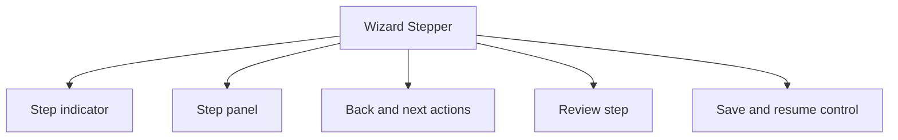

# Wizard / Stepper

> Learn how to implement wizards and steppers. Discover best practices for multi-step forms, progress tracking, and step validation.

**URL:** https://uxpatterns.dev/patterns/advanced/wizard
**Source:** apps/web/content/patterns/advanced/wizard.mdx

---

## Overview

A **Wizard / Stepper** pattern helps teams create a reliable way to break a long process into ordered steps with visible progress and review checkpoints. It is most useful when teams need onboarding and setup.

Compared with adjacent patterns, this pattern should reduce friction without hiding the state, rules, or recovery paths people need to keep moving.

## Use Cases

### When to use:

- Onboarding and setup
- Checkout and application flows
- Multi-step internal tooling

### When not to use:

- Use a simpler visible navigation or single-page flow when the product surface is still small.
- Avoid advanced interaction patterns if the team cannot support their state complexity well.
- Do not introduce hidden power-user behavior before the plain path is already strong.

### Common scenarios and examples

- Onboarding and setup where users need a clear, repeatable interface model.
- Checkout and application flows where users need a clear, repeatable interface model.
- Multi-step internal tooling where users need a clear, repeatable interface model.

## Benefits

- Clarifies how wizard / stepper should behave before implementation details begin to sprawl.
- Creates a reusable interaction model for teams who need to break a long process into ordered steps with visible progress and review checkpoints.
- Makes accessibility, edge cases, and recovery paths part of the design instead of post-launch cleanup.
- Gives product, design, and engineering a shared language for evaluating trade-offs.

## Drawbacks

- The pattern introduces more state and edge cases than its static mockups suggest.
- It requires coordination between content, interaction, and accessibility choices.
- Teams often underestimate how much polish is needed for non-happy states.
- Responsive behavior usually needs explicit planning rather than minor CSS tweaks.

## Anatomy



### Component Structure

1. **Step indicator**

- Shows current position and how much work remains.

2. **Step panel**

- Contains the fields or tasks for the active stage.

3. **Back and next actions**

- Move through the flow without losing context.

4. **Review step**

- Summarizes key choices before final submission.

5. **Save and resume control**

- Lets users leave a longer process safely.

#### Summary of Components

| Component | Required? | Purpose |
| --- | --- | --- |
| Step indicator | ✅ Yes | Shows current position and how much work remains. |
| Step panel | ✅ Yes | Contains the fields or tasks for the active stage. |
| Back and next actions | ✅ Yes | Move through the flow without losing context. |
| Review step | ❌ No | Summarizes key choices before final submission. |
| Save and resume control | ❌ No | Lets users leave a longer process safely. |

## Variations

### Linear wizard

Requires each step in order.

**When to use:** Use for onboarding, checkout, and setup flows with dependencies.

### Editable stepper

Allows users to revisit completed steps from the progress rail.

**When to use:** Use when review and backtracking are common.

### Branching wizard

Changes the upcoming path based on earlier answers.

**When to use:** Use when user intent or eligibility changes later steps.

## Best Practices

### Content

**Do's ✅**

- State the job of the pattern clearly before layering on visual complexity.
- Keep labels, controls, and outcomes in the same mental group.
- Use supporting text to reduce ambiguity, not to restate the obvious.

**Don'ts ❌**

- Do not force users to infer system state from decoration alone.
- Do not add extra interaction steps without a clear benefit.
- Do not assume the design works equally well for novice and expert users.

### Accessibility

**Do's ✅**

- Verify that wizard / stepper can be completed using keyboard alone.
- Keep focus order logical when the pattern opens, updates, or reveals additional UI.
- Preserve a visible focus state that is still readable at high zoom.
- Use semantic elements first, then add ARIA only where semantics alone are not enough.
- Announce state changes such as errors, loading, or completion in the right place and with the right politeness.

**Don'ts ❌**

- Do not remove focus styles without a visible replacement.
- Do not depend on placeholder or helper text that disappears before the user can act on it.
- Do not assume pointer, touch, and assistive technologies will all interact with the pattern the same way.

### Visual Design

**Do's ✅**

- Preserve a clear hierarchy between primary content, secondary metadata, and controls.
- Use visual rhythm to make the pattern easier to scan.
- Treat hover, focus, and active states as part of the design system.

**Don'ts ❌**

- Do not overload the default view with secondary options.
- Do not use visual emphasis without meaning behind it.
- Do not let state changes shift unrelated content unexpectedly.

### Layout & Positioning

**Do's ✅**

- Keep the pattern stable across common breakpoints.
- Preserve proximity between cause and effect.
- Plan empty, loading, and error states in the same container.

**Don'ts ❌**

- Do not let layout rearrangements hide the current state.
- Do not depend on fixed heights when content length is variable.
- Do not design only for the most ideal dataset or viewport.

## State Management

- Keep the canonical state small and derivable so advanced UI behaviors do not fork into several contradictory versions.
- Persist enough context that users can leave and return without feeling like the system forgot their progress or place.
- Treat URL state, stored preferences, and in-memory interaction state separately so restoration rules stay clear.

## Implementation Checklist

- [ ] Define the canonical state model before implementation starts.
- [ ] Specify empty, loading, and failure states alongside the default interaction.
- [ ] Test the full pattern with keyboard-only use before polishing advanced visuals.
- [ ] Document how the pattern behaves on narrow screens and with reduced motion enabled.

## Common Mistakes & Anti-Patterns 🚫

### **Designing only the happy path**

**The Problem:**
The pattern feels polished until loading, empty, and failure states appear.

**How to Fix It?**
Specify the full lifecycle alongside the default state so implementation does not improvise later.

---

### **Letting interaction and content drift apart**

**The Problem:**
Users work harder when controls, status, and supporting information feel disconnected.

**How to Fix It?**
Keep the information architecture of the pattern close to the interaction model.

---

### **Treating accessibility as a final pass**

**The Problem:**
Keyboard, announcement, and reading-order issues become expensive once the interaction is already fixed.

**How to Fix It?**
Bake semantics, focus behavior, and announcements into the first implementation.

## Examples

### Live Preview

### Basic Implementation

```html
<div class="demo-shell card wizard">
  <ol class="steps">
    <li class="active">Details</li>
    <li>Members</li>
    <li>Review</li>
  </ol>
  <div id="wizard-panel">
    <h3>Workspace details</h3>
    <p class="muted">Name the workspace and choose a short description.</p>
  </div>
  <div class="wizard-actions">
    <button type="button" id="wizard-back" disabled>Back</button>
    <button type="button" id="wizard-next">Next</button>
  </div>
</div>
```

### What this example demonstrates

- A clear baseline implementation of wizard / stepper that can be reviewed without framework-specific noise.
- Visible state, spacing, and content hierarchy that mirror the implementation guidance above.
- A small enough surface to copy into a design review or prototype before scaling the pattern up.

### Implementation Notes

- Start with semantic HTML and only add JavaScript where the interaction truly requires it.
- Keep styling tokens and spacing consistent with adjacent controls or layouts.
- If the live implementation introduces async behavior, mirror those states in the code example rather than documenting them only in prose.

## Accessibility

### Keyboard Interaction

- [ ] Verify that wizard / stepper can be completed using keyboard alone.
- [ ] Keep focus order logical when the pattern opens, updates, or reveals additional UI.
- [ ] Preserve a visible focus state that is still readable at high zoom.

### Screen Reader Support

- [ ] Use semantic elements first, then add ARIA only where semantics alone are not enough.
- [ ] Announce state changes such as errors, loading, or completion in the right place and with the right politeness.
- [ ] Connect labels, hints, and status text with `aria-describedby` or structural headings when useful.

### Visual Accessibility

- [ ] Do not rely on color alone to convey severity, completion, or selection state.
- [ ] Test the pattern at 200% zoom and with reduced motion enabled.
- [ ] Ensure touch targets remain comfortable on mobile and coarse pointers.

## Testing Guidelines

### Functional Testing

- [ ] Verify the default, loading, error, and success states for wizard / stepper.
- [ ] Test the primary action and the obvious recovery action in the same run.
- [ ] Confirm that state survives refresh, navigation, or retry in the way users would expect.

### Accessibility Testing

- [ ] Run keyboard-only checks and at least one screen reader pass on the final implementation.
- [ ] Validate headings, labels, and announcement behavior with real content rather than lorem ipsum.
- [ ] Check color contrast and focus visibility in both default and stressed states.

### Edge Cases

- [ ] Test empty, long, duplicated, and unexpectedly formatted content.
- [ ] Check behavior on narrow screens, zoomed layouts, and slower networks.
- [ ] Verify that optimistic or asynchronous states reconcile correctly after a failure.

## Frequently Asked Questions

## Related Patterns

## Resources

### References

- [WCAG 2.2](https://www.w3.org/TR/WCAG22/) - Accessibility baseline for keyboard support, focus management, and readable state changes.
- [WAI Multi-page Forms](https://www.w3.org/WAI/tutorials/forms/multi-page/) - Guidance for step indicators, repeated instructions, saved progress, and logical step splits.

### Guides

- [WAI Cognitive Pattern: Make Each Step Clear](https://www.w3.org/WAI/WCAG2/supplemental/patterns/o1p04-clear-steps/) - Recommendations for orientation, progress, and re-entry in staged task flows.

### Articles

- [Smashing Magazine: Designing efficient web forms](https://www.smashingmagazine.com/2017/06/designing-efficient-web-forms/) - Field-level usability guidance for labels, grouping, defaults, and submission flows.

### NPM Packages

- [`react-hook-form`](https://www.npmjs.com/package/react-hook-form) - Low-friction form state and validation wiring for complex input flows.
- [`zod`](https://www.npmjs.com/package/zod) - Schema validation for typed parsing, normalization, and field-level error handling.
- [`@tanstack/react-form`](https://www.npmjs.com/package/%40tanstack%2Freact-form) - Typed form state and validation workflows for advanced form UIs.
